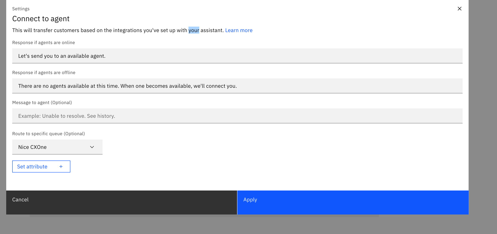
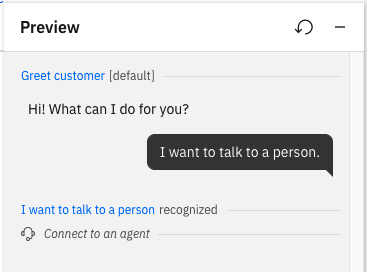

---

copyright:
  years: 2018, 2023
lastupdated: "2023-06-09"

subcollection: watson-assistant

---

{{site.data.keyword.attribute-definition-list}}

# Connecting to a live agent
{: #human-agent}

Your assistant can do a lot, but there might be some situations when your customers need help from a human. If your assistant is integrated with one of the supported service desk systems, you can build in logic that will transfer the conversation to a live agent when necessary. This is referred to as an _escalation_.
{: shortdesc}

To use this feature, your assistant must interact with customers using a **web chat** or **phone** integration. For more information, see [Deploying your assistant](/docs/watson-assistant?topic=watson-assistant-deploy-assistant).

You must add an integration to a service desk system before setting up live agent transfers to your assistant. The supported service desks depend upon how customers connect to your assistant (web chat or phone). For more information about integrating with a service desk, see [Basic web chat configuration](/docs/watson-assistant?topic=watson-assistant-web-chat-overview) and [Phone integration configuration](/docs/watson-assistant?topic=watson-assistant-deploy-phone-config).

Your agents can work with one of these supported service desk tools:
- [Genesys](/docs/watson-assistant?topic=watson-assistant-deploy-phone-genesys)
- [NICE CXone](/docs/watson-assistant?topic=watson-assistant-deploy-phone-nicecxone)
- [Salesforce](/docs/watson-assistant?topic=watson-assistant-deploy-salesforce)
- [Twilio Flex](/docs/watson-assistant?topic=watson-assistant-deploy-phone-flex)
- [Zendesk](/docs/watson-assistant?topic=watson-assistant-deploy-zendesk)

There are two basic scenarios when your assistant might need to transfer a conversation to a live agent:

- _Planned escalation_ refers to any anticipated situations in which you know you always want to hand off the conversation to a live agent.

- _Fallback escalation_ is an unexpected situation in which the customer is unable to get help from the assistant.

When the assistant initiates a transfer, the agent receives a notification within the agent dashboard, and has access to the history of the customer's chat with the assistant.

## Planned escalations
{: #planned-escalation}

Examples of planned escalations might include the following:

- The customer asks for a service that cannot be completed without the assistance of a live agent
- The customer needs help with a sensitive subject that requires a human touch, such as asking about bereavement benefits or resolving a complaint

To set up a planned escalation, you build an action that can recognize a specific situation that requires a live agent. An example would be an action that is triggered by customer input `I want to pay my bill` (you might want to let live agents handle payments).

Within any action, you can create a step that initiates a transfer to a live agent:

1. Add a step or edit an existing step to transfer the conversation to a live agent.

    Transferring the conversation to a live agent ends the action. If there are situations where you want the conversation to continue within the assistant rather than being transferred, use step conditions as needed.

1. In the **And then** field at the end of the step, select **Connect to agent**.

1. In the **Settings** window, you can customize messages the assistant displays as part of the transfer:

    

    - **Response if agents are online**: The message the assistant sends to the customer when the conversation is being transferred to an agent. The default message is `Let's send you to an available agent`.

    - **Response if agents are offline**: The message the assistant sends to the customer when no agents are currently available to take over the conversation. The default message is `There are no agents available at this time. When one becomes available, we'll connect you.`

    - **Message to agent**: An optional message the assistant sends to the live agent when transferring the conversation.
    
    - **Route to a specific queue**: An optional selection to route customers to a specific integration, which can be helpful if you have more than one set up.

1. Click **Apply**.

If you want to edit the transfer settings later, click **Edit settings** in the **And then** field.
{: note}

## Fallback escalations
{: #human-agent-fallback-escalations}

Examples of fallback escalations include:

- The customer repeatedly asks a question or makes a request that the assistant cannot match to any defined action.
- The customer repeatedly gives an invalid answer to a question.
- The customer explicitly asks to speak to a human.

Fallback escalations use the _Fallback_ action, which is a built-in system action that is automatically triggered in any of these fallback scenarios. By default, the *Fallback* action handles these error conditions by initiating a transfer to a live agent.

For more information about this automatic error handling and the *Fallback* action, see [Handling errors in the conversation](/docs/watson-assistant?topic=watson-assistant-handle-errors).

## Testing the transfer in the Preview pane
{: #human-agent-test-transfer}

After you have configured an action to connect to a live agent, you can preview it by clicking **Preview**. Note that in the action Preview pane, no actual transfer takes place, but the *Connect to an agent* message confirms that it was correctly triggered.

If you want to test the actual transfer using a working service desk integration, you can do so using the assistant Preview page. For more information, see [Previewing and sharing your assistant](/docs/watson-assistant?topic=watson-assistant-preview-share).
