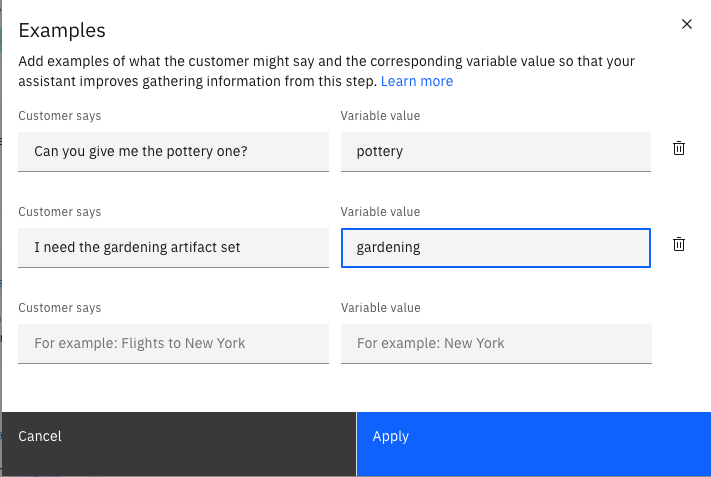

---

copyright:
  years: 2023, 2024
lastupdated: "2024-09-05"

keywords: information gathering

subcollection: watson-assistant

---

{{site.data.keyword.attribute-definition-list}}

# Information gathering
{: #information-gathering}

You can use watsonx.ai in your assistant to intelligently gather information and address a customer query quickly to avoid repetitive questions. The watsonx.ai uses large language models (LLMs) to recognize the information that is collected from the customer and store each of them in the respective variable for further processing.

This feature is available in English, French, German, Spanish, Brazilian Portuguese and Japanese. The watsonx generative AI model that supports English, French, German, Spanish, and Brazilian Portuguese is hosted only in the Dallas and Frankfurt regions. The watsonx generative AI model that supports Japanese is hosted only in the Tokyo regions.{: note}

By enabling information gathering, your assistant can analyze a customer's free text response to:
- Gather accurate information
- Complete multiple steps in one step

For more information about collecting information from customer responses, see [Collecting information from your customers](/docs/watson-assistant?topic=watson-assistant-collect-info).

## Enabling information gathering capability
{: #enable-information-gathering}

To enable the information gathering capability, do the following steps:

1. Go to **Home** > **Actions** > **Global settings** > **Generative AI** > **Information gathering**.
1. Set **Use watsonx.ai information gathering** to `On`.

When you enable intelligent information gathering, settings for existing free text customer responses change to `Skip asking if the answer is mentioned in previous messages`. If you later disable information gathering, revert the settings for free text responses to `Always ask`. For more information, see [Skipping steps, always asking steps, or never asking steps](/docs/watson-assistant?topic=watson-assistant-collect-info#collect-info-skip-step).{: tip}

## Adding examples for clarity
{: #add-examples-for-clarity}

The **Add examples** feature in the action editor improves the capability of your assistant to gather accurate information from the customer response. By using the large language models (LLMs) in *watsonx.ai* and the added examples, your assistant can identify the variables in a customer response and retrieve accurate information. 

You can add examples whenever the response from LLMs lacks clarity on a particular topic. The **Add examples** feature is an optional enhancement because watsonx.ai is capable of gathering information accurately even without the examples.

To use the **Add examples** icon, do the following:

1. Go to **Home** > **Actions** > **Editor**. 
1. Go to the **Step** where you want to add examples.
1. In **Assistant says**, type the response that you want to display.
1. Click **Define customer response** and select **Free text**.
1. Click **Add examples**  icon, which opens an 'Examples' window.
1. In the 'Examples' window, type any customer relevant topic in `Customer says` and give a variable name in `Variable value`.
1. Click `Apply` to save your changes. 

You can add only three examples in the 'Examples' window. {: note}

    
