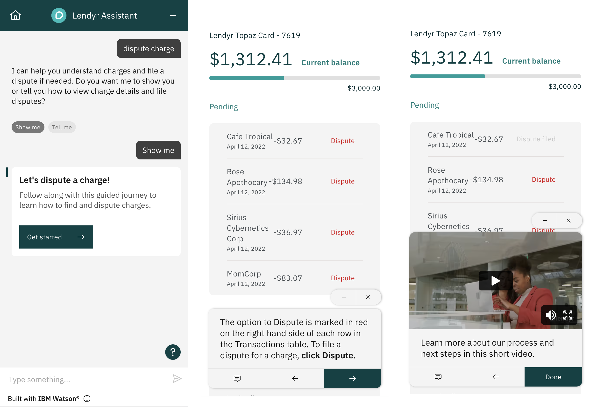

---

copyright:
  years: 2022
lastupdated: "2022-12-05"

subcollection: watson-assistant

---

{:shortdesc: .shortdesc}
{:new_window: target="_blank"}
{:external: target="_blank" .external}
{:deprecated: .deprecated}
{:important: .important}
{:note: .note}
{:tip: .tip}
{:pre: .pre}
{:codeblock: .codeblock}
{:screen: .screen}
{:javascript: .ph data-hd-programlang='javascript'}
{:java: .ph data-hd-programlang='java'}
{:python: .ph data-hd-programlang='python'}
{:swift: .ph data-hd-programlang='swift'}

{{site.data.content.classiclink}}

# Guiding customers with journeys 
{: #journeys}

A journey is an interactive response that you can use to guide your customers through a complex task, or to give them a tour of new features, taking advantage of capabilities your website already supports. A journey is a multipart response that can combine text, video, and images presented in sequence.
{: shortdesc}

This beta feature is available for evaluation and testing purposes but should not be used in production environments. Journeys require web chat version 6.9.0 or later.
{: beta}

When the customer starts a journey, the chat window temporarily closes. The web chat integration then presents the journey elements one step at a time in a small window superimposed over your website, enabling your customers to navigate and use the website as they step through the journey. At any time during the journey, the customer can freely return to the assistant chat window and then resume the journey.



You might use a journey in situations like the following examples:

- Onboarding new customers to your product or website and showing them where everything is

- Providing customers with step-by-step guidance for a complex task, like filing a claim or creating an account

- Promoting sales opportunities in your product to target users during specific marketing opportunities, such as offering a new rewards program to customers who are concerned about expenses

For more information about deciding when and how to use journeys, see our [best practices guide](https://medium.com/ibm-watson/best-practices-for-watson-assistant-journeys-993d16fb0ad0){: external}.
{: tip}

## Creating a journey
{: #journeys-create}

A journey is defined using the `user_defined` response type, which is available only in the JSON editor. (For more information, see [Defining responses using the JSON editor](/docs/watson-assistant?topic=watson-assistant-assistant-responses-json).) To create a journey, follow these steps:

1. In the action editor, create or edit the step from which you want to start the journey.

1. Click the **Switch to JSON editor** icon  to open the JSON editor.

1. In the `generic` array, create a `user_defined` response. (For more information, see [Defining responses using the JSON editor](/docs/watson-assistant?topic=watson-assistant-assistant-responses-json).)

    A journey is defined using the following structure:

    ```json
    "user_defined": {
      "user_defined_type": "IBM_BETA_JOURNEYS_TOUR",
      "skip_card": true|false,
      "card_title": "{title}",
      "card_description": "{description}",
      "steps": [
        ...
      ]
    }
    ```

    where:

    `user_defined_type`
    :   The specific type of user-defined response you are defining. To define a journey, always set this property to `IBM_BETA_JOURNEYS_TOUR`.

    `skip_card`
    :    An optional property that specifies whether the web chat should start the journey immediately without waiting for the customer to click the introductory card in the web chat window. (The default value is `false`.)

        You can use this option to start a journey directly from your website, even if the web chat is not open. For more information, see [Starting a journey without opening the web chat](#journeys-no-web-chat).
        {: tip}

    `card_title`
    :   The title to display on the introductory card that appears in the web chat when a journey is available (for example, `Website tour` or `Disputing a charge`).

    `card_description`
    :   The description to display on the introductory card. Describe the journey so your customers can decide whether they want to open it.

    `steps`
    :   An array of responses defining the steps in the journey.

### Defining steps
{: #journeys-steps}

Each step in a journey is defined as a JSON object describing a response to be shown to the customer, using a format that is similar to how you define assistant responses directly in the `generic` array. Steps in a journey are shown to the customer one at a time, in the order in which you list them in the `steps` array.

As with assistant responses, the `response_type` property identifies the type of response:

`text`
:   A step that shows only text.

    ```json
    {
      "response_type": "text",
      "text": "This is the text of the response."
    }
    ```

    Markdown formatting and links are supported in `text` steps. For more information, see [Markdown formatting](/docs/watson-assistant?topic=watson-assistant-web-chat-architecture#web-chat-architecture-markdown).

    Note that the structure of a `text` step in a journey is different from the `text` response type for assistant responses. Instead of an array of text values, only a single `text` component is supported.
    {: important}

`image`
:   A step that shows an image, along with an optional description.

    ```json
    {
      "response_type": "image",
      "source": "https://example.com/image.png",
      "description": "This is the description of the image."
    }
    ```

    The `source` property must be the `https:` URL of a publicly accessible image. The specified image must be in `.jpg`, `.gif`, or `.png` format.

`video`
:   A step that shows a video, along with an optional description.

    ```json
    {
      "response_type": "video",
      "source": "https://example.com/videos/example-video.mp4",
      "description": "This is the description of the video."
    }
    ```

    The URL specified by the `source` property can be either of the following:

    - The URL of a video file in a standard format such as MPEG or AVI. In the web chat, the linked video will render as an embedded video player.

        HLS (`.m3u8`) and DASH (MPD) streaming videos are not supported.

    - The URL of a video hosted on a supported video hosting service. In the web chat, the linked video will render using the embeddable player for the hosting service.

        Specify the URL you would use to view the video in your browser (for example, `https://www.youtube.com/watch?v=52bpMKVigGU`). You do not need to convert the URL to an embeddable form; the web chat will do this automatically.

        You can embed videos hosted on the following services:
        - [YouTube](https://youtube.com){: external}
        - [Facebook](https://facebook.com){: external}
        - [Vimeo](https://vimeo.com){: external}
        - [Twitch](https://twitch.tv){: external}
        - [Streamable](https://streamable.com){: external}
        - [Wistia](https://wistia.com){: external}
        - [Vidyard](https://vidyard.com){: external}

## Example
{: #journeys-example}

The following example defines a journey that shows users how to dispute a charge, using a combination of text, image, and video responses.

```json
{
  "generic": [
    {
      "response_type": "user_defined",
      "user_defined": {
        "card_title": "Let’s dispute a charge!",
        "card_description": "Follow along with this guided journey to learn how to find and dispute charges.",
        "user_defined_type": "IBM_BETA_JOURNEYS_TOUR",
        "steps": [
          {
            "response_type": "text",
            "text": "Charges are listed on the Transactions page. **Click your profile photo** in the top right corner of your screen, and then **click Transactions** from the menu."
          },
          {
            "response_type": "text",
            "text": "Here you can view your charges.\n **Scroll through the Transactions page and review your charges.** Each charge contains a merchant name, transaction date, and amount charged."
          },
          {
            "response_type": "image",
            "source": "https://example.com/image.png",
            "alt_text": "Image showing location of Dispute option",
            "description": "The option to Dispute is marked in red on the right hand side of each row in the Transactions table. Just click here to file a dispute."
          },
          {
            "response_type": "video",
            "source": "https://vimeo.com/769580398",
            "description": "Watch this short video to learn what to expect now that you’ve filed a dispute."
          }
        ]
      }
    }
  ]
}
```

## Starting a journey without opening the web chat
{: #journeys-no-web-chat}

Although journeys are part of the web chat integration, you can make it possible for your customers to start a journey directly from your website without opening the web chat window at all. For example, you might want to include a **Show me** button on your website that customers can click to launch an interactive tour of the page.

To start a journey without opening the web chat:

1. In the action that sends the journey response, edit the JSON that defines the journey. Include `"skip_card": true` to bypass the introductory card.

1. On your website, use the [`send()`](https://web-chat.global.assistant.watson.cloud.ibm.com/docs.html?to=api-instance-methods#send){: external} instance method to send a message to the assistant that triggers the action that starts the journey (such as `Give me a tour`). Send the message in response to whatever event you want to use to trigger the journey (such as a button click or page load).

Your customers can now start the interactive journey directly from your website without having to open the web chat first. (If the web chat window is opened later, the introductory card for the journey appears in the chat history.)

## Limitations
{: #journeys-limitations}

This beta feature currently has the following limitations:

- The preview pane does not support journeys. If you want to preview a journey, use the shareable preview link. (For more information about the preview link, see [Copying a link to share](/docs/watson-assistant?topic=watson-assistant-preview-share#preview-share-link).)

- Journeys currently do not meet accessibility requirements.

- Journeys are not supported if you are using the [`element` configuration option](https://web-chat.global.assistant.watson.cloud.ibm.com/docs.html?to=api-configuration#optionselement){: external} to render the web chat in a custom DOM element. 

- When the customer starts a journey, the web chat window temporarily closes, but will reopen when the journey finishes. If you are using the `window:close` event to trigger the display of a post-chat form, your code should check the value of the new `event.reason` parameter of the event and verify that it is not set to `open_tour`.

