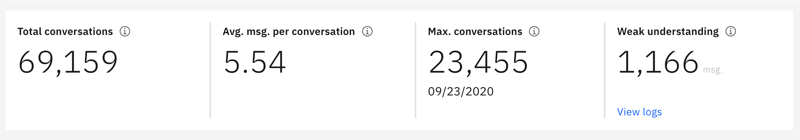
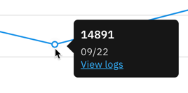
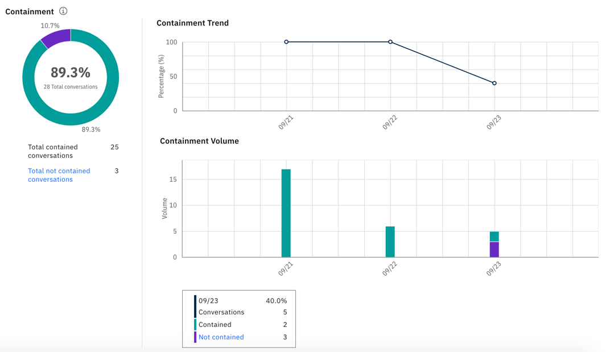
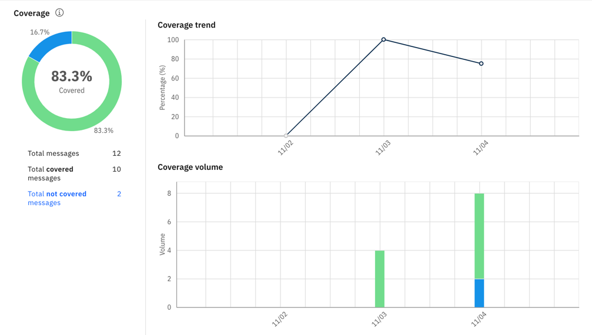
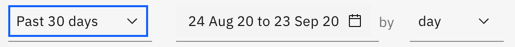
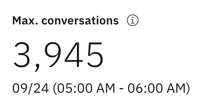

---

copyright:
  years: 2015, 2023
lastupdated: "2023-09-21"

subcollection: watson-assistant

---

{{site.data.keyword.attribute-definition-list}}

# Dialog skill analytics overview
{: #logs-overview}

## Classic experience only
This information applies to dialog skill analytics in the classic experience. For information about analytics in the new experience, see [Use analytics to review your entire assistant at a glance](/docs/watson-assistant?topic=watson-assistant-analytics-overview). 
{: attention}

The Analytics overview page provides a summary of the interactions between users and your assistant.
{: shortdesc}

Analytics help you to understand the following things:

- *What do customers want help with today?*
- *Is your assistant understanding and addressing customer needs?*
- *How can you make your assistant better?*

To see metrics information, select **Overview** in the navigation bar. The information in Analytics is not immediately updated after a user interacts with your assistant. {{site.data.keyword.assistant_classic_short}} prepares the data for Analytics in the background.

After the numbers in metrics are greater than 3,000, the totals are approximated to prevent performance lags in the page.
{: note}

## Scorecards
{: #logs-overview-scorecards}

The scorecards give you a quick view of your metrics. Scroll to see full interactive graphs later in the page.

{: caption="Scorecards" caption-side="bottom"}

- *Total conversations*: The total number of conversations between active users and your assistant that occur during the selected time period. The total conversations metric and the *User conversations* page include only conversations in which both the assistant and customer participate. Conversations that have only welcome messages from the assistant, or that have only user messages of zero length, are not included. This metric is not used for billing purposes. An exchange with a user is not considered a billable conversation until the customer submits a message.
- *Avg. msg. per conversation*: The total messages that were received during the selected time period divided by the total conversations during the selected time period, as shown in the corresponding graph.
- *Max. conversations*: The maximum number of conversations for a single data point within the selected time period.
- *Weak understanding*: The number of individual messages with weak understanding. These messages are not classified by an intent, and do not contain any known entities. Reviewing unrecognized messages can help you to identify potential dialog problems.

## Graphs and statistics
{: #logs-overview-graphs}

Detailed graphs provide additional information. Click a data point on a graph to see more detail.

{: caption="Data point" caption-side="bottom"}

- *Containment*: Number of conversations in which the assistant is able to satisfy the customer's request without human intervention.

    - The volume graph shows the total number of conversations per day and how many of the conversations were contained and not contained.
    - The trend graph shows the percentage of daily conversations that were contained. This graph helps you to see if the assistant is getting better or worse at containing conversations over time.

    {: caption="Containment" caption-side="bottom"}

    The containment metric requires that your dialog flag requests for external support when they occur. For more information, see [Measuring containment](/docs/watson-assistant?topic=watson-assistant-dialog-support#dialog-support-containment).
- *Coverage*: Number of conversations in which the assistant is confident that it can address a customer's request.

    - The volume graph shows the total number of conversations per day and how many of the conversations were covered (meaning intents in your dialog understood user requests and were able to address them), and not covered (meaning the input did not match an intent in the dialog and was processed by the *Anything else* node instead).
    - The trend graph shows the percentage of daily conversations that were covered. This graph helps you to see if your dialog is getting better or worse at covering conversations over time.

    {: caption="Coverage" caption-side="bottom"}

    The coverage metric requires that your dialog has an *Anything else* node. For more information, see [Ending the conversation gracefully](/docs/watson-assistant?topic=watson-assistant-dialog-start#dialog-start-anything-else).

    The containment and coverage metrics are available to Plus or Enterprise plan users.
    {: note}

- *Total conversations*: The total number of conversations between active users and your assistant during the selected time period. This number counts exchanges in which the welcome message is displayed to a user, even if the user doesn't respond.
- *Average messages per conversation* - The total messages that were received during the selected time period divided by the total conversations during the selected time period.
- *Total messages* - The total number of messages received from active users over the selected time period.
- *Active users* - The number of unique users who engaged with your assistant within the selected time period.
- *Average conversations per user* - The total conversations divided by the total number of unique users during the selected time period.

    Statistics for *Active users* and *Average conversations per user* require a unique `user_id` parameter to be specified with the messages. This value is typically specified by all integrations because it is used for billing purposes. For more information, see [User-based plans explained](/docs/watson-assistant?topic=watson-assistant-admin-managing-plan#admin-managing-plan-user-based).
    {: important}

## Controls
{: #logs-overview-controls}

You can use the following controls to filter the information:

- *Time period control* - Use this control to choose the period for which data is displayed. This control affects all data that is shown on the page: not just the number of conversations displayed in the graph, but also the statistics displayed along with the graph, and the lists of top intents and entities.

    The statistics can cover a longer time period than the period for which logs of conversations are retained.
    {: note}

    {: caption="Time period control" caption-side="bottom"}

    You can choose whether to view data for a single day, a week, a month, or a quarter. In each case, the data points on the graph adjust to an appropriate measurement period. For example, when you view a graph for a day, the data is presented in hourly values, but when you view a graph for a week, the data is shown by day. A week always runs from Sunday through Saturday.

    You can create custom time periods also, such as a week that runs from Thursday to the following Wednesday, or a month that begins on any date other than the first.

    The time that is shown for each conversation reflects the time zone of your browser. However, API log calls are always shown in Coordinated Universal Time time. As a result, if you choose a single day view, for example, the time that is shown in the visualization might differ from the timestamp that is specified in the log for the same conversation.

    {: caption="Time period control" caption-side="bottom"}

- *Intents* and *Entities* filters - Use either of these filters to show data for a specific intent or entity in your skill.

    The intent and entities filters are populated by the intents and entities in the skill, and not what is in the data source. If you [selected a data source](/docs/watson-assistant?topic=watson-assistant-logs#logs-deploy-id) other than the skill, you might not see an intent or entity from your data source logs as an option in the filters, unless those intents and entities are also in the skill.
    {: important}

- *Refresh data*: Select **Refresh data** to refresh the data that is used in the page metrics.

    The statistics show traffic from customers who interact with your assistant; they do not include interactions from the *Try it out* pane.

## Top intents and top entities
{: #logs-overview-tops}

You can also view the intents and entities that were recognized most often during the specified time period.

- *Top intents* - Intents are shown in a simple list. You can see the number of times an intent was recognized. You can select an intent to open the **User conversations** page with a date range that is filtered to match the data you are viewing, and the intent that is filtered to match the selected intent.

- *Top entities* are also shown in a list. You can select an entity to open the **User conversations** page with the date range that is filtered to match the data you are viewing, and the entity that is filtered to match the selected entity.

See [Improve your skill](/docs/watson-assistant?topic=watson-assistant-logs) for tips on how to edit intents and entities based on discoveries you make by reviewing the intents and entities that your assistant recognizes.

