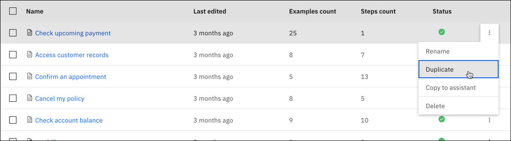
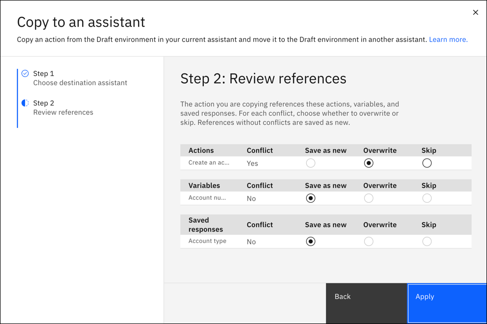

---

copyright:
  years: 2018, 2022
lastupdated: "2022-09-15"

subcollection: watson-assistant

---

{:shortdesc: .shortdesc}
{:new_window: target="_blank"}
{:external: target="_blank" .external}
{:deprecated: .deprecated}
{:important: .important}
{:note: .note}
{:tip: .tip}
{:pre: .pre}
{:codeblock: .codeblock}
{:screen: .screen}
{:javascript: .ph data-hd-programlang='javascript'}
{:java: .ph data-hd-programlang='java'}
{:python: .ph data-hd-programlang='python'}
{:swift: .ph data-hd-programlang='swift'}

{{site.data.content.classiclink}}

# Managing actions
{: #manage-actions}

Use different {{site.data.keyword.conversationshort}} capabilities to manage your actions workflow within a single assistant and between multiple assistants.

## Duplicating an action
{: #manage-actions-duplicate}

You can duplicate an action to reuse information in a new action. When you duplicate an action, the new action includes everything except example phrases. 

To duplicate an action, click the overflow menu on the action you want and select **Duplicate**.



## Copying an action to another assistant
{: #manage-actions-copy}

You can copy an action from one assistant to another. When you copy an action, references to other actions, variables, and saved responses are also copied.

To copy an action to another assistant:

1. Click the overflow menu on the action you want and select **Copy to an assistant**.

   

1. Choose the destination assistant for the copy. If the action doesn't already exist in the destination assistant, it's copied as new. If the action already exists and there is a conflict, the copy overwrites the existing one.

   

1. If there are references to other actions, variables, or saved responses, you can review the list. References without a conflict are saved as new. If there are conflicts, you can choose to overwrite the existing reference, or skip copying it. If there are no references, this step doesn't appear.

   

1. Click **Apply** to finish copying the action to the other assistant.

## Uploading or downloading all actions
{: #manage-actions-upload-download}

You can upload or download all your actions as a JSON file. 

### Downloading
{: #manage-actions-global-settings-download}

To back up all your actions, download a JSON file and store it. 

1. On the **Actions** page, click **Global settings** .

1. On the **Upload/Download** tab, click the **Download** button.

### Uploading
{: #manage-actions-global-settings-upload}

To reinstate a backup copy of actions that you exported from another service instance or environment, import the JSON file of the actions you exported.

If the {{site.data.keyword.conversationshort}} service changes between the time you export the actions and import it, due to functional updates that are regularly applied to instances in cloud-hosted continuous delivery environments, your imported actions might function differently than before.
{: important}

1. On the **Actions** page, click **Global settings** .

1. On the **Upload/Download** tab, drag and drop a JSON file onto the tab or click to select a file from your local system, then click **Upload**.

The imported JSON file must use UTF-8 encoding, without byte order mark (BOM) encoding. The JSON file cannot contain tabs, newlines, or carriage returns.
{: important}

## Uploading intents as actions
{: #manage-actions-upload-intents}

If you created intents in the classic {{site.data.keyword.conversationshort}} experience, you can migrate your intents to actions in the new {{site.data.keyword.conversationshort}} experience. When you upload intents, each intent is created as a new action. All phrases corresponding to an intent are created as example phrases for the new action. This can provide a helpful starting point when you are ready to start building actions in the new experience.

1. Download the intents that you want to migrate to actions from the classic {{site.data.keyword.conversationshort}} experience. For more information, see [Downloading intents](/docs/watson-assistant?topic=watson-assistant-migrate-intents-entities#migrate-intents-download). The format for each line in the file is as follows:
    ```text
    <phrase>,<intent>
    ```
    where `<phrase>` is the text of a user example phrase, and `<intent>` is the name of the intent. For example:
    ```text
    Tell me the current weather conditions.,weather_conditions
    Is it raining?,weather_conditions
    What's the temperature?,weather_conditions
    Where is your nearest location?,find_location
    Do you have a store in Raleigh?,find_location
    ```

1. From the main actions page, click the **Upload** icon .

1. Select the intents file that you downloaded.

    The file is validated and uploaded, and the system trains itself on the new data.

    The intents in column 2 are created as new actions, and the phrases in column 1 are created as example phrases for the corresponding action. For example, if you upload the example from step 1, two new actions are created for the `weather_conditions` and `find_location` intents. The underscores (`_`) in the intent names are replaced with spaces, for example, the `weather_conditions` intent becomes the `weather conditions` action.

    In this example, the `weather_conditions` action will have three example phrases: `Tell me the current weather conditions.`, `Is it raining?`, and `What's the temperature?`. The `find_location` action will have two example phrases: `Where is your nearest location?` and `Do you have a store in Raleigh?`.
