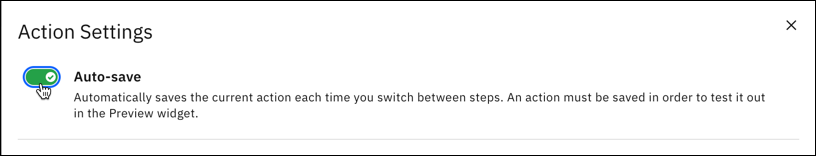
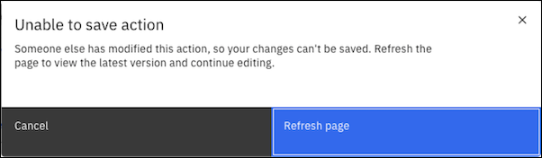

---

copyright:
  years: 2021
lastupdated: "2021-08-26"

subcollection: watson-assistant

---

{:shortdesc: .shortdesc}
{:new_window: target="_blank"}
{:external: target="_blank" .external}
{:deprecated: .deprecated}
{:important: .important}
{:note: .note}
{:tip: .tip}
{:pre: .pre}
{:codeblock: .codeblock}
{:screen: .screen}
{:javascript: .ph data-hd-programlang='javascript'}
{:java: .ph data-hd-programlang='java'}
{:python: .ph data-hd-programlang='python'}
{:swift: .ph data-hd-programlang='swift'}

# Manage actions across a team
{: #manage-team}

In this topic, learn about how to coordinate multiple people building actions in an assistant.

## Adding team members to your assistant
{: #manage-team-adding}

You can collaborate building your assistant with others. To add people with access, see [Managing access](/docs/watson-assistant?topic=watson-assistant-access-control).

## Saving changes
{: #manage-team-saving}

When working on actions, your assistant automatically saves changes when you do one of the following:

- Click on a new step
- Open Preview
- Reset Preview

You can turn auto-save on and off my opening the settings of a an action and selecting the toggle. 

The auto-save toggle setting in one action applies across every action within your assistant. If you enable or disable auto-save in one action, the change applies to all actions.

You can also save changes by clicking the **Save** icon, for example, in these places when working on actions:

- Within each action
- Actions settings
- Renaming an action
- Editing a variable

When the system automatically saves or you click the **Save** icon, the following items are saved to all:
- Actions you have created
- Edits you made to a system action
- Variables you created
- Action settings

### Avoiding conflicts
{: #manage-team-conflicts}

To avoid conflicts when saving, we recommend dividing work so that one person works on one action at a time.

Also, {{site.data.keyword.conversationshort}} prevents two users from working in an action with unsaved edits. If one user saves changes before a second user, this `Unable to save action` message may appear:

<!--## Hide in-progress work before publishing
{: #manage-team-hide-work}-->

<!--## Moving a group of actions from one assistant to another
{: #manage-team-moving-actions}

This will be via JSON import/export on the settings page.-->

