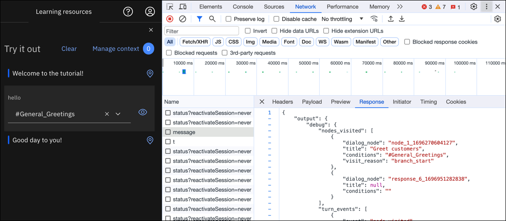

---

copyright:
  years: 2015,  2023
lastupdated: "2023-10-11"

keywords: message call, message objects

subcollection: watson-assistant

---

{{site.data.keyword.attribute-definition-list}}

# Anatomy of a message
{: #message-anatomy}

A single `/message` API call is equivalent to a single turn in a conversation, which consists of a message that is submitted by a customer and a corresponding response from your assistant.
{: shortdesc}

Each reply that a customer makes in response to a prompt from the assistant is passed as an independent `/message` API call.

The body of the `/message` API call request and response includes the following objects:

- `context`: Contains variables that are meant to be persisted. For the dialog to reference information that is submitted by the user, you must store the information in the context object. For example, the dialog can collect the user's name and then refer to the user by name in subsequent nodes. The following example shows how the context object is represented in the dialog JSON editor:

   ```json
   {
     "context" : {
       "user_name" : "<? @name.literal ?>"
     }
   ```
   {: codeblock}

   For more information, see [Retaining information across dialog turns](/docs/watson-assistant?topic=watson-assistant-dialog-runtime-context#dialog-runtime-context-dialog).

- `input`: The string of text that was submitted by the user. The text string can contain up to 2,048 characters. The following example shows how the `input` object is represented in the dialog JSON editor:

   ```json
   {
     "input" : {
       "text" : "Where's your nearest store?"
     }
   ```
   {: codeblock}

- `output`: The dialog response to return to the user. The following example shows how the output object is represented in the dialog JSON editor:

   ```json
   {
   "output": {
     "generic": [
       {
         "values": [
           {
             "text": "This is my response text."
           }
         ],
         "response_type": "text",
         "selection_policy": "sequential"
       }
     ]
   }
   }
   ```
   {: codeblock}

In the resulting API `/message` response, the text response is formatted as follows:

```json
{
   "text": "This is my response text.",
   "response_type": "text"
}
```

You can define more response types other than a text response. See [Responses](/docs/watson-assistant?topic=watson-assistant-dialog-overview#dialog-overview-responses) for more details.

For more information about the `/message` API call, see the [API reference](https://{DomainName}/apidocs/assistant/assistant-v2){: external}.

For information about how to refer to these message objects within a conversation, see [Expressions for accessing objects](/docs/watson-assistant?topic=watson-assistant-expression-language).

## Viewing API call details
{: #message-anatomy-inspect-api}

As you test your conversation, you might want to know what the underlying API calls look like that are being returned from the service. You can use the developer tools that are provided by your web browser to inspect them.

From Chrome, for example:

1. Open the developer tools. 

1. Open the Network tool. The **Name** section lists multiple API calls. 

1. Click the message call that is associated with your test utterance

1. Click the **Response** column to see the API response body. It lists the intents and entities that were recognized in the user input with their confidence scores. It also lists the values of context variables at the time of the call. 

{: caption="Use Chrome developer tools to see API response" caption-side="bottom"}

1. To view the response body in structured format, click the **Preview** column.
