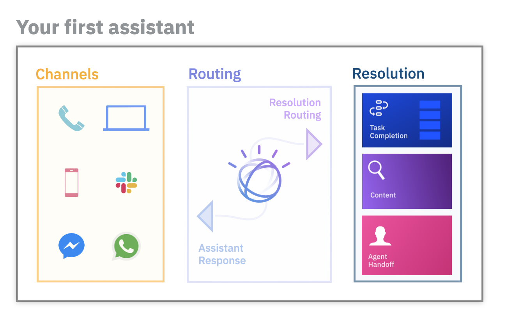

---

copyright:
  years: 2022
lastupdated: "2022-02-10"

subcollection: watson-assistant

---

{:shortdesc: .shortdesc}
{:new_window: target="_blank"}
{:external: target="_blank" .external}
{:deprecated: .deprecated}
{:important: .important}
{:note: .note}
{:tip: .tip}
{:pre: .pre}
{:codeblock: .codeblock}
{:screen: .screen}
{:javascript: .ph data-hd-programlang='javascript'}
{:java: .ph data-hd-programlang='java'}
{:python: .ph data-hd-programlang='python'}
{:swift: .ph data-hd-programlang='swift'}

# Planning your assistant
{: #plan-assistant}

Before you start to build an assistant, it’s important to think about your overall goals and plan how you're going to start.
{: shortdesc}

Your assistant can use different resolution methods to help your customers with their requests. Customers access the assistant through channels that you choose and configure. The following diagram shows the structure of an assistant after you build it:

Consider these planning steps and make key decisions up front to keep you on track as you build.

## 1. Select an initial channel
{: #plan-channel}

Before you decide which specific topics to build into your assistant, you must first decide where to deploy your assistant so that customers can easily find it. For example, you can embed the assistant in your company website or add it to a messaging platform such as Facebook, Slack, or WhatsApp. The primary channels that you can use to communicate with your customers are your website and the phone.

If you choose to use [web chat](/docs/watson-assistant?topic=watson-assistant-deploy-web-chat) to communicate with customers on your website, decide on which of your web pages you want the assistant to appear. To start, you might identify the pages where your customers most frequently ask questions from your customer service team.

If you have an existing interactive voice response (IVR) system with a branching structure (“press 1 for billing, press 2 for payments”), you might choose the [phone integration](/docs/watson-assistant?topic=watson-assistant-deploy-phone) as your initial channel. You can integrate {{site.data.keyword.conversationshort}} with your existing system to automate the IVR experience so customers can talk with your assistant over the phone.

Understanding where you will deploy the assistant before you begin can help you author the right types of answers for a given channel or platform. For more information about ways to deploy an assistant, see [Adding integrations](/docs/watson-assistant?topic=watson-assistant-deploy-integration-add).

## 2. Pick your assistant's domain of expertise
{: #plan-expertise}

Decide which general domain of expertise you want your assistant to cover (for example, billing support or scheduling appointments). To make an informed decision, review any support call logs that you have access to or ask your customer service representatives. After you choose a domain, be sure that it aligns with a channel that you can control and change. For example, don’t choose to automate billing support questions if you're unable to add the web chat client to the billing web pages.

After you select a domain, you can decide which specific questions or tasks the assistant will help customers with. Start small. Pick one or a handful of customer issues that will deliver the highest value to start. It might be valuable for your assistant to answer a simple question that is asked all the time. Or maybe there's a task, such as scheduling appointments, that you can offload to the assistant to tackle incoming customer requests.

Choose a narrow set of user goals first. If you start small and choose the goals with the highest impact first, you'll have room and time to grow the expertise of your assistant. After your assistant is live, the built-in metrics of active user conversations help you understand what your customers are asking about, how well your assistant is able to meet their needs, and what to focus on next.

## 3. Choose the tone and language of your assistant
{: #plan-language-tone}

Before you build your assistant, it can also be helpful to choose the tone with which your assistant communicates. Is your assistant an optimist or a pessimist, a shy intellectual type, or an upbeat sidekick? Write conversations that reflect your assistant's personality. Don't overdo it by sacrificing usability for the sake of keeping your assistant in character. Strive to present a consistent tone and attitude.

Never misrepresent the assistant as being a human. If users believe that the assistant is a person, then find out it's not, they are likely to distrust it. In fact, some US states have laws that require chatbots to identify themselves as chatbots.

Decide whether and how you want to handle more than one spoken language. For more information about ways to approach language support, see [Adding support for global audiences](/docs/watson-assistant?topic=watson-assistant-admin-language-support).

## 4. Connect to content sources
{: #plan-content-sources}

The answer to common questions might already be documented somewhere in your organization's technical information. Plan whether you want to connect the assistant to existing content sources by taking an inventory of relevant help content (for example, product information, knowledge articles, FAQs) available to your customers.

You can give your assistant access to this information by adding a [search integration](/docs/watson-assistant?topic=watson-assistant-search-add) to your assistant. The search integration uses {{site.data.keyword.discoveryfull}} to return smart answers to natural language questions.

<!--- ## Give the right type of answer to meet the need
{: #plan-responses}

A conversational exchange is what your assistant does best, but your assistant can do other things too. The best response to a question might be a single answer with a link somewhere else. Think about the right way to answer customer questions; don't try to fit everything into one type of conversational exchange.

The following table lists some examples.

| Customer need | Best type of response |
|---------------|-----------------------|
| Get information about your store location | Your assistant answers with text (the store address) and an image (an area map). |
| Activate a credit card | Your assistant can use a conversational flow to collect information for identity verification, and then call a webhook to submit the request to activate the card on the user's behalf. |
| Complete a simple task that involves a complicated application | Your assistant can link them to a 2-minute video that illustrates how to complete the task. |
| Learn about insurance plan details after the death of a loved one | Your assistant can connect the customer directly to a person who can show empathy and patience as the matter is addressed. |
| Solve a problem that requires a long and involved procedure to fix | Instead of trying to walk the customer through the procedure step by step in conversation, your assistant can link to a help center that documents the full procedure in detail. |
| The customer calls support and your assistant answers | Let's say the assistant needs many details from the customer before it can help. Instead of trying to prompt the customer for each piece of information and transcribe it, your assistant can switch to SMS text messaging. After years of interacting with bad interactive voice response (IVR) systems, many customers are more likely to yell `Agent` over and over than to engage in a long exchange. If you give them a chance to explain something in writing, they tend to do so willingly. |
{: caption="Example of optimal response types" caption-side="top"} --->

## 5. Plan your handoff strategy
{: #plan-handoff}

Finally, prevent customers from hitting dead ends by [escalating conversations to a human agent](/docs/watson-assistant?topic=watson-assistant-human-agent) if the assistant isn't able to resolve a customer's question or problem. As part of your planning, figure out what your escalation strategy is going to be. This strategy will vary depending on the deployment channel you choose.

If you deploy to your website, you have three options for escalating to a human agent:
- Inline
- Email address
- Phone number

If you opt for the inline approach, you can directly escalate to a human agent in your existing contact center tool without forcing the user to leave the web chat widget. This approach also provides the agent with the full context of the conversation. To use either the email address or phone number approach, provide the user with the agent’s email address or phone number. These approaches are simple to set up, but they can be more disconnected experiences for your customers.

If you deploy by using the phone integration, you can reach a human agent only by transferring the phone call to someone who can help.

## Start building an assistant
{: #plan-build}

<!---Assemble a team with people who understand your customers and their needs, people who know how to interact with customers to reach the best outcomes. These subject matter experts can focus on designing an engaging conversational flow. In fact, the actions skill is designed with this type of expert in mind. The team can simultaneously build a conversational flow by defining discrete actions.

If you have data scientists or team members with programming skills, you can take advantage of some advanced capabilities that require varying levels of development expertise. This set of users might prefer to build the conversational flow with a dialog skill because there is greater visibility into the individual components that make up the training data.

So, which conversational skill type *should* you use?

Use both. Leverage advanced capabilities that are available from a dialog skill and build individual actions to perform finite tasks that you want to support. You can call the actions in your actions skill from your dialog skill.

For more information, see [Choosing a conversational skill](/docs/assistant?topic=assistant-skills-choose).--->

If you're ready to start building an assistant, see [Editing actions](/docs/watson-assistant?topic=watson-assistant-build-actions-overview) for more information.
