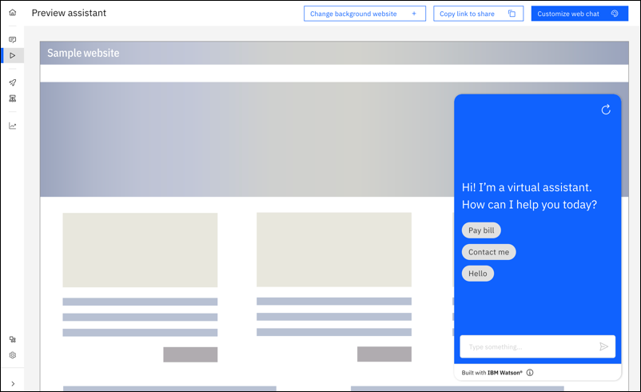

---

copyright:
  years: 2021, 2022
lastupdated: "2022-09-23"

subcollection: watson-assistant

---

{:shortdesc: .shortdesc}
{:new_window: target="_blank"}
{:external: target="_blank" .external}
{:deprecated: .deprecated}
{:important: .important}
{:note: .note}
{:tip: .tip}
{:pre: .pre}
{:codeblock: .codeblock}
{:screen: .screen}
{:javascript: .ph data-hd-programlang='javascript'}
{:java: .ph data-hd-programlang='java'}
{:python: .ph data-hd-programlang='python'}
{:swift: .ph data-hd-programlang='swift'}

{{site.data.content.classiclink}}

# Previewing and sharing your assistant
{: #preview-share}

Internal review is a necessary step in any virtual assistant workflow. You need an environment that is free from customer interactions so your team can test your assistant. The draft environment should closely resemble the final experience that your users encounter so you can ensure that you are publishing the optimal end product.
{: shortdesc}

## Saving and editing your work in the draft environment
{: #preview-share-draft}

The draft environment contains all your in-progress work in the **Actions**, **Preview**, and **Publish** pages. Use the **Draft environment** tab to manage the draft environment, including adding draft environment integrations (channels and extensions) that you can use for internal testing before going live. These integrations are unique to the draft environment, and changes to draft integrations don't affect the live environment.

## The Preview page
{: #preview-share-preview-page}

Use the **Preview** page to test your assistant. From this page, you can experience your assistant from your customers' perspective. The **Preview** page includes an interactive web chat widget where you can test out your assistant as if you were a customer. The content contained in the assistant is the content that you built into your actions or set up with the search integration. 

On the **Preview** page, you also find the following elements:
- **Copy link to share**: Share an unauthenticated version of your assistant with your colleagues by sending them a link. For more information, see [Copying a link to share](#preview-share-link).
- **Change background**: Change the background of the page so you can see what your assistant looks like on different web pages. For more information, see [Changing background website](#preview-change-background).
- **Customize web chat**: Customize your draft web chat channel to match your brand or website. For more information, see [Web chat setup overview](/docs/watson-assistant?topic=watson-assistant-web-chat-config).

## Copying a link to share
{: #preview-share-link}

You can share an unauthenticated version of your assistant with your team by sending them a link. The link opens a sample web page with an an interactive web chat widget where you can test out your assistant as if you were a customer. This method of previewing lets you share your in-progress assistant with subject-matter experts in your organization without needing access to {{site.data.keyword.conversationshort}} itself. The experience is identical to using **Preview this environment** on the draft environment tab.

To share a link:
1. On the **Preview** page, click **Copy link to share**.
1. Send the link to your team.

The preview link is not accessible if web chat security is enabled. For more information about web chat security, see [Securing the web chat](/docs/watson-assistant?topic=watson-assistant-web-chat-security).
{: note}

## Changing background website
{: #preview-change-background}

You can visualize how your assistant would look like as a web chat widget on your organization's website. You can enter a URL or upload an image.

### Entering a URL
{: #preview-enter-URL}

You can enter a URL of your organization's website. {{site.data.keyword.conversationshort}} captures an image of your website to use as the **Preview** page background. 

Your website must be publicly available to all users. Private or intranet sites can’t be accessed. Any login, splash, cookie, or warning screens might be captured in the image.
{: note}

To enter a URL:

1. On the **Preview** page, click **Change background**. 
1. Click **Enter URL**, then click **Continue**.
1. Enter the path your website URL, for example, `https://www.example.com` or `example.com`.
1. Click **Continue**.

### Uploading an image
{: #preview-upload-image}

You can upload an image of your organization's website. Images are stored for 24 hours. Maximum file size is 1 MB. Supported file types are JPEG and PNG.

To upload an image:

1. On the **Preview** page, click **Change background**. 
1. Click **Upload an image**, then click **Continue**.
1. Drag a file or click to upload, then click **Change background**.

Images are stored for 24 hours. A warning message may appear on the Preview page about the time limit expiration. To clear this message:

1. On the **Preview** page, click **Change background**. 
1. Click **Clear background setting**, then click **Continue**.
1. Click **Remove background** to finish.

### Removing the background
{: #preview-clear-background}

After you enter a URL or upload an image to use as a background, you might decide to remove the background and restore the default background.

To remove the background image:

1. On the **Preview** page, click **Change background**. 
1. Click **Remove background**, then click **Continue**.
1. Click **Remove background** to finish.

