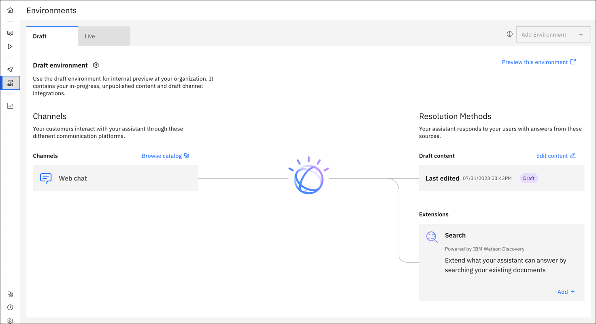

---

copyright:
  years: 2021, 2022
lastupdated: "2022-04-06"

subcollection: watson-assistant

---

{:shortdesc: .shortdesc}
{:new_window: target="_blank"}
{:external: target="_blank" .external}
{:deprecated: .deprecated}
{:important: .important}
{:note: .note}
{:tip: .tip}
{:pre: .pre}
{:codeblock: .codeblock}
{:screen: .screen}
{:javascript: .ph data-hd-programlang='javascript'}
{:java: .ph data-hd-programlang='java'}
{:python: .ph data-hd-programlang='python'}
{:swift: .ph data-hd-programlang='swift'}

{{site.data.content.classiclink}}

# Previewing and sharing your assistant
{: #preview-share}

Internal review is a necessary step in any virtual assistant workflow. You need an environment that is free from customer interactions so your team can test your assistant. The draft environment should closely resemble the final experience that your users encounter so you can ensure that you are publishing the optimal end product.
{: shortdesc}

## Saving and editing your work in the draft environment
Manage your draft environment from the **Draft environment** page, and preview customer interactions with your assistant from the **Preview** page. The assistant configurations on these pages cannot be seen by your customers. After you deploy your assistant to a live channel and publish your content, the assistant is live on its configured channels. Live channels are configured separately from draft channels so that you can test new channels in your draft environment before you deploy an assistant to them in the live environment. To learn more about {{site.data.keyword.conversationshort}} environments, see [Environments](/docs/watson-assistant?topic=watson-assistant-publish-overview#environments).

As you edit your content from the **Actions** page, your changes are automatically reflected on the **Preview** page. This includes any saved changes that are made to your assistant’s integrations, including search or integrations with other platforms.

## The Preview page
Use the **Preview** page to test your assistant with your team. From this page, you can experience your assistant from your customer's perspective. On the **Preview** page, the **Assistant preview** pane is the interactive web chat widget where you can test out your assistant as if you were a customer. The content contained in the assistant is the content that you built into your actions or set up with the search integration. On the **Preview** page, you also find the following elements:
- **Customize web chat**: Customize your draft web chat channel to match your brand or website.
- **Copy link to share**: Share an unauthenticated version of your assistant with your colleagues by sending them a link.
- **Add background website**: Change the background of the page so you can see what your assistant looks like on different web pages.

## Previewing multiple channel integrations
From the **Preview** page, you have the ability to test channels before you go live with them. For more information about adding channels to your assistant, see [Adding integrations](/docs/watson-assistant?topic=watson-assistant-deploy-integration-add). After you add channels to the assistant, they are accessible from the **Draft environment** page:

These channels can be configured and deployed to test different mediums, such as websites and Slack channels, to ensure that your content appears in the way that you want it to. Do not use these channels for live deployments because they reflect the most recently edited content, not your published content.
