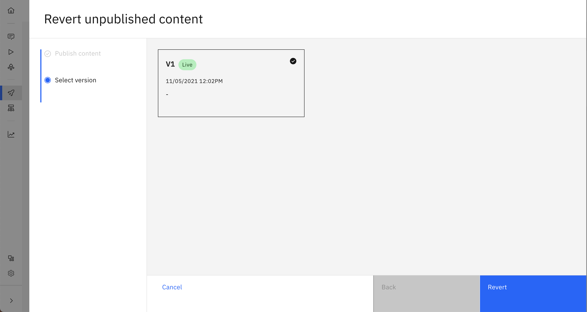
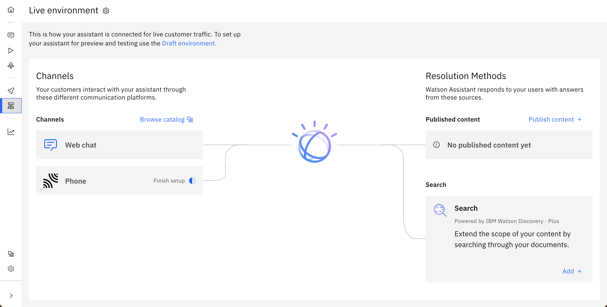

---

copyright:
  years: 2021
lastupdated: "2021-11-05"

subcollection: watson-assistant

---

{:shortdesc: .shortdesc}
{:new_window: target="_blank"}
{:external: target="_blank" .external}
{:deprecated: .deprecated}
{:important: .important}
{:note: .note}
{:tip: .tip}
{:pre: .pre}
{:codeblock: .codeblock}
{:screen: .screen}
{:javascript: .ph data-hd-programlang='javascript'}
{:java: .ph data-hd-programlang='java'}
{:python: .ph data-hd-programlang='python'}
{:swift: .ph data-hd-programlang='swift'}

{{site.data.content.classiclink}}

# Overview
{: #publish-overview}

This topic reviews the basic steps and concepts that are involved to make your assistant available to customers. For more information about the different steps, see the following topics:

- [Previewing and sharing your assistant](/docs/watson-assistant?topic=watson-assistant-preview-share)
- [Publishing your content](/docs/watson-assistant?topic=watson-assistant-publish)
- [Deploying your assistant](/docs/watson-assistant?topic=watson-assistant-deploy-assistant)

Each assistant consists of three core elements:

- **Content**: The conversation logic and words that are used to respond to your customer. Content is required for every assistant.
- **Channels**: The location where your assistant interacts with your users (for example, over the phone, on a website, or in Slack). At least one channel is required for every assistant.
- **Integrations**: Add-ons to the end experience that help solve specific user problems (for example, connecting to a human agent or searching existing help content). Integrations are not required for an assistant, but they are recommended.

These three elements evolve as you build, edit, and update your assistant. In general, follow this high-level build, deploy, and publish process through the life of your assistant:

1. Build your initial content into an assistant
1. Review content and gain approval from team members
1. Connect and deploy your assistant with one of your channels
1. Publish your content to that channel so users can interact with the assistant
1. Continue to edit and improve your assistant

## Environments
{: #environments}

You can group your work in separate containers that are called _environments_. You can think of an environment as a space within the product that contains a version of your work. Each environment can contain its own content, channels, and integrations. As you build and evolve your assistant, you can take snapshots of these items and move them from one environment to another. Environments also have their own IDs, URLs, and service credentials that can be referenced by external services.

Each new assistant comes with two environments: the draft environment and the live environment. The draft environment can be managed from the **Draft environment** page, and the live environment can be managed from the **Live environment** page. Your users interact with assistants on the live environment and cannot interact with assistants on the draft environment. The separation of these two environments allows you to ensure that any in-progress updates to the assistant do not get published. You do not want users to stumble upon an incomplete action that leads them to a dead end.

## The draft environment
Use the **Draft environment** page to manage the draft environment. Your draft content is permanently connected to the draft environment, and you can preview this content from your customers' perspective on the **Preview** page.

The draft environment's integrations can be managed from the **Preview** page. Use these integrations for testing, not for going live. The preview panel shows what the web chat channel looks like on a sample webpage. The preview panel shows draft content, draft integrations, and any changes to the web chat settings.

To access the draft integrations, click **See your test integrations** from the **Preview** page. From the **Test integrations** panel, you can review integrations and test new configurations. These integrations are unique to the draft environment, and changes to draft integrations don't affect live integrations. To share a preview of your draft content, copy and paste the share link on the left side of the **Preview** page.

## Publishing
When your content is ready to be exposed to your customers, you can publish from the **Publish** page. When you publish, you use the **Publish** page to move saved content from the draft environment to the live environment. Each time you publish, you create a new version name, such as V1 or V2.

When you publish your content, Watson Assistant creates a snapshot of the draft content and connects that snapshot to the live environment. This snapshot contains all of the content from actions, including settings and variables. Snapshots do not contain integration configurations or environment settings. Integration configurations and environment settings must be configured manually in each environment.

You can make edits to your live environment either by editing your draft environment and publishing or by reverting the version of your content on your live environment to an earlier version. By default, the most recently published version of your content is connected to the live environment. At any time, you can revert to an earlier version by clicking the **Revert** icon next to the **Publish** button.

The number of versions that can be maintained before they are deleted depends on the type of plan you have. If you reach the plan limit of versions you can have, the oldest version that isn't live is deleted when a new version is published.

## The live environment
Use the **Live environment** page to manage the live environment. This page indicates which content is live in the assistant and which channels that content is connected to. The left side of the page displays the channels where content is deployed, or where customers can interact with the assistant. The right side of the page displays the resolution methods, or how the assistant responds to customer questions or requests.

The version of content displayed under **Published content** is the version that is connected to the live environment. You can change this version from the **Publish** page, or by clicking **Edit content** from the **Live environment** page and selecting a different version.

## Deploying
To deploy an assistant to customers, a channel integration must be added. By default, a web chat integration is created, allowing an assistant to be embedded in a website. Other channel integrations are available in the **Integrations** catalog. For more information about deploying to your website, see [Adding the web chat to your website](/docs/watson-assistant?topic=watson-assistant-deploy-web-chat).

When you add an integration, that integration is added to both the draft and live environments. Use your draft environment to test draft content and integrations before you deploy your assistant to customers. For more information about adding integrations to your assistant, see [Adding integrations](/docs/watson-assistant?topic=watson-assistant-deploy-integration-add). After a live channel is added and configured, it is ready to deploy your assistant on its corresponding platform.
