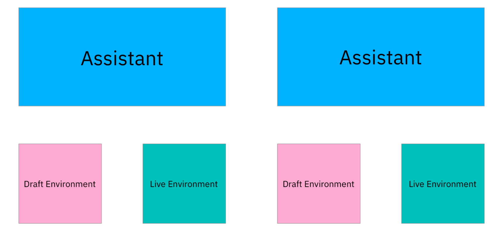
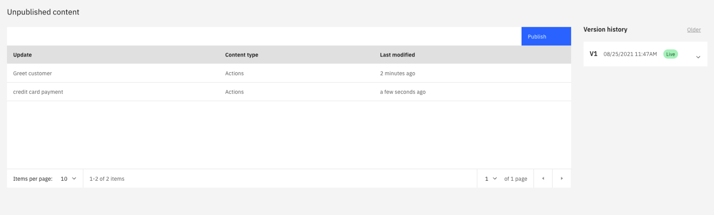
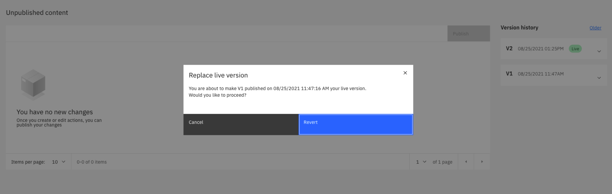
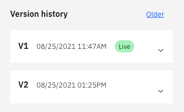
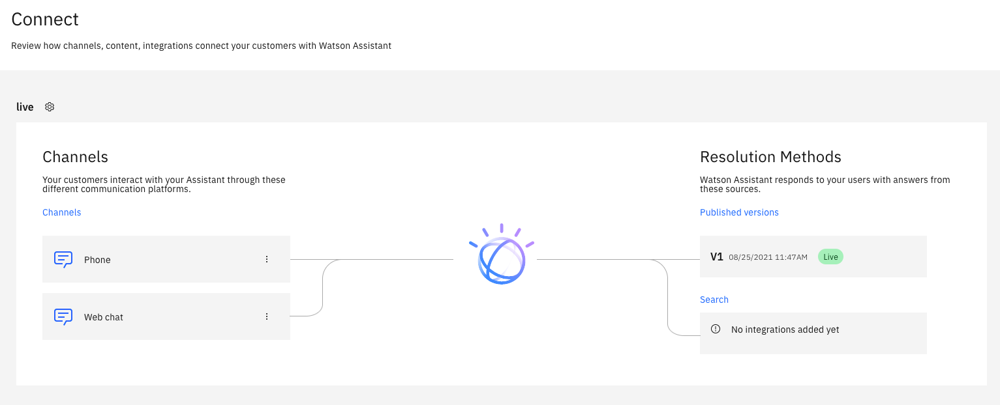

---

copyright:
  years: 2021
lastupdated: "2021-09-08"

subcollection: watson-assistant

---

{:shortdesc: .shortdesc}
{:new_window: target="_blank"}
{:external: target="_blank" .external}
{:deprecated: .deprecated}
{:important: .important}
{:note: .note}
{:tip: .tip}
{:pre: .pre}
{:codeblock: .codeblock}
{:screen: .screen}
{:javascript: .ph data-hd-programlang='javascript'}
{:java: .ph data-hd-programlang='java'}
{:python: .ph data-hd-programlang='python'}
{:swift: .ph data-hd-programlang='swift'}

{{site.data.content.classiclink}}

# Overview: Publishing and deploying your assistant
{: #publish-overview}

This topic reviews the basic steps and concepts that are involved to make your assistant available to customers. For more information about the different steps, see the following topics:

- [Previewing and sharing your assistant](/docs/watson-assistant?topic=watson-assistant-preview-share)
- [Publishing your content](/docs/watson-assistant?topic=watson-assistant-publish)
<!--- - [Deploying your assistant](link) --->

Each assistant consists of three core elements:

- Content: The conversation logic and words that are used to respond to your customer. Content is required for every assistant.
- Channels: The location where your assistant interacts with your users, for example, over the phone, on a website, or in Slack. At least one channel is required for every assistant.
- Integrations: Add-ons to the end experience that help solve specific user problems, for example, connecting to a human agent or searching existing help content. Integrations are not required for an assistant, but they are recommended.

These three elements evolve as you build, edit, and update your assistant. In general, follow this high-level build, deploy, and publish process through the life of your assistant:

1. Build your initial content into an assistant
1. Review content and gain approval from team members
1. Connect and deploy your assistant's shell, which is where your content lives, with one of your channels
1. Publish your content to that channel so users can interact with the assistant
1. Continue to edit and improve your assistant over time

## Environments
{: #environments}
After you make your assistant available to customers, you must ensure that any in progress updates to that assistant do not get published. You do not want users to stumble upon an incomplete action that leads them to a dead-end.

You can group your work in separate containers that are called _environments_. Each environment can contain content, channels, and integrations. As you build and evolve your assistant, you can take snapshots of these items and move them from one environment to another.

Each new assistant automatically comes with two environments: draft and live. Your users interact with assistants on the live environment and cannot interact with assistants on the draft environment.

All content that is built from the **Actions** page is saved to the draft environment and can be reviewed on the **Preview** page. When your content is ready to be exposed to your customers, you can publish from the **Publish** page.

When you publish your content, you are taking a non-editable snapshot of your work and sending it to your live environment. In other words, you can make edits to your live environment either by editing your draft environment and republishing or by reverting the version of your content on your live environment to an older version.

The live environment can be managed from the **Connect** page. Each environment has its own settings, integrations, and content. Environments have their own IDs, URLs, and service credentials that can be referenced by external services.

## Preview: the draft environment
You use the **Preview** page to work with the draft environment. The draft environment's integrations can be managed from the **Preview** page. Use these integrations for testing, not for going live. When you are ready to promote content from the draft environment to the live environment, publish the assistant from the **Publish** page.

The preview panel shows what the web chat channel looks like on a sample webpage. The preview panel shows recently-saved content, draft integrations, and changes to the web chat settings.

To access the draft integrations, click **See my test integrations** and open the **Test integrations** panel. These integrations are unique to the draft environment and don't affect the live environment. From the **Test integrations** panel, you can review integrations and test new configurations.

Changes to draft integrations on the **Preview** page don't affect live integrations. To share a preview of the draft content, copy and paste the share link on the left side of the page.

## Publish
When you _publish_, you use  the **Publish** page to move saved content from the draft environment to the live environment. Each time you publish, you create a new version name, such as V1 or V2, and can also add a description.

When you publish, Watson Assistant creates a snapshot of the draft actions content and connects that snapshot to the live environment. This snapshot contains all of the content from actions, including settings and variables. Snapshots do not contain integration configurations or environment settings. Integration configurations and environment settings must be configured manually in each environment.

By default, the most recent published version is connected to the live environment. At any time, you can click one of the versions in **Version history** and make that version the live version.

<!---  --->

The number of versions that can be maintained before they are deleted depends on the type of plan you have. If you reach the plan limit of versions you can have, the oldest version that isn't live is deleted when a new version is published.

## Connect: the live environment
The **Connect** page indicates which content is live in the assistant and which channels that content is connected to. The left side of the page displays the channels where content is deployed, or where customers can interact with the assistant. The right side of the page displays the resolution methods, or how the assistant responds to customer questions or requests.

Channels can be configured by clicking them. When you click a channel, the configuration page for that particular channel opens.
<!--- For more information on configuring individual channels, see [add](link). --->

The version displayed under **Published versions** is the version that is connected to the live environment. You can change this version from the **Publish** page, or by clicking the tile and selecting a different version. When content is published, it is automatically connected to the live environment and displayed on the **Connect** page.

Search can be added and configured by clicking the **Search** tile or link. To manage the settings of the live environment, click the gear icon next to **live** in the upper left.

## Deploy
To deploy an assistant to customers, a channel must be created. Web chat is created by default, which allows for an assistant to be embedded in a website. Many different channels exist that can be added from the the **Integrations** catalog.

An integration can be added to the assistant by clicking **Add**. Clicking **Add** for an integration adds that integration to all environments. Integrations can be configured from the the **Integrations** catalog, the **Preview** page (draft environment), or the **Connect** page (live environment). Use draft channels to test draft content and use live channels for live deployments. You can configure integrations only in the environments that you have access to.

After a live channel is added and configured, it is ready to deploy your assistant on its corresponding platform. Configurations can be changed at any time.
