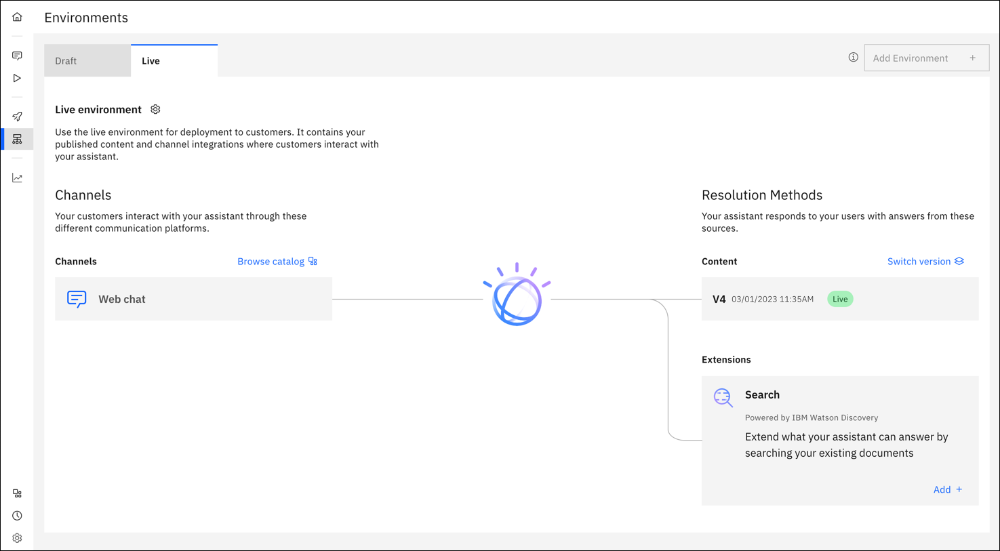

---

copyright:
  years: 2021, 2023
lastupdated: "2023-03-03"

subcollection: watson-assistant

---

{{site.data.keyword.attribute-definition-list}}

# Overview: Previewing and publishing
{: #publish-overview}

After you build an assistant, you can test to make sure it works as you intended before you make it available to customers. {{site.data.keyword.conversationshort}} makes it straightforward to preview your assistant in a closed environment and manage exactly what you make available to customers.
{: shortdesc}

An assistant consists of three core elements:

- **Content**: The conversation logic and words that are used to respond to your customer. Content is required for every assistant.
- **Channels**: The location where your assistant interacts with your customers, such as the web chat interface on your website. At least one channel is required for every assistant.
- **Extensions**: Add-ons to the end experience that help solve specific customer problems (for example, searching existing help content).

In general, you follow this high-level process throughout the life of your assistant:

1. Build your initial content.
1. Test your content in the draft environment, and gain approval from team members.
1. Publish different versions of your draft content.
1. Set up the channels in your live environment where customers interact with your assistant.
1. Assign your published version to the live environment for customers to use.
1. Use analytics to improve your assistant and republish content as needed.

## Environments
{: #environments}

You can group your work in separate containers that are called _environments_. Each environment contains its own content, channels, and extensions. Environments also have their own IDs, URLs, and service credentials that can be referenced by external services.

Each new assistant comes with two environments: the draft environment and the live environment. On the **Environments** page, the draft environment can be managed from the **Draft environment** tab, and the live environment can be managed from the **Live environment** tab. Your customers interact with assistants on the live environment and cannot interact with assistants on the draft environment. You can build and iterate on your content separately from what your customers see. You do not want customers to stumble upon an incomplete action that leads them to a dead end.

For Enterprise plans, you can add up to three environments as a staging area to test your assistant before deployment. You can build content in the draft environment and test versions of your content in the extra environments. For more information, see [Adding and using multiple environments](/docs/watson-assistant?topic=watson-assistant-multiple-environments).

## The draft environment
{: #publish-overview-draft}

The draft environment contains all your in-progress work in the **Actions**, **Preview**, and **Publish** pages. Use the **Draft environment** tab to manage the draft environment, including adding draft environment integrations (channels and extensions) that you can use for internal testing before deployment. These integrations are unique to the draft environment, and changes to draft integrations don't affect the live environment.

{: caption="Draft environment" caption-side="bottom"}

You can click **Preview this environment** to open another browser tab and see the draft environment as a sample web chat.

For more information about previewing your assistant in the draft environment, see [Previewing and sharing your assistant](/docs/watson-assistant?topic=watson-assistant-preview-share).

## Publishing
{: #publish-overview-publishing}

When you are ready to create a snapshot of your content and settings, you can publish from the **Publish** page. Each time that you publish, you create a new version, such as V1 or V2.

{: caption="Publish page" caption-side="bottom"}

When you publish your content, {{site.data.keyword.conversationshort}} creates a snapshot of the draft content, resulting in a version. This version contains all of the content from actions, including settings and variables. Versions do not contain integration configurations or environment settings. Integration configurations and environment settings must be configured manually in each environment.

The three most recent published versions appear in a list on the **Publish** page itself. If you have more than three versions, you can click **View all** to see a list of all published versions.

{: caption="All versions" caption-side="bottom"}

The number of versions that can be maintained depends on the type of plan you have. If you reach the plan limit of versions you can have, you need to delete a version before you can publish another one. 

| Service plan | Published versions |
|---|---:|
| Enterprise | 50 |
| Premium (legacy) | 50 |
| Plus | 10 |
| Trial | 10 |
| Lite | 2 | 2 |
{: caption="Service plan published versions" caption-side="top"}

## The live environment
{: #publish-overview-live}

Use the **Live environment** tab to manage the live environment. This tab indicates which content is live in the assistant and which channels that content is connected to. The left side of the tab displays the channels where content is deployed, or where customers can interact with the assistant. The right side of the tab displays the resolution methods, or how the assistant responds to customer questions or requests.

{: caption="Live environment" caption-side="bottom"}

The version of content that is displayed under **Resolution Methods** is the version that is connected to the live environment. 

There are two ways to publish a version to the live environment:

- When you publish a version from the draft environment
- Use the **Live environment** tab and click **Publish version**.

After a version is published to the live environment, there are two ways you can switch to a different version:

- When you publish a version from the draft environment, you have the option of assigning it to the live environment, replacing the one that's already there
- Use the **Live environment** tab and click **Switch version**.

For more information about publishing, see [Publishing your content](/docs/watson-assistant?topic=watson-assistant-publish).

## Environment settings
{: #publish-overview-environment-settings}

The draft and live environments each have settings. On either tab, click the **Settings** gear icon to open the settings.

**API details** provide these values for each environment:
- Environment name
- Environment ID
- Session URL

**Webhooks**

Settings for pre-message, post-message, and log webhooks. For more information, see [Extending your assistant with webhooks](/docs/watson-assistant?topic=watson-assistant-webhook-overview).

**Inactivity timeout**

Specify the amount of time to wait after the customer stops interacting with the assistant before ending the session.

When a customer connects to your assistant through one of the built-in integrations, or through a custom client that uses the stateful `message` API, the session ends after the specified timeout interval.

When the session ends, the assistant loses any contextual information that it saved during the conversation with the customer. For example, if the assistant asks for the customer's name and then calls the customer by that name throughout the rest of the conversation, then after the session ends and a new one begins, the assistant will start by asking for the customer's name again.

The maximum inactivity timeout differs by service instance plan type. The following table lists the limits.

| Service plan | Chat session default inactivity period | Chat session maximum inactivity period |
|--------------|--------------------------------:|----------------------------:|
| Enterprise   |                          1 hour |          168 hours (7 days) |
| Premium (legacy) |                      1 hour |          168 hours (7 days) |
| Plus         |                          1 hour |                    24 hours |
| Trial        |                       5 minutes |                   5 minutes |
| Lite         |                       5 minutes |                   5 minutes |
{: caption="Service plan details" caption-side="top"}
