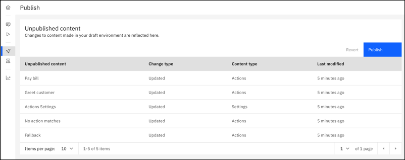
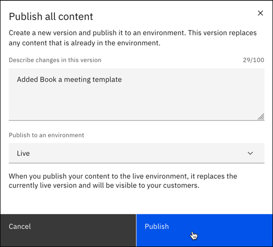
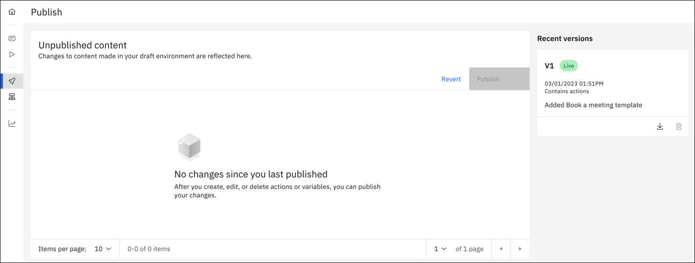
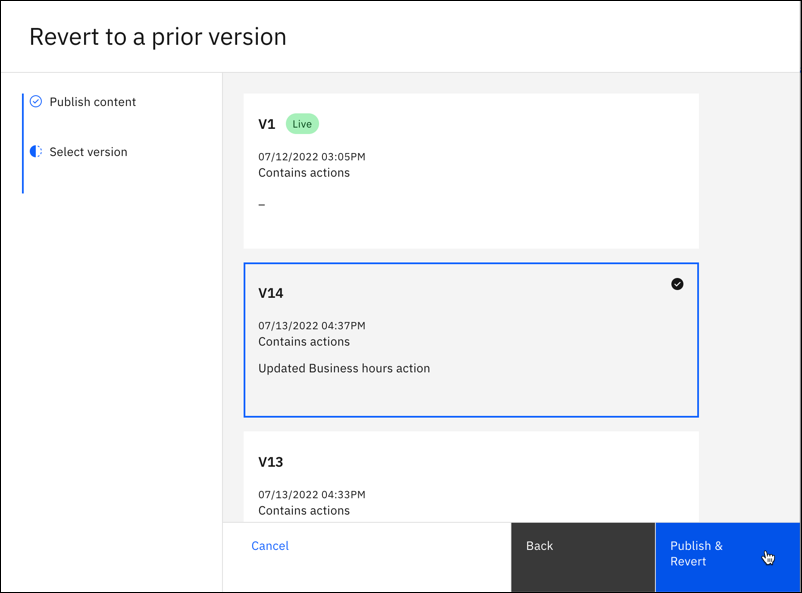

---

copyright:
  years: 2021, 2022
lastupdated: "2022-07-19"

subcollection: watson-assistant

---

{:shortdesc: .shortdesc}
{:new_window: target="_blank"}
{:external: target="_blank" .external}
{:deprecated: .deprecated}
{:important: .important}
{:note: .note}
{:tip: .tip}
{:pre: .pre}
{:codeblock: .codeblock}
{:screen: .screen}
{:javascript: .ph data-hd-programlang='javascript'}
{:java: .ph data-hd-programlang='java'}
{:python: .ph data-hd-programlang='python'}
{:swift: .ph data-hd-programlang='swift'}

{{site.data.content.classiclink}}

# Publishing your content
{: #publish}

Publishing is a way to maintain a healthy lifecycle management process. You can create incremental versions of your content over time, making it easier to manage deployment of changes and roll back (revert) to prior versions if necessary.
{: shortdesc}

When you are ready to create a snapshot of your content and settings, you can publish from the **Publish** page. Each time you publish, you create a new version, such as V1 or V2. When you publish a version, you can assign it to the live environment.

When you publish your content, {{site.data.keyword.conversationshort}} creates a snapshot of the draft content, resulting in a version. This version contains all of the content from actions, including settings and variables. Versions do not contain integration configurations or environment settings. Integration configurations and environment settings must be configured manually in each environment.

The three most recent published versions appear in a list on the **Publish** page itself. Once you have more than three versions, you can click **View all** to see a list of all published versions.

The number of versions that can be maintained depends on the type of plan you have. If you reach the plan limit of versions you can have, you need to delete a version before you can publish another one. For information about {{site.data.keyword.conversationshort}} plan limits, see [Pricing plans](https://www.ibm.com/cloud/watson-assistant/pricing/){: external}.
{: important}

## How to publish
{: #publish-how}

1. If changes are available to publish, click **Publish**. 

1. Enter a description of the version.

1. Decide if you want to assign the version to the live environment. This step is optional if you want to create a snapshot version of your content without using it with customers.

1. Click **Publish**:

    

1. After you publish, the list is clear until you make more edits to your content.

   

## What is being published?
{: #publish-what}

When you publish, a snapshot is taken of the current state of actions. All updates to actions content are published in a version, including the following updates:

- Creating an action
- Editing an action
- Editing actions settings
- Deleting actions
- Creating variables
- Editing variables
- Deleting variables

If you are using [dialog with actions](/docs/watson-assistant?topic=watson-assistant-migrate-overview), these updates are published:
- Activating dialog
- Creating a dialog
- Editing a dialog
- Editing dialog settings
- Deleting a dialog

The following updates are not published in a version and must be configured manually for each environment:

- Channel configurations
- Environment settings

## Assigning or switching versions in the live environment
{: #publish-switch}

There are two ways to assign a verison to the live environment:

- When you a publish a version, you have the option of assigning it to the live environment.
- If you want to assign a version later, use the **Live environment** tab and click **Assign version**.

Once a version has been assigned to the live environment, there are two ways you can switch to a different version:

- When you a publish a version, you have the option of assigning it to the live environment, replacing the one that's already there.
- Use the **Live environment** tab and click **Switch version**.

## Reverting to a previous version
{: #publish-revert}

Use the revert function if you need to update a version of content that is already published to a version. For example, if you publish V1 of your content and then notice an error in this content, you can revert your actions to V1 and use the draft environment to correct the error. 

If you revert to a previous version, your published content isn't affected, but the content on the **Actions** page is overwritten with the version that you revert to. For example, if you decide to revert to V1 of your content, all content on the **Actions** page is overwritten with the V1 content so you can continue to work on it. 

To revert to a previous version:

1. Click the **Revert** button from the **Publish** page.

1. On the **Publish content** tab, choose whether you want to save your in-progress actions as a content version so that you don't lose your current work. For example, if you are reverting to V1 and you choose to create a version at this point, V2 is created so you can resume work on it later.

   To create a version, check **Publish content** and add a description.

   

1. Next, select the version of content that you want to revert to, then click **Publish & Revert**. 

   

1. After you revert, you can go to the **Actions** page to make any fixes or updates. When you're ready to publish, go to the **Publish** page and publish your updated content as a new version, for example, V3.
