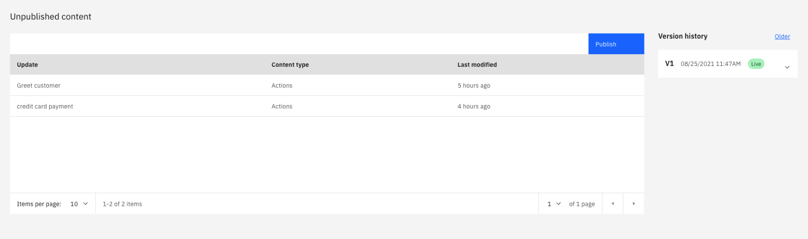
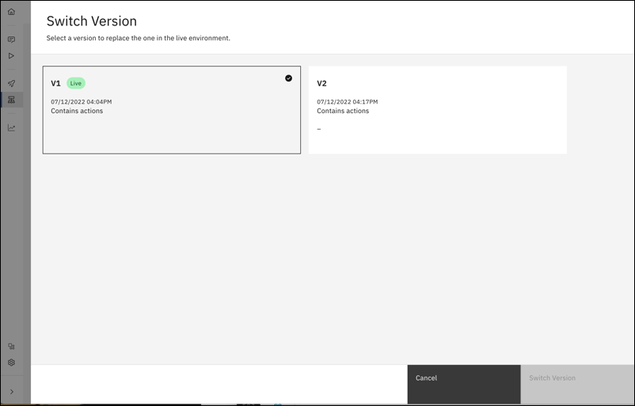
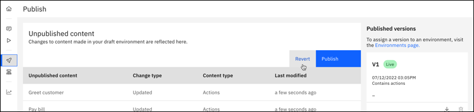

---

copyright:
  years: 2021, 2022
lastupdated: "2022-03-29"

subcollection: watson-assistant

---

{:shortdesc: .shortdesc}
{:new_window: target="_blank"}
{:external: target="_blank" .external}
{:deprecated: .deprecated}
{:important: .important}
{:note: .note}
{:tip: .tip}
{:pre: .pre}
{:codeblock: .codeblock}
{:screen: .screen}
{:javascript: .ph data-hd-programlang='javascript'}
{:java: .ph data-hd-programlang='java'}
{:python: .ph data-hd-programlang='python'}
{:swift: .ph data-hd-programlang='swift'}

{{site.data.content.classiclink}}

# Publishing your content
{: #publish}

Publishing is a way to maintain a healthy lifecycle management process. Publishing allows you to build and test your assistant in an environment separate from the live assistant that your customers interact with.
{: shortdesc}

It's important to understand how publishing works to ensure proper lifecycle management process for your assistant. For customers to interact with your most up-to-date content, you must do two foundational things:

- Deploy your assistant to a live channel
- Publish content to the live environment

## How to publish
1. Go to the **Publish** page.

1. From the **Publish** page, you see a table that contains all changes to actions that occurred since you last published. If changes are available to publish, click **Publish**. Enter an optional description of the version and click **Confirm**:

  

1. After you publish, no changes are available to publish because the live environment is up to date.

  

## What is being published?
When you publish content, a snapshot is taken of the current state of actions. All updates to actions content are published in a version, including the following updates:

- Creating an action
- Editing an action
- Editing actions settings
- Deleting actions
- Creating variables
- Editing variables
- Deleting variables

The following updates are not published in a version and must be configured manually for each environment:

- Channel configurations
- Environment settings

The number of content versions that can be maintained before they are deleted depends on the type of plan you have. If you reach the plan limit of versions you can have, the oldest version that isn't live is deleted when a new version is published. For information about {{site.data.keyword.conversationshort}} plan limits, see [Pricing plans](https://www.ibm.com/cloud/watson-assistant/pricing/){: external}.
{: important}

## Switching the live version
{: #switching-live-version}
1. To change the version of content that is live, go to the **Live environment** page and click the content under the **Published content** heading. The **Switch version** window opens.

1. From the **Switch version** window, select the version of content that you want to connect to your live environment.

  

1. Click **Switch version** to point the live environment to the version of content that you selected in the previous step.

## Reverting to a previous version
Use the revert function if you need to update a version of content that is already published to your live environment. For example, if you publish V1 of your content and then notice an error in this content, you can revert your actions to V1 to correct the error. To revert to a previous version, click the **Revert** button from the **Publish** page:

   

From the **Revert unpublished content** page, first choose whether you want to save your in-progress actions as a content version so that you don't lose your current work. If you revert to a previous version, your published content isn't affected, but the content on the **Actions** page is overwritten with the version that you revert to. For example, if your V1 content is published and you revert to V1, then your V1 content remains published, and any content on the **Actions** page is overwritten with the V1 content.

Next, select the version of content that you want to revert to. After you revert, you can go to the **Actions** page to make any fixes or updates. When you're ready to publish, go to the **Publish** page and publish your updated content as a new version (for example, V2).

## Managing the live environment
The **Live environment** page shows the live environment and the content and channels that are attached to it. From the **Live environment** page, you can manage live channel configurations by clicking them. You can also change the content version that is connected to the live environment by clicking the version and following the instructions that are outlined in [Changing the live version](#changing-live-version).

Update environment-specific settings by clicking the gear icon next to **live** in the upper left. From this menu, API details, web hooks, and inactivity timeout can be accessed and managed.

