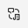
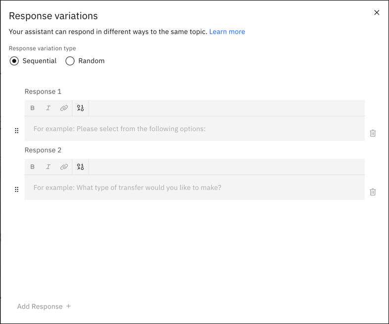
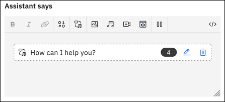

---

copyright:
  years: 2021, 2024
lastupdated: "2024-06-07"

subcollection: watson-assistant

---

{{site.data.keyword.attribute-definition-list}}

# Adding assistant responses
{: #respond}

When an action is activated, the body of the action is composed of multiple *steps* that make up the conversation between your assistant and your users. One part of each step is what the assistant says to the customer when the step is processed.

To create your assistant's response in a step, you use the **Assistant says** section. This represents the text or speech that the assistant delivers to a user at a particular step. Depending on the step, you can add a complete answer to a user's question or ask a follow-up question.

You can enter a simple text response just by entering the text that you want your assistant to display to the user. You can also add formatting and web content, and you can reference user information by using *variables*.

## Formatting responses
{: #respond-formatting}

Use the text editor tools to apply font styling, such as bold or italic, to the text or to add links.

Behind the scenes, font styling and link syntax are stored in Markdown format. If you are using the web chat integration, HTML and Markdown tagging are supported. For more information, see [Markdown formatting](/docs/watson-assistant?topic=watson-assistant-web-chat-architecture#web-chat-architecture-markdown).

HTML tags (except for links) are automatically removed from text responses that are sent to the Facebook, WhatsApp, and Slack integrations, because those channels do not support HTML formatting. HTML tags are still handled in channels that support them (such as the web chat) and stored in the session history.

If you're using a custom client application that does not support Markdown, don't apply text styling to your text responses.
{: note}

## Adding and referencing variables
{: #respond-variables}

During the conversation, your assistant stores information as *variables*. Variables are containers for data values that become available at run time. The value of a variable can change over time. Variables include *action variables*, which persist only during a particular action, and *session variables*, which are available to any action. For more information about variables, see [Managing information during the conversation](/docs/watson-assistant?topic=watson-assistant-manage-info).

In your assistant's output, you can reference variables to personalize the conversation or include information that is available at run time. For more information about referencing variables in what your assistant says, see [Using variables to customize the conversation](/docs/watson-assistant?topic=watson-assistant-manage-info#reference-variables).

## Testing responses
{: #respond-testing}

To check that the assistant responses are formatted correctly, you can use **Preview**.

1. Click the **Preview** button.
1. To start the action, enter your first phrase, for example: `What are your store hours?`.
1. When the assistant responds, check that the message displays as you intended with formatting and use of variables.

## Tips for adding responses
{: #respond-tips-responses}

- Keep answers short and useful.
- Reflect the user's intent in the response. Doing so assures users that the bot is understanding them, or if it is not, gives users a chance to correct a misunderstanding immediately.
- Include links to external sites in responses if the answer depends on data that changes frequently.
- Word your responses carefully. You can change how someone reacts to your system based on how you phrase a response. Changing one line of text can prevent you from having to write multiple lines of code to implement a complex programmatic solution.

## Adding variations
{: #respond-variations}

If your users return to your assistant frequently, they might be bored to see the same greetings and responses every time. You can add *response variations* so that your assistant can respond to the same request in different ways.

You can choose to rotate through the response variations sequentially or in random order. By default, responses are rotated sequentially, as if they were chosen from an ordered list.

To add response variations:

1. In **Assistant says**, click the **Add response variations** icon .

1. For **Response variation type**, choose whether to rotate through the response variations sequentially or in random order. For more information, see [Sequential or random](#respond-variations-sequential-random).

   {: caption="Response variations" caption-side="bottom"}

1. Add each variation into its own field. For example:

   | Response number | Variation |
   | --- | --- |
   | Response 1 | How can I help you? |
   | Response 2 | What can I do for you today? |
   | Response 3 | Tell me what I can help with. |
   | Response 4 | Can I help you? |
{: caption="Response variation examples" caption-side="bottom"}

1. When you're finished, click **Apply**. The variations appear as a block inside **Assistant says**. You can click the **Edit** icon to update the variations, or click the **Delete** icon to remove all the variations. Also, you can add multiple sets of response variations to a step.

   {: caption="Response variations in Assistant says" caption-side="bottom"}

### Sequential or random
{: #respond-variations-sequential-random}

For **Response variation type**, you can choose **Sequential** or **Random**.

**Sequential** returns the first response variation the first time the action is triggered, the second response variation the second time the action is triggered, and so on, in the same order as you entered the variations. This results in responses returned in the following order when the node is processed:

- First time:

   ```screen
   How can I help you?
   ```

- Second time:

   ```screen
   What can I do for you today?
   ```

- Third time:

   ```screen
   Tell me what I can help with.
   ```

- Fourth time:

   ```screen
   Can I help you?
   ```

**Random** selects variation the first time that the action is triggered, and randomly selects another variation the next time, but without repeating the same variation consecutively. This example show an order that responses might appear:

- First time:

   ```screen
   Tell me what I can help with.
   ```

- Second time:

   ```screen
   Can I help you?
   ```

- Third time:

   ```screen
   How can I help you?
   ```

- Fourth time:

   ```screen
   What can I do for you today?
   ```

## Media responses
{: #respond-response-types}

In addition to text responses, you can use other _response types_ to send responses that include multimedia or interactive elements. 

The action editor supports the following media response types:

- **Image**: Embeds an image into the response. The source image file must be hosted somewhere and have a URL that you can use to reference it. It cannot be a file that is stored in a directory that is not publicly accessible.
- **Video**: Embeds a video player into the response. The source video must be hosted somewhere, either as a playable video on a supported video streaming service or as a video file with a URL that you can use to reference it. It cannot be a file that is stored in a directory that is not publicly accessible.
- **Audio**: Embeds an audio clip into the response. The source audio file must be hosted somewhere and have a URL that you can use to reference it. It cannot be a file that is stored in a directory that is not publicly accessible.
- **iframe**: Embeds content from an external website, such as a form or other interactive component, directly within the chat. The source content must be publicly accessible using HTTP, and must be embeddable as an HTML `iframe` element.

Different channel integrations have different capabilities for displaying media responses. To see which channel integrations support which response types, see [Channel integration support for response types](/docs/watson-assistant?topic=watson-assistant-response-types-reference).

If you want to define different responses that are customized for different channels, you can do so by editing the response by using the JSON editor. For more information, see [Targeting specific integrations](/docs/watson-assistant?topic=watson-assistant-assistant-responses-json#assistant-responses-json-target-integrations).

By editing your responses in the JSON editor, you can also access more response types for handling channel-specific interactions.

For more information about how to edit responses by using the JSON editor, see [Defining responses using the JSON editor](/docs/watson-assistant?topic=watson-assistant-assistant-responses-json).
{: note}

### Adding an *Image* response
{: #respond-add-image}

Add an *Image* response to display an image to the customer.

The *Image* response type is supported by the following channel integrations:
- Web chat
- SMS
- Slack
- Microsoft Teams
- Facebook
- WhatsApp

To add an *Image* response, complete the following steps:

1. In the **Assistant says** field, click the  **Image** icon.

1. In the **Source URL** field, type the full URL to the hosted image.

    The image must be in `JPEG`, `GIF`, or `PNG` format. The image file must be stored in a location that is publicly addressable by an `https:` URL (such as `https://www.example.com/assets/common/logo.png`).

    To access an image that is stored in {{site.data.keyword.cloud}} {{site.data.keyword.cos_short}}, enable public access to the individual image storage object, and then reference it by specifying the image source with syntax like this: `https://s3.eu.cloud-object-storage.appdomain.cloud/your-bucket-name/image-name.png`.

1. Optionally specify an image title, description, and alt text in the fields provided. In the web chat integration, the title and description are displayed along with the image.

    References to variables are not supported. Some integration channels ignore titles or descriptions.
    {: note}

1. Click **Apply**.

### Adding an *Audio* response
{: #respond-add-audio}

Add an *Audio* response to include spoken-word or other audible content. In the web chat, an audio response renders as an embedded audio player. In the phone integration, an audio response plays over the phone.

The *Audio* response type is supported by the following channel integrations:
- Web chat
- Phone
- SMS
- Slack
- Facebook
- WhatsApp

To add an *Audio* response, complete the following steps:

1. In the **Assistant says** field, click the  **Audio** icon.

1. In the **Source URL** field, type the full URL to the hosted audio clip:

    - To link directly to an audio file, specify the URL to a file in any standard format such as MP3 or WAV. In the web chat, the linked audio clip renders as an embedded audio player.

    - To link to an audio clip on a supported audio hosting service, specify the URL to the audio clip. In the web chat, the linked audio clip renders by using the embeddable player for the hosting service.

      Specify the URL that you would use to access the audio file in your browser (for example, `https://soundcloud.com/ibmresearch/fallen-star-amped`). You do not need to convert the URL to an embeddable form; the web chat does this automatically.
      {: note}

      You can embed audio hosted on the following services:
      - [SoundCloud](https://soundcloud.com){: external}
      - [Mixcloud](https://mixcloud.com){: external}

1. Optionally specify a title, description, and alt text in the fields provided. In the web chat integration, the title and description are displayed along with the audio player.

    References to variables are not supported. Some integration channels ignore titles or descriptions.
    {: note}

### Adding a *Video* response
{: #respond-add-video}

Add a *Video* response to display a how-to demonstration, promotional clip, or other video content. In the web chat, a video response renders as an embedded video player.

The *Video* response type is supported by the following channel integrations:
- Web chat
- SMS
- Slack
- Facebook
- WhatsApp

To add a *Video* response, complete the following steps:

1. In the **Assistant says** field, click the  **Video** icon.

1. In the **Source URL** field, type the full URL to the hosted video:

    - To link directly to a video file, specify the URL to a file in any standard format such as MPEG or AVI. In the web chat, the linked video renders as an embedded video player.

      HLS (`.m3u8`) and DASH (MPD) streaming videos are not supported.
      {: note}

    - To link to a video hosted on a supported video hosting service, specify the URL to the video. In the web chat, the linked video renders by using the embeddable player for the hosting service.

      Specify the URL that you would use to view the video in your browser (for example, `https://www.youtube.com/watch?v=52bpMKVigGU`). You do not need to convert the URL to an embeddable form; the web chat does this automatically.
      {: note}

      You can embed videos that are hosted on the following services:
      - [YouTube](https://youtube.com){: external}
      - [Facebook](https://facebook.com){: external}
      - [Vimeo](https://vimeo.com){: external}
      - [Twitch](https://twitch.tv){: external}
      - [Streamable](https://streamable.com){: external}
      - [Wistia](https://wistia.com){: external}
      - [Vidyard](https://vidyard.com){: external}

1. Optionally specify a video title, description, and alt text in the fields provided. In the web chat integration, the title and description are displayed along with the video player.

    References to variables are not supported. Some integration channels ignore titles or descriptions.
    {: note}

1. If you want to scale the video to a specific display size, specify a number in the **Base height** field.

### Adding an *iframe* response
{: #respond-add-iframe}

Add an *iframe* response to embed content from another website directly inside the chat window as an HTML `iframe` element. An iframe response is useful if you want to enable customers to perform some interaction with an external service without leaving the chat. For example, you might use an *iframe* response to display the following examples within the web chat:

- An interactive map on [Google Maps](https://www.google.com/maps){: external}
- A survey that uses [SurveyMonkey](https://www.surveymonkey.com/){: external}
- A form for making reservations through [OpenTable](https://www.opentable.com/){: external}
- A scheduling form that uses [Calendly](https://calendly.com/){: external}

In the web chat, there are two ways the iframe can be included:
- Like a preview card that describes the embedded content. Customers can click this card to display the frame and interact with the content.
- Inline, meaning within the conversation. This option is good for smaller pieces of iframe content.

The *iframe* response type is supported by the following channel integrations:
- Web chat
- Facebook

To add an *iframe* response type, complete the following steps:

1. In the **Assistant says** field, click the **iframe** icon ().

1. Add the full URL to the external content in the **iframe source** field.

   The URL must specify content that is embeddable in an HTML `iframe` element. Different sites have different restrictions for embedding content, and different processes for generating embeddable URLs. An embeddable URL is one that can be specified as the value of the `src` attribute of the `iframe` element.

   For example, to embed an interactive map that uses Google Maps, you can use the Google Maps Embed API. For more information, see [The Maps Embed API overview](https://developers.google.com/maps/documentation/embed/get-started){: external}. Other sites have different processes for creating embeddable content.

   For the technical details of using `Content-Security-Policy: frame-src` that gives you permission to embed the website content in your assistant, see [CSP: frame-src](https://developer.mozilla.org/en-US/docs/Web/HTTP/Headers/Content-Security-Policy/frame-src){: external}.

1. Optionally add a descriptive title in the **Title** field.

   In the web chat, the title that you add is displayed in the preview card. The customer clicks the preview card to render the external content.

   If you do not specify a title, the web chat attempts to retrieve metadata from the specified URL and displays the content title per the specification in the source.{: note}

   References to variables are not supported.
   {: note}

1. To show the iframe in the flow of the conversation, rather than as a preview card, set **Display iframe inline** to **On**. You can also set the height of the iframe. The default is 180 pixels.

#### Technical details: `iframe` sandboxing

Content that is loaded in an iframe by the web chat is _sandboxed_, meaning that it restricts permissions that reduce security vulnerabilities. The web chat uses the `sandbox` attribute of the `iframe` element to grant only the following permissions:

| Permission          | Description |
|---------------------|-------------|
| `allow-downloads`   | Allows downloading files from the network, if the download is initiated by the user. |
| `allow-forms`       | Allows submitting forms. |
| `allow-scripts`     | Allows running scripts, but _not_ opening pop-up windows. |
| `allow-same-origin` | Allows the content to access its own data storage (such as cookies), and allows limited access to JavaScript APIs. |

A script that runs inside a sandboxed iframe cannot change any content outside the iframe, _if_ the outer page and the iframe have different origins. Be careful if you use an *iframe* response to embed content that has the same origin as the page where your web chat widget is hosted. In this situation the embedded content can defeat the sandboxing and gain access to content outside the frame. For more information about this potential vulnerability, see the `sandbox` attribute [documentation](https://developer.mozilla.org/en-US/docs/Web/HTML/Element/iframe#attr-sandbox){: external}.
{: note}

#### Technical details: `iframe` preview card

The `iframe` response type in web chat displays the **Preview card**, which includes an image, title, and description of the webpage that the user visits in the web chat.

To display an image, title, and description in the **Preview card**, the webpage needs the following `<meta>` tags inside the `<head>` tag:
```html
<meta property="og:image" content="https://.../image.jpg" />

<meta property="og:image:url" content="https://.../image.jpg" />

<meta property="og:title" content="The webpage title" />
<meta property="og:description" content="The webpage description" />
```

These metadata properties specified come from [The Open Graph Protocol](https://ogp.me/).

The metadata is optional. The web chat displays a preview card with the webpage url and metadata, that the web chat fetched successfully. {: tip}

## Pause response
{: #respond-pause-response}

Use a *Pause* response to have your assistant wait for a specified interval before the next response. This pause allows time for a request to complete, or acts like a live agent who pauses between responses. The pause must be of any duration from `0` to `60` seconds, which can include decimals of a second to configure the pause up to `milliseconds`.

A *Pause* response is typically used in combination with other responses. By default, a typing indicator animation appears during the pause to simulate a live agent.

The *Pause* response type is supported by the following channel integrations:
- Web chat
- Facebook
- WhatsApp

With the phone channel, you can add a pause by including the SSML `break` element in the assistant output. For more information, see the [{{site.data.keyword.texttospeechshort}} documentation](/docs/text-to-speech?topic=text-to-speech-elements#break_element){: external}.
{: note}

To add a *Pause* response:

1. In the **Assistant says** field, click the  **Pause** icon. 

1. In the **Duration** field, enter the length of time for the pause in `seconds`.


    The duration must not exceed `60 seconds`. In addition, you can enter the decimals of `second` in the **Duration** field to pause the response up to `milliseconds`. For example, if you enter `10.50 seconds`, the response pauses for `10500 milliseconds`. Customers are typically willing to wait about 8 seconds for someone to enter a response.{: note}
    
1. The **Typing indicator** is set to **On** by default. You can set this to **Off** if you want.

    Add another response type, such as a text response type, after the pause to clearly denote that the pause is over.{: tip}
