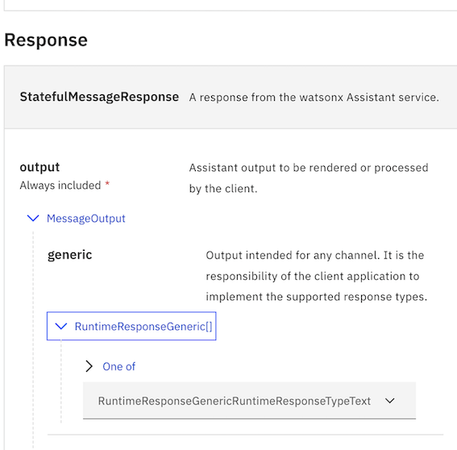

---

copyright:
  years: 2015, 2024
lastupdated: "2024-04-16"

subcollection: watson-assistant

---

{{site.data.keyword.attribute-definition-list}}

# Response types reference
{: #response-types-reference}

 You can use the JSON editor to specify responses of many different types. 
 You can use JSON editor to specify the responses to the customer query. By adding the JSON scripts in the JSON editor, your assistant uses the response format mentioned in the JSON script.

For more information, see [Defining responses with the JSON editor](/docs/watson-assistant?topic=watson-assistant-assistant-responses-json).

{: shortdesc}

 When the variables in the action and message API differ at run time, the format of response types in the action and message API also differs. The following examples show the differences in response type format when you use message API and the JSON editor.
 
If the **text** response from the message API has the following format:
> { "response_type": "text", "text": "Hello world" }

Then, the assistant displays the actual text message, `Hello world`, in a single step.

If the **text** response from the JSON action editor has the following format:
```json
{
  "generic": [
    {
      "response_type": "text",
      "values": [
        {
          "text_expression": {
            "concat": [
              {
                "scalar": "Hi, "
              },
              {
                "variable": "step_472"
              },
              {
                "scalar": ". How can I help you?"
              }
            ]
          }
        }
      ],
      "selection_policy": "sequential"
    }
  ]
}
```
Then, the assistant combines actual value of `variable` with other items in the `values` array and displays the response. For example, if `step_472` takes the value "Bob", then the assistant displays `Hi, Bob. How can I help you?`.

## Viewing the response type at the runtime
You can refer to the [API documentation for {{site.data.keyword.conversationshort}}](https://cloud.ibm.com/apidocs/assistant-v2?code=node#introduction) to view the [details of response types and the APIs](https://cloud.ibm.com/apidocs/assistant-v2?code=node#message-response){: external}.
 
 For example, to view the runtime response type, do the following:
 1. In the **Response** section, click **`MessageOutput`** in **output** to see the **generic** section.
 1. In the **`generic`** section, click **`RuntimeResponseGeneric[]`**.
 1. Select an option in the **`One of`** dropdown.

To view more details about the selected option, click **`One of`**.{: note}




The following response types are supported in the JSON editor.

## `audio`
{: #response-types-json-audio}
Plays an audio clip that is specified by a URL.

### Integration channel support
{: #response-types-json-audio-integrations}

| Web chat                          | Phone                             | SMS                               | Slack                             | Facebook                          | WhatsApp                          |
|-----------------------------------|-----------------------------------|-----------------------------------|-----------------------------------|-----------------------------------|-----------------------------------|
|  |  |  |  |  |  |

- Some channel integrations do not display audio titles or descriptions.

### Fields
{: #response-types-json-audio-fields}

| Name          | Type   | Description                        | Required? |
|---------------|--------|------------------------------------|-----------|
| response_type | string | `audio`                            | Y         |
| source        | string | The `https:` URL of the audio clip. The URL can specify either an audio file or an audio clip on a supported hosting service. | Y |
| title         | string | The title to show before the audio player.| N  |
| description   | string | The text of the description that accompanies the audio player. | N |
| alt_text      | string | Descriptive text that can be used for screen readers or other situations where the audio player cannot be seen. | N |
| channel_options.voice_telephony.loop | string | Whether the audio clip repeats indefinitely (phone integration only). | N |

The URL specified by the `source` property can be one of the following types:

- The URL of an audio file in any standard format such as MP3 or WAV. In the web chat, the linked audio clip renders as an embedded audio player.

- The URL of an audio clip on a supported streaming service. In the web chat, the linked audio clip renders by using the embeddable player for the hosting service.

    Specify the URL that you use to access the audio file in your browser (for example, `https://soundcloud.com/ibmresearchfallen-star-amped`). The web chat automatically converts the URL to an embeddable form.

    You can embed audio hosted on a supported service:
    - [SoundCloud](https://soundcloud.com){: external}
    - [Mixcloud](https://mixcloud.com){: external}

For the phone integration, the URL must specify an audio file that is single-channel (mono) and PCM-encoded, and is sampled at 8,000 Hz with 16 bits per sample.
{: note}

### Example
{: #response-types-json-audio-example}

This example plays an audio clip with a title and descriptive text.

```json
{
  "generic":[
    {
      "response_type": "audio",
      "source": "https://example.com/audio/example-file.mp3",
      "title": "Example audio file",
      "description": "An example audio clip returned as part of a multimedia response."
    }
  ]
}
```
{: codeblock}

## `button`
{: #response-types-json-button}

Show interactive buttons that help the users to complete their tasks.

### Integration channel support
{: #response-types-button-integrations}

| WebChat | 
|-----------|
|   |

### Fields
{: #response-types-json-button-fields}

| Name          | Type   | Description        | Required? |
|---------------|--------|--------------------|-----------|
| response_type | string | `button` | Y         |
| label | string | The button label | Y         |
| button_type | string | The type of button. For example, `post_back`, `custom_event`, `show_panel`, and `url`. | Y |
| kind | string | The kind of button. For example, `primary`, `secondary`, `tertiary`, `danger`, and `link`. <p>The default value is `primary`.</p> | N |
| image_url | string | The url of an image to render as a button. | N |
| alt_text | string | The alternate text to label the image for the accessibility purposes. | N |

### `post_back` button type

The `post_back` button sends a response to the assistant when the user clicks the button. You can use both the `value` and `label` properties to set up the response to send.

#### Fields

| Name          | Type   | Description        | Required? |
|---------------|--------|--------------------|-----------|
| value | object | Defines the response that WebChat sends to the {{site.data.keyword.conversationshort}} service when the user selects an option. <p>**Note:** If you do not define `value.input.text`, then the WebChat sends the value of `label` to the assistant.</p> | N |

#### Example

The following example shows the JSON configuration for a button to send an authored text input to the assistant when the user clicks the button.

```json
{
  "response_type": "button",
  "button_type": "post_back",
  "label": "Send message",
  "value": {
    "input": {
      "text": "[Message to send]"
    }
  }
}
```
{: codeblock}

### `custom_event` button type

When the user clicks the `custom_event` button, a custom event, which you configured along with the user-defined data, is triggered. You must create the event to achieve the desired behavior by using custom codes. In web chat, you can use the `messageItemCustom` event to apply the desired behavior when the user clicks the button.

#### Fields

| Name          | Type   | Description        | Required? |
|---------------|--------|--------------------|-----------|
| custom_event_name | string | The name of the custom event that is triggered when the user clicks the button. <p>In web chat, the [messageItemCustom](https://web-chat.global.assistant.watson.cloud.ibm.com/docs.html?to=api-events#messageItemCustom){: external} event is triggered when the user clicks the `custom_event` button.</p> | Y |
| user_defined | object | The user-defined data attached to the custom event. | N |

#### Example

In the following example, you use the JSON script to trigger an alert when the button is clicked.

```json
{
  "response_type": "button",
  "button_type": "custom_event",
  "label": "Alert",
  "kind": "danger",
  "custom_event_name": "trigger_alert",
  "user_defined": {
    "message": "[Alert message]"
  }
}
```
{: codeblock}

### `show_panel` button type

When a user clicks the `show_panel` button, the assistant opens a panel that the users can use to get additional information or complete a task.

#### Fields

| Name          | Type   | Description        | Required? |
|---------------|--------|--------------------|-----------|
| panel | string | An object that defines the content of the panel. | Y |
| panel.title | string | The title of the panel. | N |
| panel.show_animations | boolean | The object to enable or disable the animations in the panel when the user opens or closes it. The default value is `true` | Y |
| panel.body[] | list | A list of response types to create rich visual content. Maximum 10 response types are allowed in the list. <p>Supported response types: `text`, `image`, `video`, `audio`, `iframe`, `grid`, `card` and `user_defined`.</p> <p>**Note:** A card response type in a panel does not support buttons.</p> | Y |
| panel.footer[] | list | A list of `button` response types. Maximum 5 buttons are allowed in the list.<p>**Note:** The button type `show_panel` is not supported in this list.</p> | N |

#### Example

In the following example, you use JSON script to create a button that opens a panel for product details:

```json
{
  "response_type": "button",
  "button_type": "show_panel",
  "label": "See details",
  "kind": "secondary",
  "panel": {
    "title": "[Product name]",
    "show_animations": true,
    "body": [
      {
        "response_type": "image",
        "source": "https://example.com/image.jpg"
      },
      {
        "response_type": "text",
        "text": "[Product details]"
      }
    ]
  }
}
```
{: codeblock}

### `url` button type

When a user clicks the `url` button, the user goes to the url field to add the destination url.

#### Fields

| Name          | Type   | Description        | Required? |
|---------------|--------|--------------------|-----------|
| url | string | The destination url of the button. | Y |
| target | string | The location to open the url in the browser. For example, `_blank` or  `_self`. `_blank` opens the url in a new tab. `_self` opens the url in the same tab. <p>The default value is `_blank`.</p> | N |

#### Example

The example presents a button that takes the user to ibm.com when the button is clicked.

```json
{
  "response_type": "button",
  "button_type": "url",
  "label": "Visit ibm.com",
  "url": "https://www.ibm.com"
}
```
{: codeblock}

## `card`
{: #response-types-json-card}

Visual content to improve the information experience of users by using `card`.

### Integration channel support
{: #response-types-card-integrations}

| WebChat |
|-----------|
|   |

### Fields
{: #response-types-json-card-fields}

| Name          | Type   | Description        | Required? |
|---------------|--------|--------------------|-----------|
| response_type | string | `card` | Y         |
| body[] | list | A list of response types to create rich content. A maximum of 10 response types are allowed in the list. <p> Supported response types: `text`, `image`, `video`, `audio`, `iframe`, `grid`, and `user_defined`.</p> | Y |
| footer[] | list | A list of only `button` response types. A maximum of 5 buttons are allowed in the list. | N |

A `card` can be rendered in a panel, but it is not allowed to have buttons.

### Example
{: #response-types-json-card-example}

The following example shows the basic structure for building a `card` response type:

```json
{
  "response_type": "card",
  "body": [
    {
      "response_type": "text",
      "text": "# Heading"
    },
    {
      "response_type": "text",
      "text": "body"
    }
  ]
}
```
{: codeblock}

## `carousel`
{: #response-types-json-carousel}

A `carousel` to present cards with rich content. If there is only one card in the carousel, the web chat integration will just render the card instead of the card in a carousel.

### Integration channel support
{: #response-types-json-carousel-integrations}

| WebChat | 
|-----------|
|   |
 

### Fields
{: #response-types-json-carousel-fields}

| Name          | Type   | Description        | Required? |
|---------------|--------|--------------------|-----------|
| response_type | string | `carousel` | Y         |
| items[] | list | A list of `card` response types. A maximum of 5 cards are allowed in the list. | Y |

### Example
{: #response-types-json-carousel-example}

The following example shows the basic structure for building a `carousel` response type:

```json
{
  "response_type": "carousel",
  "items": [
    {
      "response_type": "card",
      "body": [
        {
          "response_type": "text",
          "text": "# Heading"
        },
        {
          "response_type": "text",
          "text": "body"
        }
      ]
    },
    {
      "response_type": "card",
      "body": [
        {
          "response_type": "text",
          "text": "# Heading"
        },
        {
          "response_type": "text",
          "text": "body"
        }
      ]
    }
  ]
}
```
{: codeblock}

## `channel_transfer`
{: #response-types-json-channel-transfer}

Transfers the conversation to a different channel integration. Currently, the web chat integration is the only supported target of a channel transfer.

### Integration channel support
{: #response-types-json-channel-transfer-integrations}

| Phone                              | SMS                               | Slack                             | Facebook                          | WhatsApp                          |
|------------------------------------|-----------------------------------|-----------------------------------|-----------------------------------|-----------------------------------|
|   |  |  |  |  |

- The indicated channel integrations support _initiating_ a channel transfer (currently, the web chat integration is the only supported transfer target).
- Initiating a channel transfer from the phone integration requires that the SMS integration is also configured.

### Fields
{: #response-types-json-channel-transfer-fields}

| Name          | Type   | Description        | Required? |
|---------------|--------|--------------------|-----------|
| response_type | string | `channel_transfer` | Y         |
| message_to_user | string | A message to display to the user before the link for initiating the transfer. | Y |
| transfer_info | object | Information used by an integration to transfer the conversation to a different channel. | Y |
| transfer_info.target.chat | string | URL for the website that hosts the web chat to which the conversation is transferred. | Y |

### Example
{: #response-types-json-channel-transfer-example}

This example requests a transfer from WhatsApp to the web chat. In addition to the `channel_transfer` response, the output also includes a `text` response to be displayed by the web chat integration after the transfer. The use of the `channels` array ensures that the `channel_transfer` response is handled only by the WhatsApp integration (before the transfer), and the `connect_to_agent` response only by the web chat integration (after the transfer).

```json
{
  "generic": [
    {
      "response_type": "channel_transfer",
      "channels": [
        {
          "channel": "whatsapp"
        }
      ],
      "message_to_user": "Click the link to connect with an agent using our website.",
      "transfer_info": {
        "target": {
          "chat": {
            "url": "https://example.com/webchat"
          }
        }
      }
    },
    {
      "response_type": "connect_to_agent",
      "channels": [
        {
          "channel": "chat"
        }
      ],
      "message_to_human_agent": "User asked to speak to an agent.",
      "agent_available": {
        "message": "Please wait while I connect you to an agent."
      },
      "agent_unavailable": {
        "message": "I'm sorry, but no agents are online at the moment. Please try again later."
      },
      "transfer_info": {
        "target": {
          "zendesk": {
            "department": "Payments department"
          }
        }
      }
    }
  ]
}
```
{: codeblock}

## `connect_to_agent`
{: #response-types-json-connect-to-agent}

Transfers the conversation to a live agent for help. Service desk support must be configured for the channel integration.

### Integration channel support
{: #response-types-json-connect-to-agent-integrations}

| Web chat                          | Phone                             | WhatsApp                          |
|-----------------------------------|-----------------------------------|-----------------------------------|
|  |  |  |

- For information about adding service desk support to the web chat integration, see [Adding contact center support](/docs/watson-assistant?topic=watson-assistant-deploy-web-chat-haa).
- For information about adding service desk support to the phone integration, see [Configuring backup call center support](/docs/watson-assistant?topic=watson-assistant-deploy-phone-config#deploy-phone-config-transfer-service).

### Fields
{: #response-types-json-channel-transfer-fields-2}

| Name                   | Type   | Description        | Required? |
|------------------------|--------|--------------------|-----------|
| response_type          | string | `connect_to_agent` | Y         |
| message_to_human_agent | string | A message to display to the live agent to whom the conversation is being transferred. | Y |
| agent_available        | string | A message to display to the user when agents are available.                            | Y |
| agent_unavailable      | string | A message to display to the user when no agents are available.                         | Y |
| transfer_info          | object | Information that is used by the web chat service desk integrations for routing the transfer.   | N |
| transfer_info.target.zendesk.department | string | A valid department from your Zendesk account.                         | N |
| transfer_info.target.salesforce.button_id | string | A valid button ID from your Salesforce deployment.                  | N |

### Example
{: #response-types-json-connect-to-agent-example}

This example requests a transfer to a live agent and specifies messages to be displayed both to the user and to the agent at the time of transfer.

```json
{
  "generic": [
    {
      "response_type": "connect_to_agent",
      "message_to_human_agent": "User asked to speak to an agent.",
      "agent_available": {
        "message": "Please wait while I connect you to an agent."
      },
      "agent_unavailable": {
        "message": "I'm sorry, but no agents are online at the moment. Please try again later."
      }
    }
  ]
}
```
{: codeblock}

## `date`
{: #response-types-json-date}

Use an interactive date picker that a customer can use to specify a date value.

### Integration channel support
{: #response-types-json-date-integrations}

| Web chat                          |
|-----------------------------------|
|  |

- In the web chat, the customer can specify a date value either by clicking the interactive date picker or typing a date value in the input field.

### Fields
{: #response-types-json-date-fields}

| Name          | Type   | Description        | Required? |
|---------------|--------|--------------------|-----------|
| response_type | string | `date`             | Y         |

### Example
{: #response-types-json-date-example}

This example sends a text response that asks the user to specify a date, and then shows an interactive date picker.

```json
{
  "generic": [
    {
      "response_type": "text",
      "text": "What day will you be checking in?"
    },
    {
      "response_type": "date"
    }
  ]
}
```
{: codeblock}

## `dtmf`
{: #response-types-json-dtmf}

Sends commands to the phone integration to control input or output with dual-tone multi-frequency (DTMF) signals. (DTMF is a protocol that transmits tones, which are generated when a user presses keys on a push-button phone.)

### Integration channel support
{: #response-types-json-dtmf-integrations}

| Phone                             |
|-----------------------------------|
|  |

### Fields
{: #response-types-json-dtmf-fields}

| Name          | Type   | Description        | Required? |
|---------------|--------|--------------------|-----------|
| response_type | string | `dtmf`             | Y         |
| command_info  | object | Information specifying the DTMF command to send to the phone integration. | Y |
| command_info.type | string | The DTMF command to send (`collect`, `disable_barge_in`, `enable_barge_in`, or `send`). | Y |
| command_info.parameters | object | See [Handling phone interactions](/docs/watson-assistant?topic=watson-assistant-phone-actions). | N |

The `command_info.type` field can specify any of the following supported commands:

- `collect`: Collects DTMF keypad input.
- `disable_barge_in`: Disables DTMF barge-in so that playback from the phone integration is not interrupted when the customer presses a key.
- `enable_barge_in`: Enables DTMF barge-in so that the customer can interrupt playback from the phone integration by pressing a key.
- `send`: Sends DTMF signals.

For detailed information about how to use each of these commands, see [Handling phone interactions](/docs/watson-assistant?topic=watson-assistant-phone-actions).

### Example

This example shows the `dtmf` response type with the `collect` command, used to collect DTMF input. For more information, see [Handling phone interactions](/docs/watson-assistant?topic=watson-assistant-phone-actions).

```json
{
  "generic": [
    {
      "response_type": "dtmf",
      "command_info": {
        "type": "collect",
        "parameters": {
          "termination_key": "#",
          "count": 16,
          "ignore_speech": true
        }
      },
      "channels": [
        {
          "channel": "voice_telephony"
        }
      ]
    }
  ]
}
```
{: codeblock}

## `end_session`
{: #response-types-json-end-session}

Sends a command to the channel that ends the session. This response type instructs the phone integration to hang up the call.

### Integration channel support
{: #response-types-json-end-session-integrations}

| Phone                             | SMS                               |
|-----------------------------------|-----------------------------------|
|  |                                   |

- The SMS integration supports ending a session by using the `terminateSession` action command. 

### Fields
{: #response-types-json-end-session-fields}

| Name          | Type   | Description        | Required? |
|---------------|--------|--------------------|-----------|
| response_type | string | `end_session`      | Y         |

For the phone integration, you can use the `channel_options` object to include custom headers with the SIP `BYE` request that is generated. For more information, see [End the call](/docs/watson-assistant?topic=watson-assistant-phone-actions#phone-actions-hangup).

### Example

This example uses the `end_session` response type to end a conversation.

```json
{
  "generic": [
    {
      "response_type": "end_session"
    }
  ]
}
```
{: codeblock}

## `grid`
{: #response-types-json-grid}

Gives you the flexibility to create the layout you need to present content that conveys the type of information you want users to consume.

### Integration channel support
{: #response-types-json-grid-integrations}

| WebChat |
|-----------|
|   |

### Fields
{: #response-types-json-grid-fields}

| Name                                        | Type   | Description                        | Required? |
|---------------------------------------------|--------|------------------------------------|-----------|
| response_type                               | string | `grid`                             |     Y     |
| horizontal_alignment                        | string | The horizontal alignment for all items in the grid (`left`, `center`, or `right`). <p>The default value is `left`.</p> | N |
| vertical_alignment                          | string | The vertical alignment for all items in the grid (`top`, `center`,  or `bottom`). <p>The default values is `top`.</p> | N |
| columns[]                                   | list   | The list of columns. A maximum of 5 columns are allowed in the list. Each column is separated by 8px of space. | N |
| columns[].width                             | string | The width of the column. You can set the value of width by using number (for example, `1`) or pixel (for example, `48 px`). <p>The number value of a column width is calculated based on the total width of the row and the width of other columns in the row. For example, if the width of the first column is `1` and the width of the second column is 2, then the first column and the second column takes one-third and two-thirds of the total width of the row respectively.</p> <p>By default, the number value of width is `1`.</p> | Y |
| rows[]                                      | list   | The list of rows. Maximum 5 rows are allowed in the list. Each row is separated by 8px of space. | Y |
| rows[].cells[]                              | list   | The list of cells in a row. Each cell is a column in a row (for example, cell 1 is column 1 in a row). The width of the cell is equal to width of the column. | Y |
| rows[].cells[].items[]                      | list   | A list of response-type items. Each item is separated by 8px of space. Maximum 5 response-type items are allowed in the list. <p>Supported response-type items are `text`, `image`, `vdeo`, `audio`, `iframe`, `grid`, and `user_defined`.</p> You can set up a `grid` only within a `grid` and below the first level. <br>A `grid` in a cell cannot contain a grid response type.{: note} | Y |
| rows[].cells[].horizontal_alignment         | string | The horizontal alignment for items in the cell (`left`, `center`, or `right`). <p>The default value is `left`.</p> | N |
| rows[].cells[].vertical_alignment           | string | The vertical alignment for items in the cell (`top`, `center`,  or `bottom`). <p>The default values is `top`.</p> | N |

### Example
{: #response-types-json-grid-example}

The following example shows the basic structure for building a `grid` response type:

```json
{
  "response_type": "grid",
  "columns": [
    {
      "width": "1"
    },
    {
      "width": "1"
    }
  ],
  "rows": [
    {
      "cells": [
        {
          "items": [
            {
              "response_type": "text",
              "text": "row 1 cell 1"
            }
          ]
        },
        {
          "items": [
            {
              "response_type": "text",
              "text": "row 1 cell 2"
            }
          ]
        }
      ]
    },
    {
      "cells": [
        {
          "items": [
            {
              "response_type": "text",
              "text": "row 2 cell 1"
            }
          ]
        },
        {
          "items": [
            {
              "response_type": "text",
              "text": "row 2 cell 2"
            }
          ]
        }
      ]
    }
  ]
}
```
{: codeblock}

## `iframe`
{: #response-types-json-iframe}

Embeds content from an external website as an HTML `iframe` element.

### Integration channel support
{: #response-types-json-iframe-integrations}

| Web chat                          | Facebook                          |
|-----------------------------------|-----------------------------------|
|  |  |

- Currently, the web chat integration ignores the `description` and `image_url` properties. Instead, the description and preview image are dynamically retrieved from the source at run time.

### Fields
{: #response-types-json-iframe-fields}

| Name                                        | Type   | Description                        | Required? |
|---------------------------------------------|--------|------------------------------------|-----------|
| response_type                               | string | `iframe`                           | Y         |
| source                                      | string | The URL of the external content. The URL must specify content that is embeddable in an HTML `iframe` element. | Y |
| title                                       | string | The title to show before the embedded content. | N |
| description                                 | string | The text of the description that accompanies the embedded content. | N |
| image_url                                   | string | The URL of an image that shows a preview of the embedded content. | N |
| channel_options.chat.display                | string | The way web chat renders the response type (`inline` or `panel`). The default value is `panel` for this response type. | N |
| channel_options.chat.dimensions.base_height | number | The base height (in pixels) to use to scale the content to a specific display size. This property works only when `display` is set to `inline`. | N |

Different sites have varying restrictions for embedding content, and different processes for generating embeddable URLs. An embeddable URL is one that can be specified as the value of the `src` attribute of the `iframe` element.
 
For example, to embed an interactive map with Google Maps, you can use the Google Maps Embed API. (For more information, see [The Maps Embed API overview](https://developers.google.com/maps/documentation/embed/get-started){: external}.) Other sites have different processes for creating embeddable content.

For technical details about using `Content-Security-Policy: frame-src` to allow embedding of your website content, see [CSP: frame-src](https://developer.mozilla.org/en-US/docs/Web/HTTP/Headers/Content-Security-Policy/frame-src){: external}.

### Example
{: #response-types-json-iframe-example}

The following example embeds an iframe with a title and description.

```json
{
  "generic":[
    {
      "response_type": "iframe",
      "source": "https://example.com/embeddable/example",
      "title": "Example iframe",
      "description": "An example of embeddable content returned as an iframe response.",
      "channel_options": {
        "chat": {
          "display": "inline",
          "base_height": 180
        }
      }
    }
  ]
}
```
{: codeblock}

## `image`
{: #response-types-json-image}

Displays an image that is specified by a URL.

### Integration channel support
{: #response-types-json-image-integrations}

| Web chat                          | SMS                               | Slack                             | Facebook                          | WhatsApp                          | MS Teams                          |
|-----------------------------------|-----------------------------------|-----------------------------------|-----------------------------------|-----------------------------------|-----------------------------------|
|  |  |  |  |  | |

- Some channel integrations do not display image titles or descriptions.

### Fields
{: #response-types-json-image-fields}

| Name          | Type   | Description                        | Required? |
|---------------|--------|------------------------------------|-----------|
| response_type | string | `image`                            | Y         |
| source        | string | The `https:` URL of the image. The specified image must be in `.jpg`, `.gif`, or `.png` format. | Y |
| title         | string | The title to show before the image. | N        |
| description   | string | The text of the description that accompanies the image. | N |
| alt_text      | string | Descriptive text that can be used for screen readers or other situations where the image cannot be seen. | N |

### Example
{: #response-types-json-image-example}

This example displays an image with a title and descriptive text.

```json
{
  "generic":[
    {
      "response_type": "image",
      "source": "https://example.com/image.jpg",
      "title": "Example image",
      "description": "An example image returned as part of a multimedia response."
    }
  ]
}
```
{: codeblock}

## `option`
{: #response-types-json-option}

Use to show a set of options (such as buttons or a drop-down list) that users can choose from. The selected value is then sent to the assistant as user input. An `options` response is automatically defined when you choose the **Options** customer response type for a step. For more information, see [Collecting information from your customers](/docs/watson-assistant?topic=watson-assistant-collect-info).

### Integration channel support
{: #response-types-json-option-integrations}

| Web chat                          | Phone                             | SMS                               | Slack                             | Facebook                          | WhatsApp                          | MS Teams                          |
|-----------------------------------|-----------------------------------|-----------------------------------|-----------------------------------|-----------------------------------|-----------------------------------|-----------------------------------|
|  |  |  |  |  |  |  |

- How options are presented varies by channel integration. The `preference` field is supported when possible, but not all channels support drop-down lists or buttons.

### Fields
{: #response-types-json-option-fields}

| Name          | Type   | Description                         | Required? |
|---------------|--------|-------------------------------------|-----------|
| response_type | string | `option`                            | Y         |
| title         | string | The title to show before the options. | Y       |
| description   | string | The text of the description that accompanies the options. | N |
| preference    | string | The preferred type of control to display, if supported by the channel (`dropdown` or `button`). | N |
| options       | list   | A list of key-value pairs that specify options from which a user can choose. | Y |
| options[].label | string | The user-facing label for the option. | Y     |
| options[].value | object | An object that defines the response that is sent to the {{site.data.keyword.conversationshort}} service if the user selects the option. | Y |
| options[].value.input | object | An object that includes the message input corresponding to the option, including input text and any other field that is a valid part of a {{site.data.keyword.conversationshort}} message. For more information, see the [API Reference](https://{DomainName}/assistant/assistant-v2?curl=#message){: external}. | N |

### Example
{: #response-types-json-option-example}

This example presents two options (`Buy something` and `Exit`).

```json
{
  "generic":[
    {
      "response_type": "option",
      "title": "Choose from the following options:",
      "preference": "button",
      "options": [
        {
          "label": "Buy something",
          "value": {
            "input": {
              "text": "Place order"
            }
          }
        },
        {
          "label": "Exit",
          "value": {
            "input": {
              "text": "Exit"
            }
          }
        }
      ]
    }
  ]
}
```
{: codeblock}

## `pause`
{: #response-types-json-pause}

Pauses before the next message to the channel, and optionally sends a "user is typing" event (for channels that support it).

### Integration channel support
{: #response-types-json-pause-integrations}

| Web chat                          | Facebook                          | WhatsApp                          |
|-----------------------------------|-----------------------------------|-----------------------------------|
|  |  |  |

- With the phone integration, you can add a pause by including the SSML `break` element in the assistant output. For more information, see the [{{site.data.keyword.texttospeechshort}} documentation](/docs/text-to-speech?topic=text-to-speech-elements#break_element){: external}.

### Fields
{: #response-types-json-pause-fields}

| Name          | Type   | Description        | Required? |
|---------------|--------|--------------------|-----------|
| response_type | string | `pause`            | Y         |
| time          | int    | How long to pause, in milliseconds. | Y |
| typing        | Boolean | Whether to send the "user is typing" event during the pause. Ignored if the channel does not support this event. | N |

### Example
{: #response-types-json-pause-example}

This example sends the "user is typing" event and pauses for 5 seconds.

```json
{
  "output": {
    "generic":[
      {
        "response_type": "pause",
        "time": 5000,
        "typing": true
      }
    ]
  }
}
```
{: codeblock}


## `speech_to_text`
{: #response-types-json-speech-to-text}

Sends a command to the {{site.data.keyword.speechtotextshort}} service instance used by the phone integration. These commands can dynamically change the configuration or behavior of the service during a conversation.

### Integration channel support
{: #response-types-json-speech-to-text-integrations}

| Phone                             |
|-----------------------------------|
|  |

### Fields
{: #response-types-json-speech-to-text-fields}

| Name          | Type   | Description        | Required? |
|---------------|--------|--------------------|-----------|
| response_type | string | `speech_to_text`   | Y         |
| command_info  | object | Information specifying the command to send to the {{site.data.keyword.speechtotextshort}}. | Y |
| command_info.type | string | The command to send (currently only the `configure` command is supported). | Y |
| command_info.parameters | object | See [Applying advanced settings to the {{site.data.keyword.speechtotextshort}} service](/docs/watson-assistant?topic=watson-assistant-phone-actions#phone-actions-speech-advanced) | N |

The `command_info.type` field can specify any of the following supported commands:

- `configure`: Dynamically updates the {{site.data.keyword.speechtotextshort}} configuration. Configuration changes can be applied only to the next conversation turn, or for the rest of the session.

For information about how to use this command, see [Applying advanced settings to the {{site.data.keyword.speechtotextshort}} service](/docs/watson-assistant?topic=watson-assistant-phone-actions#phone-actions-speech-advanced).

### Example

This example uses the `speech_to_text` response type with the `configure` command to change the language model from the {{site.data.keyword.speechtotextshort}} service to Spanish, and to enable smart formatting.

```json
{
  "generic": [
    {
      "response_type": "speech_to_text",
      "command_info": {
        "type": "configure",
        "parameters": {
          "narrowband_recognize": {
            "model": "es-ES_NarrowbandModel",
            "smart_formatting": true
          }
        }
      },
      "channels":[
        {
          "channel": "voice_telephony"
        }
      ]
    }
  ]
}
```
{: codeblock}

## `start_activities`
{: #response-types-json-start-activities}

Sends a command to a channel integration to start one or more activities that are specific to that channel. You can use this response type to restart any activity you previously stopped with the `stop_activities` response type.

### Integration channel support
{: #response-types-json-start-activities-integrations}

| Phone                             |
|-----------------------------------|
|  |

### Fields
{: #response-types-json-start-activities-fields}

| Name          | Type   | Description        | Required? |
|---------------|--------|--------------------|-----------|
| response_type | string | `start_activities` | Y         |
| activities    | list   | A list of objects that identify the activities to start. | Y |
| activities[].type | string | The name of the activity to start. | Y |

Currently, the following activities for the phone integration can be started:

- `speech_to_text_recognition`: Recognizes speech. Streaming audio to the {{site.data.keyword.speechtotextshort}} service is resumed.
- `dtmf_collection`: Processes inbound DTMF signals.

### Example

This example uses the `start_activities` response type to restart recognizing speech. Because this command is specific to the phone integration, the `channels` property specifies `voice_telephony` only.

```json
{
  "generic": [
    {
      "response_type": "start_activities",
      "activities": [
        {
          "type": "speech_to_text_recognition"
        }
      ],
      "channels":[
        {
          "channel": "voice_telephony"
        }
      ]
    }
  ]
}
```
{: codeblock}

## `stop_activities`
{: #response-types-json-stop-activities}

Sends a command to a channel integration to stop one or more activities that are specific to that channel. The activities remain stopped until they are restarted with the `start_activities` response type.

### Integration channel support
{: #response-types-json-stop-activities-integrations}

| Phone                             |
|-----------------------------------|
|  |

### Fields
{: #response-types-json-stop-activities-fields}

| Name          | Type   | Description        | Required? |
|---------------|--------|--------------------|-----------|
| response_type | string | `stop_activities`  | Y         |
| activities    | list   | A list of objects that identify the activities to stop. | Y |
| activities[].type | string | The name of the activity to stop. | Y |

Currently, the following activities for the phone integration can be stopped:

- `speech_to_text_recognition`: Stops recognizing speech. All streaming audio to the {{site.data.keyword.speechtotextshort}} service is stopped.
- `dtmf_collection`: Stops processing of inbound DTMF signals.

### Example

This example uses the `stop_activities` response type to stop recognizing speech. Because this command is specific to the phone integration, the `channels` property specifies `voice_telephony` only.

```json
{
  "generic": [
    {
      "response_type": "stop_activities",
      "activities": [
        {
          "type": "speech_to_text_recognition"
        }
      ],
      "channels":[
        {
          "channel":"voice_telephony"
        }
      ]
    }
  ]
}
```
{: codeblock}

## `text`
{: #response-types-json-text}

Displays text (or reads it aloud, for the phone integration). To add variety, you can specify multiple alternative text responses. If you specify multiple responses, you can choose to rotate sequentially through the list, choose a response randomly, or output all specified responses.

### Integration channel support
{: #response-types-json-text-integrations}

| Web chat                          | Phone                             | SMS                               | Slack                             | Facebook                          | WhatsApp                          |
|-----------------------------------|-----------------------------------|-----------------------------------|-----------------------------------|-----------------------------------|-----------------------------------|
|  |  |  |  |  |  |

### Fields
{: #response-types-json-text-fields}

| Name          | Type   | Description        | Required? |
|---------------|--------|--------------------|-----------|
| response_type | string | `text`             | Y         |
| values        | list   | A list of one or more objects that define a text response. | Y |
| values.[_n_].text_expression | object | An object that describes the text of the response. | N |
| values.[_n_].text_expression.concat | list | A list of objects that form components of the text response. These objects can include scalar text strings and references to variables. | N |
| selection_policy | string | How a response is selected from the list, if more than one response is specified. The possible values are `sequential`, `random`, and `multiline`. | N |
| delimiter     | string | The delimiter to output as a separator between responses. Used only when `selection_policy`=`multiline`. The default delimiter is newline (`\n`). | N |

### Example
{: #response-types-json-text-example}

This example displays a greeting message to the user.

```json
{
  "generic": [
    {
      "response_type": "text",
      "values": [
        {
          "text_expression": {
            "concat": [
              {
                "scalar": "Hi, "
              },
              {
                "variable": "step_472"
              },
              {
                "scalar": ". How can I help you?"
              }
            ]
          }
        }
      ],
      "selection_policy": "sequential"
    }
  ]
}  
```
{: codeblock}

## `text_to_speech`
{: #response-types-json-text-to-speech}

Sends a command to the {{site.data.keyword.texttospeechshort}} service instance used by the phone integration. These commands can dynamically change the configuration or behavior of the service during a conversation.

### Integration channel support
{: #response-types-json-text-to-speech-integrations}

| Phone                             |
|-----------------------------------|
|  |

### Fields
{: #response-types-json-text-to-speech-fields}

| Name          | Type   | Description        | Required? |
|---------------|--------|--------------------|-----------|
| response_type | string | `text_to_speech`   | Y         |
| command_info  | object | Information specifying the command to send to the {{site.data.keyword.texttospeechshort}}. | Y |
| command_info.type | string | The command to send (`configure`, `disable_barge_in`, or `enable_barge_in`). | Y |
| command_info.parameters | object | See [Applying advanced settings to the {{site.data.keyword.texttospeechshort}} service](/docs/watson-assistant?topic=watson-assistant-phone-actions#phone-actions-text-advanced) | N |

The `command_info.type` field can specify any of the following supported commands:

- `configure`: Dynamically updates the {{site.data.keyword.texttospeechshort}} configuration. Configuration changes can be applied only to the next conversation turn, or for the rest of the session.
- `disable_barge_in`: Disables speech barge-in so that playback from the phone integration is not interrupted when the customer speaks.
- `enable_barge_in`: Enables speech barge-in so that the customer can interrupt playback from the phone integration by speaking.

For detailed information about how to use each of these commands, see [Applying advanced settings to the {{site.data.keyword.texttospeechshort}} service](/docs/watson-assistant?topic=watson-assistant-phone-actions#phone-actions-text-advanced).

### Example

This example uses the `text_to_speech` response type with the `configure` command to change the voice used by the {{site.data.keyword.texttospeechshort}} service.

```json
{
  "generic": [
    {
      "response_type": "text_to_speech",
      "command_info": {
        "type": "configure",
        "parameters" : {
          "synthesize": {
            "voice": "en-US_LisaVoice"
          }          
        }
      },
      "channels":[
        {
          "channel": "voice_telephony"
        }
      ]
    }
  ]
}
```
{: codeblock}

## `user_defined`
{: #response-types-json-user-defined}

A custom response type with any JSON data that the client or integration knows how to handle. For example, you might customize the web chat to display a special card, or build a custom application to format responses with a table or chart.

The user-defined response type is not displayed unless the channel has code to handle it. For more information, see [Applying advanced customizations](/docs/watson-assistant?topic=watson-assistant-web-chat-config).
{: note}

### Integration channel support
{: #response-types-json-user-defined-integrations}

| Web chat                          | Phone                             | SMS                               | Slack                             | Facebook                          | WhatsApp                          |
|-----------------------------------|-----------------------------------|-----------------------------------|-----------------------------------|-----------------------------------|-----------------------------------|
|  | *| *|  |  |  |

- With the phone integration, the `user_defined` response type is used to send legacy commands (for example, `vgwActForceNoInputTurn` or `vgwActSendSMS`). For more information, see [Handling phone interactions](/docs/watson-assistant?topic=watson-assistant-phone-actions).
- With the SMS integration, the `user_defined` response type is used to send action commands (for example, `terminateSession` or `smsActSendMedia`). 

### Fields
{: #response-types-json-user-defined-fields}

| Name          | Type   | Description        | Required? |
|---------------|--------|--------------------|-----------|
| response_type | string | `user_defined`     | Y         |
| user_defined  | object | An object that contains any data the client or integration knows how to handle. This object can contain any valid JSON data, but it cannot exceed a total size of 5000 bytes. | Y |

### Example
{: #response-types-json-user-defined-example}

This example shows a generic example of a user-defined response. The `user_defined` object can contain any valid JSON data.

```json
{
  "generic":[
    {
      "response_type": "user_defined",
      "user_defined": {
        "field_1": "String value",
        "array_1": [
          1,
          2
        ],
        "object_1": {
          "property_1": "Another string value"
        }
      }
    }
  ]
}
```
{: codeblock}

## `video`
{: #response-types-json-video}

Displays a video that is specified by a URL.

### Integration channel support
{: #response-types-json-video-integrations}

| Web chat                          | SMS                               | Slack                             | Facebook                          | WhatsApp                          |
|-----------------------------------|-----------------------------------|-----------------------------------|-----------------------------------|-----------------------------------|
|  |  |  |  |  |

- Some channel integrations do not display video titles or descriptions.

### Fields
{: #response-types-json-video-fields}

| Name          | Type   | Description                        | Required? |
|---------------|--------|------------------------------------|-----------|
| response_type | string | `video`                            | Y         |
| source        | string | The `https:` URL of the video. The URL can specify a video file or a streaming video on a supported hosting service. | Y |
| title         | string | The title to show before the video.| N         |
| description   | string | The text of the description that accompanies the video. | N |
| alt_text      | string | Descriptive text that can be used for screen readers or other situations where the video cannot be seen. | N |
| channel_options.chat.dimensions.base_height | number | The base height (in pixels) to use to scale the video to a specific display size. | N |

The URL specified with the `source` property can be one of the following types:

- The URL of a video file in a standard format such as MPEG or AVI. In the web chat, the linked video renders as an embedded video player.

    HLS (`.m3u8`) and DASH (MPD) streaming videos are not supported.

- The URL of a video from a supported service. In the web chat, the linked video renders with the embeddable player for the hosting service.

    Specify the URL of the video that you want to view in your browser (for example, `https://www.youtube.com/watch?v=52bpMKVigGU`). The web chat automatically converts the URL to an embeddable form.

    You can embed videos from the following services:
    - [YouTube](https://youtube.com){: external}
    - [Facebook](https://facebook.com){: external}
    - [Vimeo](https://vimeo.com){: external}
    - [Twitch](https://twitch.tv){: external}
    - [Streamable](https://streamable.com){: external}
    - [Wistia](https://wistia.com){: external}
    - [Vidyard](https://vidyard.com){: external}

### Example
{: #response-types-json-video-example}

This example displays a video with a title and descriptive text.

```json
{
  "generic":[
    {
      "response_type": "video",
      "source": "https://example.com/videos/example-video.mp4",
      "title": "Example video",
      "description": "An example video returned as part of a multimedia response."
    }
  ]
}
```
{: codeblock}

