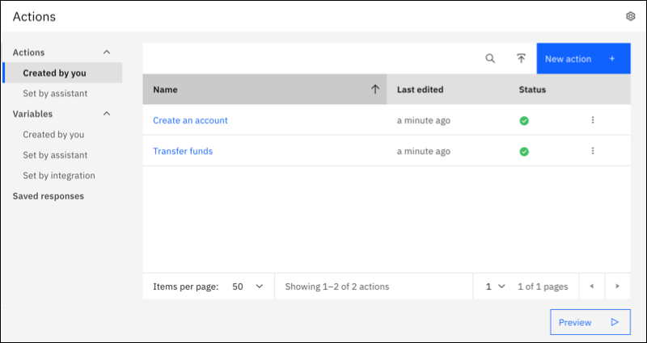
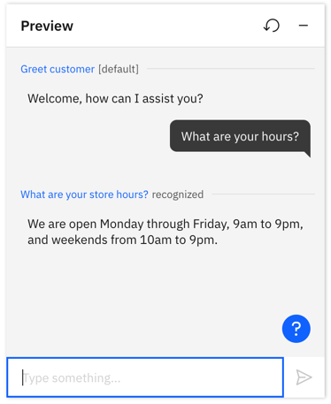
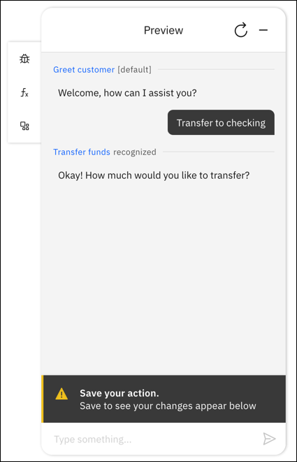
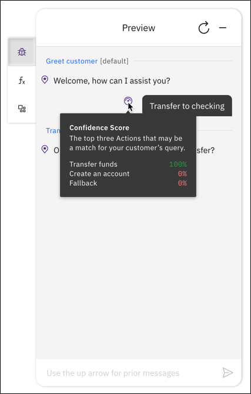
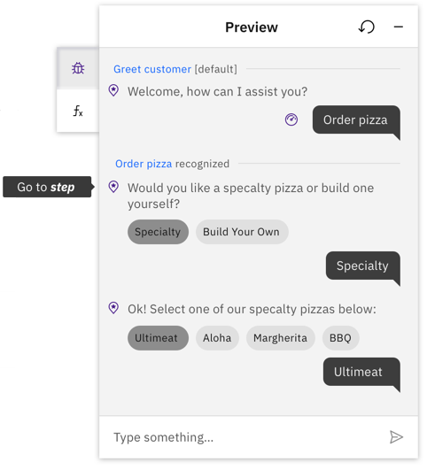

---

copyright:
  years: 2021
lastupdated: "2022-08-17"

subcollection: watson-assistant

---

{:shortdesc: .shortdesc}
{:new_window: target="_blank"}
{:external: target="_blank" .external}
{:deprecated: .deprecated}
{:important: .important}
{:note: .note}
{:tip: .tip}
{:pre: .pre}
{:codeblock: .codeblock}
{:screen: .screen}
{:javascript: .ph data-hd-programlang='javascript'}
{:java: .ph data-hd-programlang='java'}
{:python: .ph data-hd-programlang='python'}
{:swift: .ph data-hd-programlang='swift'}

{{site.data.content.classiclink}}

# Reviewing and debugging your actions
{: #review}

In this topic, learn how to test the conversation you have built into an action, to experience what your users see with your assistant. If there are any issues, learn how to debug the user’s experience.

## Using Preview to test your action
{: #review-test}

As you make changes, test the action at any time to see whether the resulting interaction works as intended. **Preview**, which is a button on every action page, shows you what customers see if they interact with the action using web chat.

Before testing your action, make sure you have saved any new changes, and wait until the system has finished training. If the system is still training, a message is displayed that says so.
{: note}

1.  Click **Preview**. The Greet customer action starts.

1.  In the chat window, type some text and then press Enter.

1.  Check the response to see if your assistant correctly interpreted the input, started the intended action, and performed the appropriate step.

    The Preview pane names the action that was recognized in the input. 

    
    
    If the assistant doesn't understand a phrase, you'll see the built-in action `No action matches`.

1.  Continue to converse with your assistant to see how the conversation flows.

1.  To remove prior test utterances from the chat pane and start over, click the **Reset** icon. Not only are the test utterances and responses removed, but this action also clears the values of any variables that were set as a result of your previous interactions.

Queries you submit through the Preview pane generate `/message` API calls, but they are not logged and do not incur charges.
{: note}

### Saving changes before testing
{: #review-save}

**Preview** represents updates from the last time the assistant was saved. 

Changes are saved when you:
-   Select the save icon
-   Click on a new step
-   Open Preview
-   Reset Preview

To learn more about saving changes, see [Saving your work](/docs/watson-assistant?topic=watson-assistant-save-work).

If you make several edits without saving, the preview panel shows a message that you need to save before testing your changes. 

## Using debug mode in Preview
{: #review-debug}

Preview has a debug mode you can turn on to see information that helps you understand why the assistant responds or doesn't respond to a particular input.

Debug mode has four tools to analyze your action:

-   [Start and end of an action](#review-debug-start-end)
-   [Confidence scores](#review-debug-confidence)
-   [Step locator](#review-debug-step-locator)
-   [Follow along](#review-debug-follow-along)

### Start and end of an action
{: #review-debug-start-end}

The assistant marks the spots in the conversation when a customer enters an input that fits within an action. The assistant also marks when an action completes, and how it completes. 

Completion options include ending:
-   With an end step
-   Without an end step
-   With a human agent escalation
-   With a search to a knowledge base

### Action confidence score
{: #review-debug-confidence}

Every input you enter that can start a new action/conversation topic shows a confidence score icon. Hover over this icon to see a list of actions with different confidence scores.

These scores represent the assistant’s confidence that the sentence or phrase you entered can be solved by the steps built into a specific action.

The top score in green represents the action with the highest confidence and the one the assistant used.

The remaining two are actions that were considered because of their confidence score, but weren't used because thee cofidence scores were lower.

If no action scores higher than 20% confidence, you'll see the built-in action `No action matches`.

### Step locator
{: #review-debug-step-locator}

Sometimes you may find an error in the middle of a test conversation, and need to find which step and action is involved. A locator icon next to each assistant response lets you find the associated steps in the editor.

Click the icon, and the editor shows the corresponding step in the background.

### Follow along
{: #review-debug-follow-along}

**Follow along** connects what you are seeing in Preview with what you have built in the action. As you interact with your assistant, the debug mode automatically opens each step in the background. That means you can fix an error as soon as you see it, because the editor is already open to the corresponding step.

## Variable values
{: #review-variable-values}

Click **Variable values** to see the values stored in each variable during the conversation. The **Variable values** pane has two tabs, one for action variables and one for session variables. As you test your conversation in Preview, you can check that each variable is set correctly.

To learn more about variables, see [Managing information during the conversation](/docs/watson-assistant?topic=watson-assistant-manage-info).
