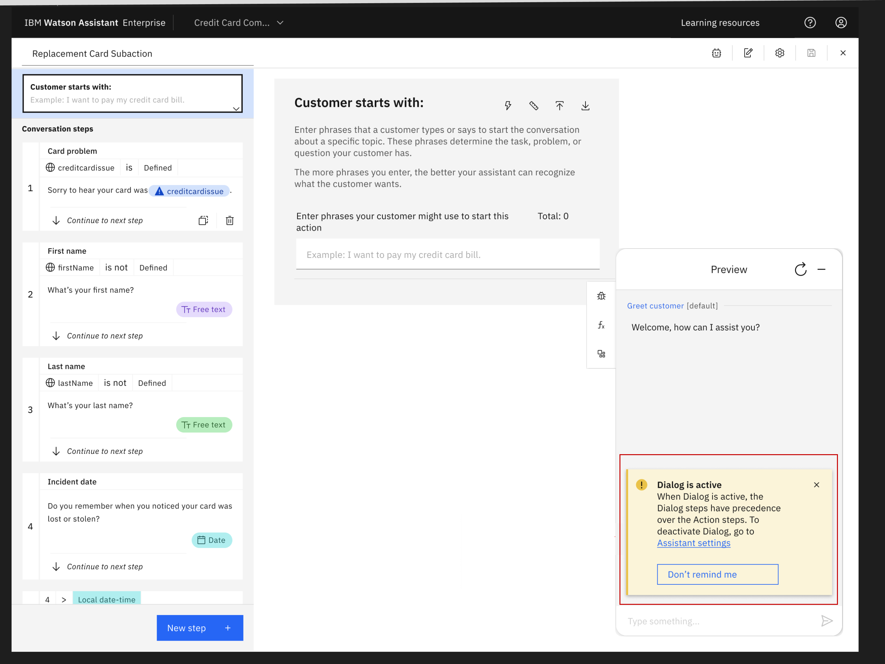
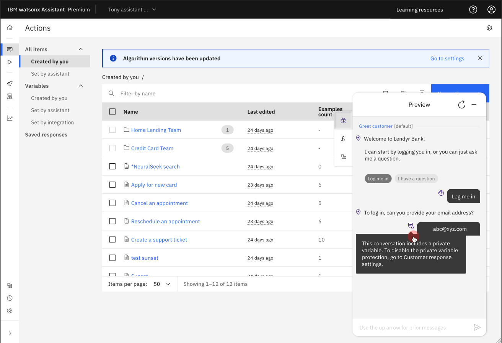
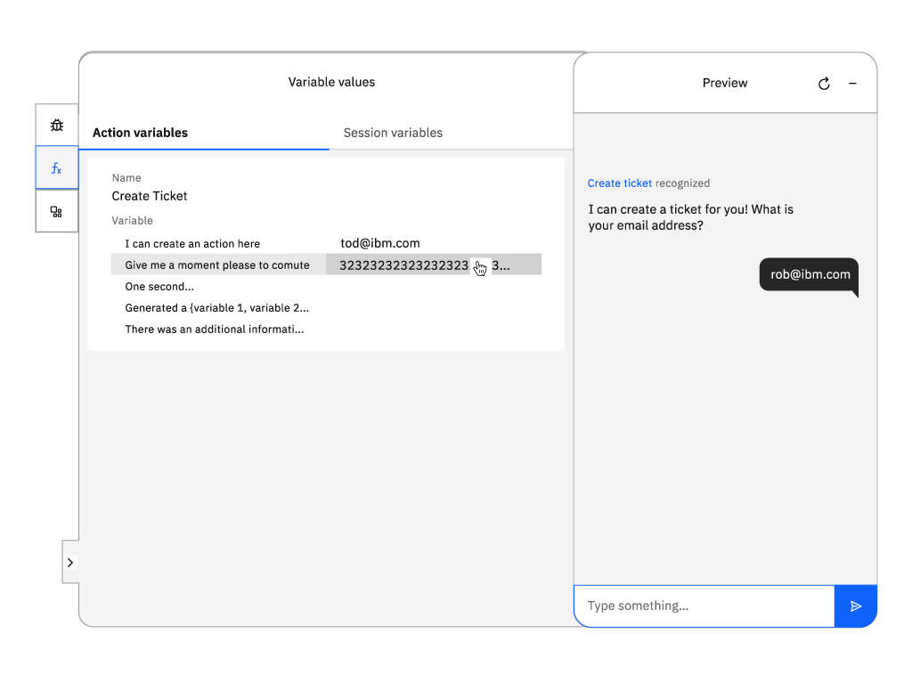
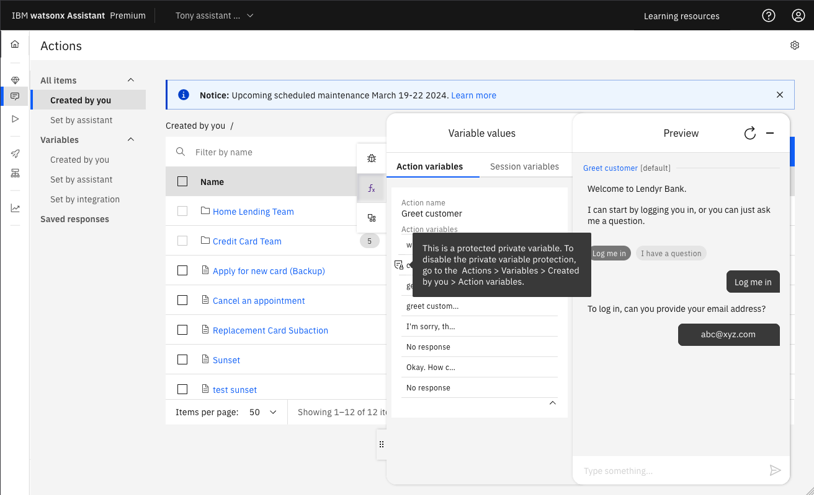
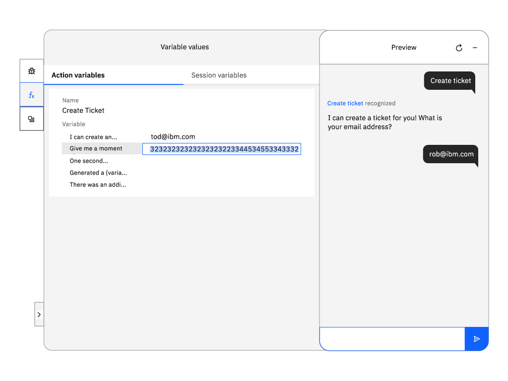
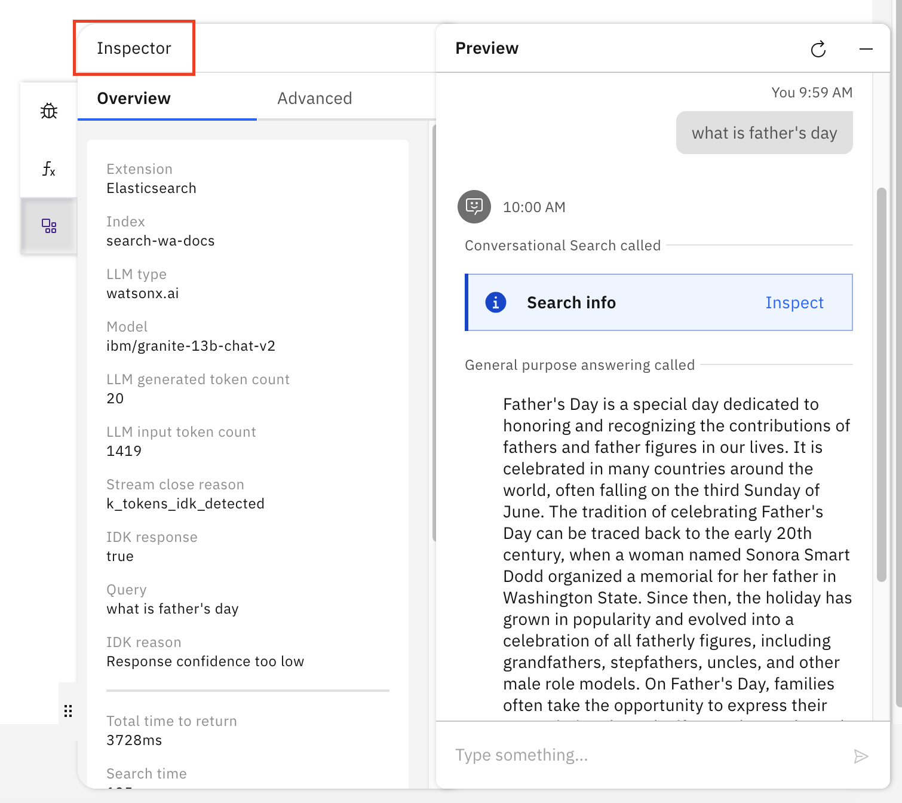

---

copyright:
  years: 2021, 2024
lastupdated: "2024-06-27"

subcollection: watson-assistant

---

{{site.data.keyword.attribute-definition-list}}

# Reviewing and debugging your actions
{: #review}

Learn how to test the conversation you built into an action to experience what your users see with your assistant. If there are any issues, learn how to debug the user experience.

## Using Preview to test your action
{: #review-test}

You can test the action at any time to see whether the resulting interaction works as intended. The **Preview** in the action pages, shows you what customers see when they use web chat to interact with this action.

Before you test your action, make sure you save any new changes, and wait until the system finishes training. If the system is still training, a message is displayed that says so.
{: note}

1.  Click **Preview**. The Greet customer action starts.

1.  In the chat window, type some text and then press Enter.

1.  Check the response to see if your assistant correctly interpreted the input, started the intended action, and performed the appropriate step.

    The Preview pane names the action that was recognized in the input. 

    {: caption="Preview" caption-side="bottom"}
    
    If the assistant doesn't understand a phrase, you see the built-in action `No action matches`.

1.  Continue to converse with your assistant to see how the conversation flows.

1.  To remove prior test utterances from the chat pane and start over, click the **Reset** icon. Not only are the test utterances and responses removed, but this action also clears the values of any variables that were set as a result of your previous interactions.

Queries that you submit through the Preview pane generate `/message` API calls, but they are not logged and do not incur charges.
{: note}

## Using Preview to test your action with dialog activated
{: #review-test-action-dialog-activated}

In the action editor, if dialog is activated, the preview panel shows an error message:

Click **Don’t remind me** to hide the notification until you turns off and then on dialog.

### Saving changes before testing
{: #review-save}

**Preview** represents updates from the last time that the assistant was saved. 

Changes are saved when you:
-   Select the save icon
-   Click a new step
-   Open Preview
-   Reset Preview

To learn more about saving changes, see [Saving your actions](/docs/watson-assistant?topic=watson-assistant-save-actions).

If you make several edits without saving, the preview pane shows a message that you need to save before you test your changes. 

{: caption="Save your action" caption-side="bottom"}

## Using debug mode in Preview
{: #review-debug}

The **Preview** menu has **Debug mode** that you can turn on to see information related to why the assistant responds or doesn't respond to a particular input.

In **debug mode**, you can identify a conversation that includes a private variable by using the **toggle-tip** icon ().

To disable the private variable protection, go to **Customer response settings** in the **Editor** tab inside an action step.{: tip}

{: caption="Private variable in debug mode" caption-side="bottom"}

**Debug mode** has four tools to analyze your action:

-   [Start and end of an action](#review-debug-start-end)
-   [Confidence scores](#review-debug-confidence)
-   [Step locator](#review-debug-step-locator)
-   [Follow along](#review-debug-follow-along)

### Start and end of an action
{: #review-debug-start-end}

The assistant marks the spots in the conversation when a customer enters an input that fits within an action. The assistant also marks when an action completes, and how it completes. 

Completion options include ending:
-   With an end step
-   Without an end step
-   With a human agent escalation
-   With a search to a knowledge base

### Action confidence score
{: #review-debug-confidence}

Every input that you enter can start a new topic to show a **confidence score** icon. Hover over the **confidence score** icon to see a list of actions with different confidence scores.

The confidence scores represent the assistant’s confidence that the sentence or phrase that you entered can be solved by the steps that are built into a specific action.

{: caption="Debug mode" caption-side="bottom"}

The top score in green represents the action with the highest confidence and the one the assistant used.

The remaining two are actions that were considered because of their confidence score, but weren't used because the confidence scores were lower.

If no action scores higher than 20% confidence, you see the built-in action `No action matches`.

### Step locator
{: #review-debug-step-locator}

Sometimes you might find an error in the middle of a test conversation, and need to find which step and action is involved. A locator icon next to each assistant response lets you find the associated steps in the editor.

Click the icon, and the editor shows the corresponding step in the background.

{: caption="Step locator" caption-side="bottom"}

### Follow along
{: #review-debug-follow-along}

**Follow along** connects what you are seeing in Preview with what you built in the action. As you interact with your assistant, the debug mode automatically opens each step in the background. That means you can fix an error as soon as you see it, because the editor is already open to the corresponding step.

## Variable values in Preview
{: #Preview-variable-values}

In **Preview**, you can test your conversation by verifying the variable values. You click **Variable values** to see the values stored in each variable. The **Variable values** pane has two tabs, one for action variables and another one for session variables.

{: caption="Variable values" caption-side="bottom"}

For better visibility of long variable values, you can expand the width of the debug mode panel by using the **Expand** icon.{: note}

To learn more about variables, see [Managing information during the conversation](/docs/watson-assistant?topic=watson-assistant-manage-info).

The private variables appear as masked texts in the conversation. You can identify a conversation that includes a private variable with the toggle-tip icon () that appears next to the conversation.

### Action variables in Preview
{: #Preview-action-variable-values}

In the **Action variables** section, identify a private variable with the toggle-tip icon () that appears next to the conversation.

To disable the private variable protection, go to **Actions** > **Variables** > **Created by you** > **Action variables**.  In **Action variables** clear **Protect data stored in this variable** checkbox.
{: tip}

{: caption="Private variable in action variables" caption-side="bottom"}

### Session variables in Preview
{: #Preview-session-variable-values}

If you are using dialog, you can see session variables for both actions and dialog on the **Session variables** tab.

In the **Session variables** section, you can identify a private variable with the toggle-tip icon () that appears next to the conversation.

To disable the private variable protection, go to **Actions** > **Variables** > **Created by you** > **Session variables**. In **Session variables** clear **Protect data stored in this variable** checkbox.
{: tip}

{: caption="Private variable in session variables" caption-side="bottom"}

### Editing the variable values
{: edit-variable-values}

In the debug mode, you can edit the variable values by clicking on the value that you want to edit. For better visibility of long variable values, you can resize the width of the debug mode panel by using the **Resize** tab (<). To edit large values for action variables, you can click the **Expand** button next to the variable value to open the **Editor** window. The **Editor** window contains the variable name and the value that is associated with it. You can use the **Editor** window to edit the variable value.

{: caption="Edit variable values" caption-side="bottom"}

## Extension inspector in Preview
{: #review-extension-inspector}

If you are using a custom extension in your action, you can use the **Extension inspector** in Preview to debug. For more information, see [Debugging custom extensions](/docs/watson-assistant?topic=watson-assistant-call-extension#extension-debug)

{: caption="Extension inspector" caption-side="bottom"}
