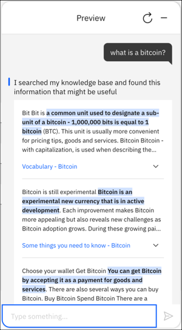
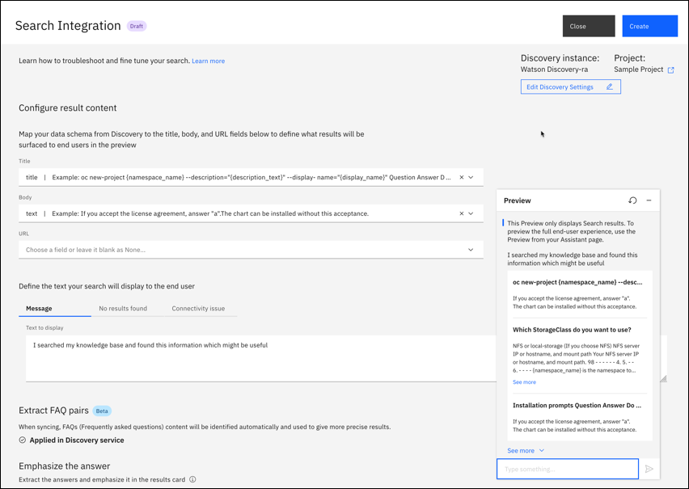
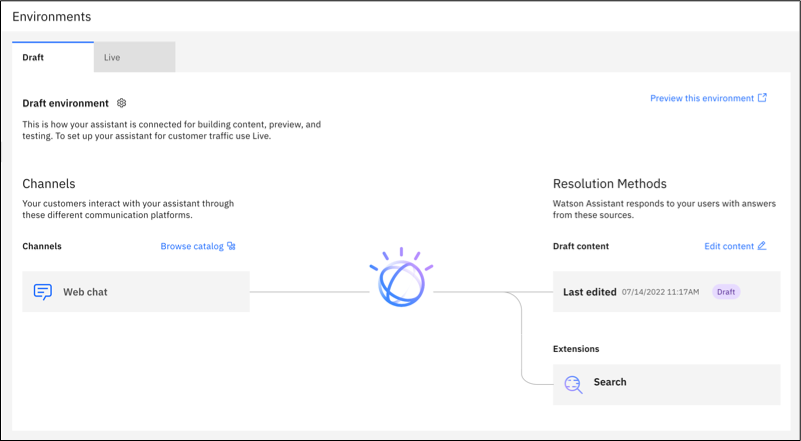
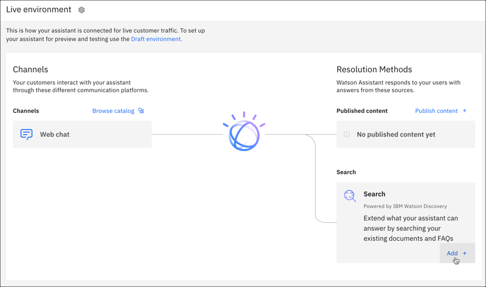

---

copyright:
  years: 2021
lastupdated: "2021-12-09"

subcollection: watson-assistant

---

{:shortdesc: .shortdesc}
{:new_window: target="_blank"}
{:external: target="_blank" .external}
{:deprecated: .deprecated}
{:important: .important}
{:note: .note}
{:tip: .tip}
{:pre: .pre}
{:preview: .preview}
{:codeblock: .codeblock}
{:screen: .screen}
{:javascript: .ph data-hd-programlang='javascript'}
{:java: .ph data-hd-programlang='java'}
{:python: .ph data-hd-programlang='python'}
{:swift: .ph data-hd-programlang='swift'}
{:table: .aria-labeledby="caption"}
{:video: .video}

{{site.data.content.classiclink}}

# Adding a search integration 
{: #search-add}

Put your subject matter expertise to work by adding search. The search integration gives your assistant access to corporate data collections that it can mine for answers.
{: shortdesc}

When a search integration is added, your assistant can route complex customer inquiries to the {{site.data.keyword.discoveryfull}} service. {{site.data.keyword.discoveryshort}} treats the user input as a search query. It finds information that is relevant to the query from an external data source and returns it to the assistant.

This feature is available only to paid plan users.
{: note}

Add search to your assistant to prevent the assistant from having to say things like, `I'm sorry. I can't help you with that`. Instead, the assistant can query existing company documents or data to see whether any useful information can be found and shared with the customer.



To show the exact answer highlighted in bold font, enable the *Emphasize the answer* feature that is available with {{site.data.keyword.discoveryshort}} v2 instances.
{: tip}

The following 4-minute video provides an overview of the search integration.

{: video output="iframe" id="youtubeplayer" frameborder="0" width="560" height="315" webkitallowfullscreen mozallowfullscreen allowfullscreen}

To read a transcript of the video, [open the video on YouTube.com](https://www.youtube.com/watch?v=_UgRPaxipgI&feature=emb_imp_woyt), click the *More actions* icon, and then choose *Open transcript*.

To learn more about how search can benefit your business, [read this blog post](https://medium.com/ibm-watson/adding-search-to-watson-assistant-99e4e81839e5){: external}.

Find out how to keep your assistant data current by reading the blog post, [COVID-19: Are Your Virtual Assistant’s Answers Up-To-Date?](https://medium.com/ibm-watson/covid-19-are-your-virtual-assistants-answers-up-to-date-c9e1ba70eb65){: external}.

## How it works
{: #search-add-how}

The search integration searches for information from a data collection that you create by using the {{site.data.keyword.discoveryshort}} service.

{{site.data.keyword.discoveryshort}} is a service that crawls, converts, and normalizes your unstructured data. The product applies data analysis and cognitive intuition to enrich your data such that you can more easily find and retrieve meaningful information from it later. To read more about {{site.data.keyword.discoveryshort}}, see the [product documentation](/docs/discovery-data?topic=discovery-data-about){: external}.

Typically, the type of data collection you add to {{site.data.keyword.discoveryshort}} and access from your assistant contains information that is owned by your company. This proprietary information can include FAQs, sales collateral, technical manuals, or papers written by subject matter experts. Mine this dense collection of proprietary information to find answers to customer questions quickly.

## Before you begin
{: #search-add-prereqs}

1.  Before you begin, you must set up a {{site.data.keyword.discoveryshort}} instance.

    You can do this at no cost by using a Plus plan, which offers a free 30-day trial. However, to create a Plus plan instance of the service, you must have a paid account (where you provide credit card details).

1.  Create a Plus plan {{site.data.keyword.discoveryshort}} service instance.

    Go to the [{{site.data.keyword.discoveryshort}}](https://cloud.ibm.com/catalog/services/watson-discovery){: external} page in the {{site.data.keyword.cloud_notm}} catalog and create a Plus plan service instance.

If you decide not to continue using the Plus plan and don't want to pay for it, delete the Plus plan service instance before the 30-day trial period ends.
{: important}

## Create the search integration
{: #search-add-task}

1.  From the assistant where you want to add search, click **Integrations**.

    You can only add search if you are a user with a paid plan.
    {: note}

1.  In the **Extensions** section, locate Search, click **Add**, then click **Confirm**.

1.  Next, you will connect to a {{site.data.keyword.discoveryshort}} service instance.

## Connect to an existing Watson Discovery instance
{: #search-add-connect-discovery}

1.  Choose the {{site.data.keyword.discoveryshort}} service instance that you want to extract information from.
{: #choose-d-instance}

    If you see a warning that some of your {{site.data.keyword.discoveryshort}} service instances do not have credentials set, it means that you can access at least one instance that you never opened from the {{site.data.keyword.cloud_notm}} dashboard directly yourself. You must access a service instance for credentials to be created for it, and credentials must exist before {{site.data.keyword.conversationshort}} can establish a connection to the {{site.data.keyword.discoveryshort}} service instance on your behalf. If you think a {{site.data.keyword.discoveryshort}} service instance is missing from the list, open the instance from the {{site.data.keyword.cloud}} dashboard directly to generate credentials for it.
    {: note}

1.  Indicate the data collection to use, by doing one of the following things:
{: #pick-data-collection}

    - Choose an existing project.

      You can click the *Open {{site.data.keyword.discoveryshort}}* icon to review the configuration of a project before you decide which one to use.

      Go to [Configure the search](#search-add-configure).

    - If you do not have a project or do not want to use any of the projects that are listed, click **Create a new project** to add one. Follow the steps in [Create a project](#search-add-create-discovery-collection).

      The **Create a new project** button is not displayed if you have reached the limits based on your {{site.data.keyword.discoveryshort}} service plan. See [{{site.data.keyword.discoveryshort}} pricing plans](/docs/discovery-data?topic=discovery-data-pricing-plans){: external} for plan limit details.
      {: note}

## Create a project
{: #search-add-create-discovery-collection}

1.  On the **OK, where is your data?** page, select your data source, then click **Next**. Example choices include Salesforce, SharePoint, Box, IBM Cloud Object Storage, web crawl, and upload data. 

1. On the **Let's create a collection for your data** pages, enter the information on how to connect to your data and configure your collection. The information you need to enter is different depending on the data source. For example, you need to enter your authentication credentials for services such as Salesforce, Sharepoint, and Box. For web crawl, you specify the website where your existing information resides.

    Optionally, select the **Apply FAQ extraction** checkbox. This feature allows the {{site.data.keyword.discoveryshort}} service to extract question and answer pairs that it identifies in the data collection. If the answers to common questions are identified ahead of time, your assistant can more quickly find and return a concise answer when a customer asks a similar question.

1. Click **Finish**. Give {{site.data.keyword.discoveryshort}} a few minutes to start creating documents. You can use the **Manage collections** page within the project to see the progress.

1.  Wait for the collection to be fully ingested, then click **Back to {{site.data.keyword.conversationshort}}**.

## Configure the search
{: #search-add-configure}

1.  On the {{site.data.keyword.conversationshort}} search integration page, ensure the {{site.data.keyword.discoveryshort}} instance and project you want to use is selected, then click **Next**.

1.  In the **Configure result content** section, review the {{site.data.keyword.discoveryshort}} fields and examples that are used in the search results shown to your customers. You can accept the defaults, or customize them as you want.

    The appropriate collection fields to extract data from vary depending on your collection's data source and how the data source was enriched. After you choose a data collection type, the collection field values are prepopulated with source fields that are considered most likely to contain useful information given the collection's data source type. However, you know your data better than anyone. You can change the source fields to ones that contain the best information to meet your needs.

     To learn more about the structure of the documents in your collection, including the names of fields that contain information you might want to extract, open the collection in {{site.data.keyword.discoveryshort}}, and then use the **Identity fields** and **Manage fields** tabs.

    Each search result can consist of the following sections:

    - **Title**: Search result title. Use the title, name, or similar type of field from the collection as the search result title.

      You must select something for the title or no search result response is displayed in the Facebook and Slack integrations.

    - **Body**: Search result description. Use an abstract, summary, or highlight field from the collection as the search result body.

       You must select something for the body or no search result response is displayed in the Facebook and Slack integrations.

    - **URL**: This field can be populated with any footer content that you want to include at the end of the search result.

       For example, you might want to include a hypertext link to the original data object in its native data source. Most online data sources provide self-referencing public URLs for objects in the store to support direct access. If you add a URL, it must be valid and reachable. If it is not, the Slack integration will not include the URL in its response and the Facebook integration will not return any response.

       The Facebook and Slack integrations can successfully display the search result response when the URL field is empty.
  
    You must use a field for at least one of the search results.
    {: important}

    If no options are available from the drop-down fields, give {{site.data.keyword.discoveryshort}} more time to finish creating the collection. After waiting, if the collection is not created, then your collection might not contain any documents or might have ingestion errors that you need to address first.

    

    As you add field mappings, a preview of the search result is displayed with information from the corresponding fields of your data collection. This preview shows you what gets included in the search result response that is returned to users.

    To get help with configuring the search, see [Troubleshooting](#search-add-troubleshoot).

1.  Use the **Message**, **No results found** and **Connectivity issue** tabs to customize different messages to share with users based on the successfulness of the search.

    | Tab | Scenario | Example message |
    | --- | --- | --- |
    | Message | Search results are returned | `I found this information that might be helpful:` |
    | No results found | No search results are found | `I searched my knowledge base for information that might address your query, but did not find anything useful to share.` |
    | Connectivity issue | I was unable to complete the search for some reason | `I might have information that could help address your query, but am unable to search my knowledge base at the moment.` |
    {: caption="Search result messages" caption-side="top"}

1.  The **Extract FAQ pairs** section displays if the feature is enabled in your {{site.data.keyword.discoveryshort}} collection. Frequently asked questions content is identified automatically and used to give more precise results.

1.  Choose whether to enable **Emphasize the answer**. 

    This option is available only if your {{site.data.keyword.discoveryshort}} instance uses the v2 {{site.data.keyword.discoveryshort}} API.
    {: note}

    When you enable this feature, the sentence that is determined by {{site.data.keyword.discoveryshort}} to be the exact answer to the customer's question is highlighted in the block of text that is displayed to the customer as the search result.

1.  In the **Adjust result quantity** section, specify the number of results to return.

    The top three results are returned automatically. You can choose to show fewer or more (up to 10) results in the response.

    By default, customers can choose to see more results. If you don't want to give customers this choice, clear the **Include link for customers to view up to 10 results** checkbox.

1.  In the **Set result selectivity** section, decide whether to be more selective with the answers that are returned. By increasing result selectivity, Search returns fewer but more accurate results. In most cases, Search is accurate enough that the default setting (off) is sufficient.

1.  Click **Preview** to open the Preview pane for testing. Enter a test message to see the results that are returned when your configuration choices are applied to the search. Make adjustments as necessary.

1.  Click **Create**.

## Edit the search skill configuration
{: #search-edit-config}

If you want to change the configuration of the search result card later, open the search integration again, and make edits. You do not need to save changes as you make them; they are automatically applied. When you are happy with the search results, click **Save** to finish configuring the search integration.

If you decide you want to connect to a different {{site.data.keyword.discoveryshort}} service instance or project, open the search integration and click ***Edit Discovery Settings**. Then you can choose either a new project from the same instance, or a new instance and project.

## Troubleshooting
{: #search-add-troubleshoot}

Review this information for help with performing common tasks.

- **Creating a Web crawl data collection**: Things to know when you create a web crawl data source:

    - To increase the number of documents that are available to the data collection, click add a URL group where you can list the URLs for pages that you want to crawl but that are not linked to from the initial seed URL.
    - To decrease the number of documents that are available to the data collection, specify a subdomain of the base URL. Or, in the web crawl settings, limit the number of hops that Watson can make from the original page. You can specify subdomains to explicitly exclude from the crawl also.
    - If no documents are listed after a few minutes and a page refresh, then make sure that the content you want to ingest is available from the URL's page source. Some web page content is dynamically generated and therefore cannot be crawled.

- **Configuring search results for uploaded documents**: If you are using a collection of uploaded documents and cannot get the correct search results or the results are not concise enough, consider using *Smart Document Understanding* when you create the data collection.

    This feature enables you to annotate documents based on text formatting. For example, you can teach {{site.data.keyword.discoveryshort}} that any text in 28-point bold font is a document title. If you apply this information to the collection when you ingest it, you can later use the *title* field as the source for the title section of your search result.

    You can also use Smart Document Understanding to split up large documents into segments that are easier to search. For more information, see the the [Smart Document Understanding](/docs/discovery-data?topic=discovery-data-configuring-fields){: external} topic in the {{site.data.keyword.discoveryshort}} documentation.

- **My response text is surrounded by brackets**: If you notice that your response text is surrounded by brackets and quotation marks (`["My response text"]`) when you test it from the Preview, for example, you might need to change the source field that you're using in the configuration. The unexpected formatting indicates that the value is stored in the source document as an array. Any field that you extract text from must contain a value with a String data type, not an Array data type. When the chat integration shows a response that is extracted from a field that stores the data as an array, it does a straight conversion of the array value into a string, which produces a response that includes the array syntax.

    For example, maybe the field in the source document contains an array with a single text value as its only array element:

    ```json
    "title": ["a single array element"]
    ```
    {: codeblock}

    The array value is converted by the {{site.data.keyword.conversationshort}} into this string value:

    ```json
    "title": "[\"a single array element\"]"
    ```
    {: codeblock}

    As a result, the string is returned in this format in the chat; the surrounding brackets and quotation marks are displayed:

    ```code
    ["a single array element"]
    ```
    {: codeblock}

    If you see this happening, consider choosing a different collection field from which to extract search results.

    The {{site.data.keyword.discoveryshort}} document `highlight` field stores values in an array.
    {: note}

## Next steps
{: #search-add-next-steps}

After you add the search integration for the first time, it appears as a tile on the **Draft environment** page. Click on the tile to see or edit the search configuration.



When you're ready, you can repeat the steps above to add the search integration to your **Live environment**.



## Search trigger
{: #search-add-trigger}

The search integration is triggered from an action step. This approach is useful if you want to narrow down a user query before you trigger a search.

For example, the conversational flow might collect information about the type of device a customer wants to buy. When you know the device model, you can then send a model keyword in the query that is submitted to the search integration to get better results.

In the *And then* field of the step where you want the search to be triggered, choose **Search for the answer**.

To configure the search that is performed in {{site.data.keyword.discoveryshort}}, complete the following steps:

1.  Click **Edit settings**.

1.  Add values to one or both of the following fields:

    - **Custom search query**. Add a word or phrase that you want to submit to {{site.data.keyword.discoveryshort}} as the query string for the search.

      For example, you can specify a string such as, `What cities do you fly to?`.

      For a more dynamic string, you can include a variable. For example, `Do you have flights to ${destination}?`

      You are effectively defining the value that is used by the {{site.data.keyword.discoveryshort}} API as the `natural_language_query` parameter. For more information, see [Query parameters](/docs/discovery?topic=discovery-query-parameters#nlq){: external}.

      If you don't specify a text string, the action sends the most recently submitted user message as the search string.

      If you want to use the original customer message that triggered the action as the query string instead, you need to plan ahead. You can follow these steps:

      1. Create a session variable to store the initial user input. For example, named `original message`.
      1. In Step 1, meaning the first step after the action trigger, set the value of the session variable. For more information about session variables, see [Defining session variables](#actions-variables-global).
      1. Set the value of the variable by using an expression that looks like this: `<? input.text ?>`.

        This expression captures the complete message that was submitted by the customer. As a result, your variable captures the customer message that triggered this action.
      1. Add the session variable to the *Custom query* field. For example: `${original_message}`

    - **Custom results filter**: Add a text string that defines information that must be present in any of the search results that are returned.

      You are effectively defining the value that is used by the {{site.data.keyword.discoveryshort}} API as the `filter` parameter. For more information, see [Query parameters](/docs/discovery?topic=discovery-query-parameters#filter){: external}.

      The syntax to use for the filter value is not intuitive. Here are a few examples of common use cases:

      - To indicate that you want to return only documents with positive sentiment, for example, specify `enriched_text.sentiment.document.label:positive`.

      - To filter results to includes only documents that mention `Boston, MA`, specify `enriched_text.entities.text:"Boston, MA"`.

      - To filter results to includes only documents that mention a city name that you saved in a context variable named `$destination`, you can specify `enriched_text.entities.text:$destination`.

    If you add both a query and a filter value, the filter parameter is applied first to filter the data collection documents and cache the results. The query parameter then ranks the cached results.

1.  If you want the search for an answer to be the last step in the action, select **End the action after returning results**.

1.  Click **Apply**.

## Test the search integration
{: #search-add-test}

After you configure search, you can send test queries to see the search results that get returned from {{site.data.keyword.discoveryshort}} by using the Preview page.

To test the full experience that customers have when they ask questions that are either answered by the action or trigger a search, use the *Preview* button for your assistant.

## Use search when no action matches
{: #search-no-action-matches}

You can use the search integration with the built-in [No action matches](/docs/watson-assistant?topic=watson-assistant-handle-errors#no-action-matches) capability. By adding search to *No action matches*, you can have your assistant refer to search when a customer asks a question that isn't addressed by an existing action.

To update *No action matches* to use search:

1. In your assistant, click **Actions**, then click **Set by assistant**.

1. Click **No action matches** to open it in the editor.

1. Click **New step**.

1. In the **And then** section, click **Continue to next step**, then choose **Search for the answer**.

1. Because you're adding search, you no longer need step 2, which is the step for when the **No action matches** count is 3 or less. Click the delete (trash can) icon to remove it.

1. Close **No action matches**. Now your assistant uses search to provide customers with potentially useful answers, if the customer question does not trigger any of the existing actions.
