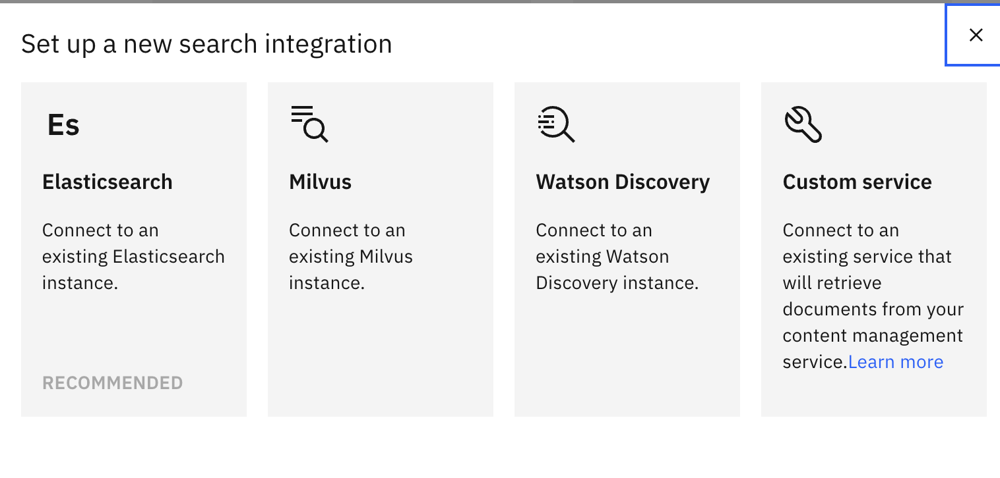
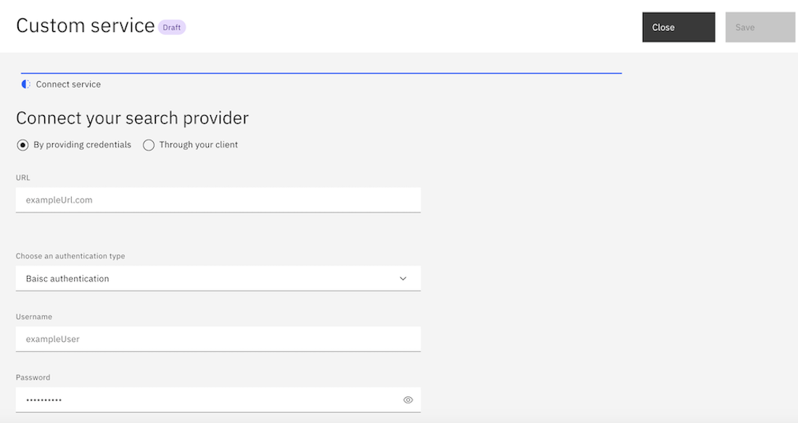

---

copyright:
  years: 2023, 2024
lastupdated: "2024-12-13"

subcollection: watson-assistant

---

{{site.data.keyword.attribute-definition-list}}

# Custom service integration setup
{: #search-customsearch-add}

[Plus]{: tag-green} [Enterprise]{: tag-purple}

A Custom service integration searches for information by using a search capability that you create.  You can use a Custom service integration with the conversational search capabilities of your assistant to generate AI responses. This integration supports both server-side and client-side retrieval of information.


You can have only one search integration per environment. When you change the existing search integration to other integration types such as {{site.data.keyword.discoveryfull}} or Elasticsearch, the settings of the existing search integration are overwritten.
{: important}


## Selecting Custom service
{: #select-custom-service}

To select a Custom service as the search integration, use one of the following procedures:

 - **Selecting Custom service search integration from the Integrations page** 

    1. After you create a {{site.data.keyword.conversationshort}} instance, go to **Home** > **Integrations**.
    1. Click **Open** inside the **Search** tile to view the "Open Search" window.
    1. In the "Open Search" window, select the `Draft` option in the dropdown if you want to set up Custom service in your assistant’s draft environment. If you want to set up Custom service in your assistant’s live environment, select the `Live` option in the dropdown.
    1. In the following "Edit an existing new search integration" window, select the **Custom service** tile.

 - **Selecting Custom service search integration from the Environments page** 
 
    1. After you create a {{site.data.keyword.conversationshort}} instance, go to **Home** > **Environments**.
    1. Select the `Draft` tab if you want to set up Custom service in the draft environment. If you want to set up Custom service in the live environment, select the `Live` tab.
    1. In the **Resolution methods** section, click **Add** inside the **Search** tile under **Extensions** if you want to add a Custom service search integration.
 
       If you already added the Custom service search integration, you see the **Open** button instead of **Add** inside the **Search** tile under **Extensions**.
       {: tip}
 
    1. In the `Set up a new search extension` window, select the **Custom service** tile to see the `Search integration` dialog.
 
      


Your assistant has limitations in passing the search parameters directly to your Custom service or retrieving the search results directly from it. Hence, your Custom service search integration must host an accessible web server that implements the search API interface provided by the assistant or a client that is configured to call your assistant to provide search results. For more information, see [Setting up retrieval systems for a Custom service](#setup-retrieval).
{: note}

## Setting up a Custom service with server credentials
{: #setup-custom-service-server}
      
To set up Custom service on your assistant with server credentials, use the following procedure:
      
1. In the **Connect your search provider** section of the **Custom service** window, select **By providing credentials**. By default, this option is selected.       
1. Provide the following fields to enable your assistant to connect to your Custom service 	instance:
    - **URL**
    - **Choose an authentication type**
        * if you select `Basic authentication`, you must provide **Username** and **Password**.
        * if you select `API key`, you must provide an **API key**.
        * if you select `None`, you cannot provide any other authentication details.
1. Click **Next** to go to **Conversational search (optional)**.
1. If you want to activate conversational search, switch the **Conversational Search** toggle to `on`. For more information about conversational search, see [conversational search](/docs/watson-assistant?topic=watson-assistant-conversational-search#conversational-search-setup).
1. Filling **Default filter** and **Metadata** is optional. You can place the information in these fields for your server to perform search requests. The metadata must be a JSON object and the default filter can be a text string.  You can override the default filter in an action step or dialog node that starts the search. You cannot override the metadata through other options and the metadata you provide applies to all uses of this integration. For more information, see [filling default filter and metadata for server](https://github.com/watson-developer-cloud/assistant-toolkit/blob/master/integrations/extensions/starter-kits/search-with-custom-service/custom-search-server-setup-guide.md){: external}.

1. Use the **No results found** and **Connectivity issue** tabs to customize different messages to share with users based on the success of the search.

     | Tab | Scenario | Example message |
     | --- | --- | --- |
     | No results found | No search results are found | `I searched my knowledge base for information that might address your query, but did not find anything useful to share.` |
     | Connectivity issue | I was unable to complete the search for some reason | `I might have information that could help address your query, but am unable to search my knowledge base at the moment.` |
     {: caption="Custom service search result messages" caption-side="top"}

1. Click **Save** and then **Close** to end the custom service set up with server credentials.


    

## Setting up a Custom service through your client
{: #setup-custom-service-client}

To set up Custom service on your assistant through your client, use the following procedure:

1. In the **Connect your search provider** section of the **Custom service** window, select “Through your client”.
1. Click **Next** to go to **Conversational search (optional)**.
1. If you want to activate conversational search, switch the **Conversational Search** toggle to `on`. For more information about conversational search, see [conversational search](/docs/watson-assistant?topic=watson-assistant-conversational-search#conversational-search-setup).
1. Filling **Default filter** and **Metadata** is optional. You can place the information in these fields for your server to perform search requests. The metadata must be a JSON object and the default filter can be a text string.  You can override the default filter in an action step or dialog node that starts the search. You cannot override the metadata through other options and the metadata you provide applies to all uses of this integration. For more information, see [filling default filter and metadata for client](https://github.com/watson-developer-cloud/assistant-toolkit/blob/master/integrations/extensions/starter-kits/search-with-custom-service/custom-search-client-setup-guide.md){: external}.
1. Use the **No results found** and **Connectivity issue** tabs to customize different messages to share with users based on the success of the search.

     | Tab | Scenario | Example message |
     | --- | --- | --- |
     | No results found | No search results are found | `I searched my knowledge base for information that might address your query, but did not find anything useful to share.` |
     | Connectivity issue | I was unable to complete the search for some reason | `I might have information that could help address your query, but am unable to search my knowledge base at the moment.` |
     {: caption="Custom service search result messages" caption-side="top"}
1. Click **Save** and then **Close** to end the Custom service set up in the client-side.

## Setting up Milvus for Custom service
{: #setup-milvus}

Milvus is a full-text search engine that you can use for handling large-scale datasets. For applications requiring real-time search capabilities and numerous concurrent users, you can use Milvus, that has a distributed architecture, high performance, flexible data model, and real-time analytics capabilities.
{: shortdesc}

### Setting up Milvus with server credentials
{: #setup-milvus-server}

1.	Set up Milvus on your assistant with server credentials by following the steps mentioned in [Setting up a Custom service with server credentials](#setup-custom-service-server).
2.	For more information on examples and references for Milvus, see [Example with Milvus]( https://github.com/watson-developer-cloud/assistant-toolkit/blob/master/integrations/extensions/starter-kits/search-with-custom-service/custom-search-server-setup-guide.md#example-with-milvus){: external}.

### Setting up Milvus through your client
{: #setup-milvus-client}

Set up Milvus on your assistant through your client by following the steps mentioned in [Setting up a Custom service through your client](#setup-custom-service-client).
    
## Setting up retrieval systems for a Custom service
{: #setup-retrieval}
      
To use a Custom service with your search integration, you must integrate your search capability by providing a server or by having the client that calls your assistant to provide search results.  You can use your own retrieval if the retrieval schema matches with the schema that is provided by your assistant. If your retrieval schema does not match with the assistant’s schema, you must provide a wrapper that does the schema mapping.  You can deploy the wrapper as a service or your chat client can start it. Building a wrapper is useful when you want to combine a different source or invoking libraries or services that do not comply with the schema for assistant search results. {: shortdesc}

### Setting up a server for Custom service retrieval
{: #server-side-retrieval}
      
A server for Custom service retrieval must implement the following API:

Query: `POST <server_url>`

**Request**
```json
{
    "query": "<QUERY>",
    "filter": "<FILTER>", // optional
    "metadata": {
        // optional, you can fill any information here
    }
}
```
{: codeblock}

**Response**

```json
{
    
  "search_results": [
    {
      "result_metadata": { // optional
        "score": <SCORE as a number>
      },
      "title": "<TITLE>",
      "body": "<BODY>",
      "url": "<URL>", // optional
      "highlight": { // optional, will be used instead of "body" for Conversational Search if provided
        "body": [
          "<HIGHLIGHT1>",
          "<HIGHLIGHT2>",
           ...
        ]
      }
    }
  ]

}
```
{: codeblock}


The metadata in the request and the entire response object must not exceed 100 KB.{: important}
     

### Setting up a client for Custom service retrieval
{: #client-side-retrieval}

You can see the following API response from the [/message API](/apidocs/assistant-v2#message){: external} requesting search at run time:
      
```json
{
    "output": {
        "intents": [ ... ],
        "actions": [
            {
                "type": "search",
                "query": "<QUERY>",
                "filter": "<FILTER>",
                "metadata": { // optional
                    /* you can use any JSON object here */
                }
            }
        ]
    }
}
```
{: codeblock}

Whenever the chat client receives a response with that form (it has an entry in the `output.actions` list of type `search`), it passes the results back to the assistant through the next call to the `/message API` as follows:

```json
{
    "input": {
        "message_type": "search_results",
         "search_results": [
          {
            "result_metadata": { // optional
                "score": <SCORE as a number>
            },
            "title": "<TITLE>",
            "body": "<BODY>",
            "url": "<URL>", // optional
            "highlight": { // optional, will be used instead of "body" for Conversational Search if provided
                "body": [
                "<HIGHLIGHT1>",
                "<HIGHLIGHT2>",
                ...
                ]
            }
         }
     ]
  }
}
```
{: codeblock}


Your assistant response limit cannot exceed 100 KB.  If your assistant gets a `search_results`message with a body that exceeds 100 KB, it returns a 400 response.
{: important}     

### Processing the search results in conversational search
{: #process-search-results}
    
When you setup your Custom service by providing server credentials or by sending results from your client and if you enable conversational search with your Custom service, you get the following behavior:

1. Conversational search iterates through the search results from first to last. 
1. From each search result:
    - If you don't have a `highlight.body` list, it takes the `body` as a text snippet. 
    - If a `highlight.body` list is present, it takes each element in that list as a text snippet. 
1. After discarding the duplicate text snippets, it continues to iterate through the search results and `highlight.body` lists until it has 5 text snippets. 
1. Conversational search applies a pre-generation filter model to compare the query and the search results to judge the relevance of the results to the query. If pre-generation filter model produces two scores:
    - A low score, conversational search returns an *I don't know* signal. For more information on *I don't know* signal, see [conversational search](/docs/watson-assistant?topic=watson-assistant-conversational-search#conversational-search-setup).
    - A high score, conversational search sends the snippets along with the corresponding titles to the generative AI model to generate an answer.
1. If the text is too long for the generative AI model to process, it repeatedly discards the last snippet or title pair until it is short. When it has no text, the search fails.
1. Conversational search applies the response to the post-filter model. If the post-filter model produces two scores:
    - A low score, conversational search returns an *I don't know* signal. 
    - A high score, conversational search returns the generated response along with all the `search_results` to the calling application.
   
Your assistant follows the same process for the other search options like Elasticsearch and {{site.data.keyword.discoveryfull}}.

### Adding separate fields for `body` and `highlight.body`
{: #fields-body-highlightbody}
   
When the `highlight.body` is present, it is used to generate conversational search answers, else the `body` is used.  Both are passed to the client as part of the search results object and the client provides context for the answer.  For example, the built-in web chat shows the `body` text. If you click a citation card for some search result, you can't see a URL for that search result.

Recommendations for using the fields:
- If the search technology returns short portions of documents, use those portions of the documents in the `body` field and omit the `highlight.body`.  For example, many vector database solutions store only 512 token segments of documents.
- If the search technology returns both short portions of documents (“passages” or “highlights” or “snippets”) and the full text of the documents, use the short portions in the `highlight.body` field and use the full text in the `body` field.

### Adding optional user-defined metadata 
{: #optional-user-defined-metadata}

For both clients and servers, the schemas for results include a `metadata` field and a `result_metadata` field.  

Recommendations for using the fields:
- The `metadata` field sends the configuration information to the search capability.  Some examples of configuration information that is used for a search capability include index names, embedding model names, requested passage length, fields to boost, and so on.  The following reasons explain why it is helpful to use the `metadata` field to pass configuration information to the server or client:
    * Multiple assistants can use the same server or client code but with a different configuration.
    * Even with one assistant, it is easy to update configurations through the assistant interface.
- The `result_metadata` field sends additional information about a search result from the server or client to the assistant. The assistant passes the information as part of the `search_results` object in the final response. Calling applications use the additional information.  For example, when the `result_metadata` sends the URLs for images in the search result, the calling application renders the images along with the response.

 
      
             
    

     

      
