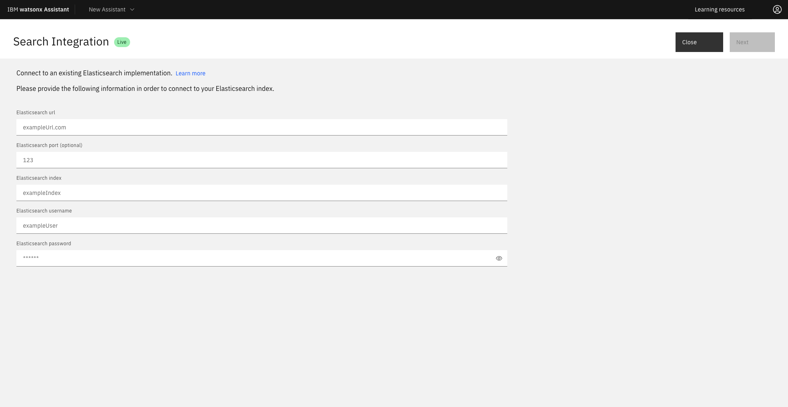

---

copyright:
  years: 2021, 2023
lastupdated: "2023-11-29"

subcollection: watson-assistant

---

{{site.data.keyword.attribute-definition-list}}

# Elasticsearch search integration set up 
{: #search-elasticsearch-add}

[Plus]{: tag-green} [Beta]{: tag-cyan} 

You can integrate search in your assistants by using Elasticsearch if you have Plus or Enterprise plan. Elasticsearch powers your assistants to perform different types of searches such as metric, structured, unstructured, and semantic with higher accuracy and relevance. The powerful data analytics engine in Elasticsearch expands the scope of search integration to larger data sets in assistants. In addition, you can enable conversational search for Elasticsearch in your assistant that helps to answer query by using simple conversation.

When you change the existing search integration to a new one, the settings of the existing search integration is deleted completely. For example, when you change from {{site.data.keyword.discoveryshort}} to Elasticsearch, the configuration of {{site.data.keyword.discoveryshort}} is deleted completely from the assistant.{: important}

For more information about integrating {{site.data.keyword.discoveryshort}}, see [{{site.data.keyword.discoveryfull}} search integration setup](/docs/watson-assistant?topic=watson-assistant-search-add).{: tip}

This beta feature is available for evaluation and testing purposes only. {: beta}

## Select Elasticsearch
{: #select-elasticsearch-search-integration}

To select Elasticsearch as the default search integration, do one of the following options:

- **Select Elasticsearch search integration from the Integrations page** 

    1. After you launch a {{site.data.keyword.conversationshort}} instance, go to **Home** > **Integrations**.
    1. Click **Open** inside the **Search** tile to view the "Open Search" window.
    1. In the "Open Search" window, select the `Draft` option in the dropdown if you want to set up Elasticsearch in a draft assistant. If you want to set up Elasticsearch in a live assistant, select the `Live` option in the dropdown.
    1. In the following "Edit an existing new search extension" window, select the **Elasticsearch** tile.

- **Select Elasticsearch search integration from the Environments page** 

    1. After you launch a {{site.data.keyword.conversationshort}} instance, go to **Home** > **Environments**.
    1. Select the `Draft` tab if you want to set up Elasticsearch in a draft assistant. If you want to set up Elasticsearch in a live assistant, select the `Live` tab.
    1. In the **Resolution methods** section, click **Add** inside the **Search** tile under **Extensions** if you want to add a new Elasticsearch search integration.

       If you already added the Elasticsearch search integration, you see the **Open** button instead of **Add** inside the **Search** tile under **Extensions**. {: tip}

    1. In the "Set up a new search extension" window, select the **Elasticsearch** tile to see the "Search integration" dialog.

    

## Set up Elasticsearch

After you add the Elasticsearch search skill, do the following:

1. In the first section of the "Search integration" window, fill up the following fields to enable your assistant to connect with your Elasticsearch index:
    - **Elasticsearch url**
    - **Elasticsearch port (optional)**
    - **Elasticsearch index**
    - **Elasticsearch username**
    - **Elasticsearch password**

      Elasticsearch setup in your assistant supports only the Basic Authentication token.{: important}

      

1. Click **Next** to go to the **Configure result content** section.

1. In the **Configure result content** section, fill up the following fields to map the title, body, and URL to the search response:

    - **Title**: Search result title. Use the title, name, or similar type of field from the collection as the search result title.

      You must select something for the title or no search result response is displayed in the Facebook and Slack integrations.

    - **Body**: Search result description. Use an abstract, summary, or highlight field from the collection as the search result body.

       You must select something for the body or no search result response is displayed in the Facebook and Slack integrations.

    - **URL**: This field can be populated with any footer content that you want to include at the end of the search result.

1. Expand the **Advanced Elasticsearch settings** section to see the following text boxes:

    - **Configure the filter array for Elasticsearch**

      You define the filter as an array of objects so that you can create filters to arrange the content per the query body. 

    - **Configure the query body for Elasticsearch**

      The query body is used to manipulate the user requests into a format that is expected by search. It controls the query forms, search fields, filters and query size. In the REST API, the query body is an object representing the `POST` body for the `_search` request to Elasticsearch, with a `"$QUERY"` token to represent the user's query, and a `"$FILTER"` token representing the array of filters defined either in the search settings, or at the step level.

    You cannot customize the query body in the assistant with an existing Elasticsearch configuration.{: important}
      
1. Switch the **Conversational Search** toggle to `on` if you want to activate [conversational search](/docs/watson-assistant?topic=watson-assistant-conversational-search). If you don't want to activate conversational search, switch the toggle to `off`.

    The **Conversational Search** toggle is available only if you signed up for the beta version.{: beta}

1.  Use the **Message**, **No results found** and **Connectivity issue** tabs to customize different messages to share with users based on the successfulness of the search.

    | Tab | Scenario | Example message |
    | --- | --- | --- |
    | Message | Search results are returned | `I found this information that might be helpful:` |
    | No results found | No search results are found | `I searched my knowledge base for information that might address your query, but did not find anything useful to share.` |
    | Connectivity issue | I was unable to complete the search for some reason | `I might have information that could help address your query, but am unable to search my knowledge base at the moment.` |
    {: caption="Search result messages" caption-side="top"}

1. Click **Finish**.

## Test Elasticsearch
{: #conversational-search-test}

You can test search integration for Elasticsearch in actions preview, the preview page, or by using the preview link.

In this example, the user asks, `Tell me about a custom extension`.

Search results are pulled from your knowledge base when conversational search is `off`. The answer is, `I searched my knowledge base and found this information which might be useful`.

   

A text-based reply from the best results in your knowledge base displays when conversational search is `on`. 

   

