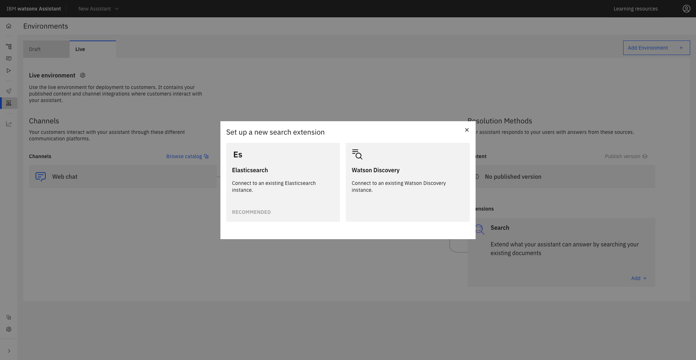
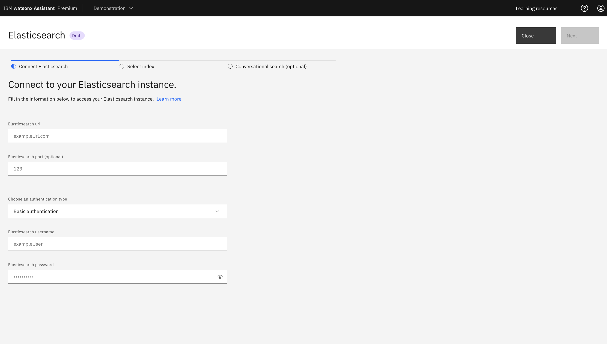
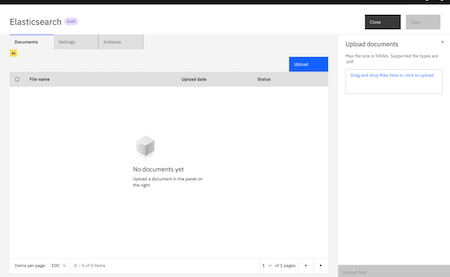
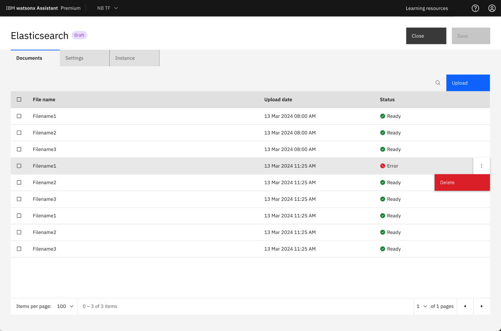
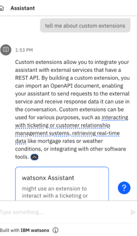

---

copyright:
  years: 2021, 2024
lastupdated: "2024-05-10"

subcollection: watson-assistant

---

{{site.data.keyword.attribute-definition-list}}

# Elasticsearch search integration set up 
{: #search-elasticsearch-add}

[Plus]{: tag-green} [Enterprise]{: tag-purple}

Elasticsearch powers your assistants to perform different types of searches such as metric, structured, unstructured, and semantic with higher accuracy and relevance by leveraging enterprise content. The data analytics engine in Elasticsearch expands the scope of search integration to larger data sets in assistants. In addition to this integration, you can enable conversational search for Elasticsearch in your assistant that helps to answer queries in a conversational manner.

You can also integrate with {{site.data.keyword.discoveryfull}}. For more information about integrating {{site.data.keyword.discoveryshort}}, see [{{site.data.keyword.discoveryfull}} search integration set up](/docs/watson-assistant?topic=watson-assistant-search-add).{: tip}

When you change an existing search integration to {{site.data.keyword.discoveryshort}} to connect to Elasticsearch or vice-versa, the settings of the existing search integration are overwritten. For example, when you change from {{site.data.keyword.discoveryshort}} to Elasticsearch, the configuration of {{site.data.keyword.discoveryshort}} is deleted completely from the assistant.{: important}

## Selecting Elasticsearch
{: #select-elasticsearch-search-integration}

To select Elasticsearch as the default search integration, use one of the following procedures:

- **Selecting Elasticsearch search integration from the Integrations page** 

    1. After you create a {{site.data.keyword.conversationshort}} instance, go to **Home** > **Integrations**.
    1. Click **Open** inside the **Search** tile to view the "Open Search" window.
    1. In the "Open Search" window, select the `Draft` option in the dropdown if you want to set up Elasticsearch in your assistant’s draft environment. If you want to set up Elasticsearch in your assistant’s live environment, select the `Live` option in the dropdown.
    1. In the following "Edit an existing new search integration" window, select the **Elasticsearch** tile.

- **Selecting Elasticsearch search integration from the Environments page** 

    1. After you create a {{site.data.keyword.conversationshort}} instance, go to **Home** > **Environments**.
    1. Select the `Draft` tab if you want to set up Elasticsearch in the draft environment. If you want to set up Elasticsearch in the live environment, select the `Live` tab.
    1. In the **Resolution methods** section, click **Add** inside the **Search** tile under **Extensions** if you want to add a new Elasticsearch search integration.

       If you already added the Elasticsearch search integration, you see the **Open** button instead of **Add** inside the **Search** tile under **Extensions**. {: tip}

    1. In the "Set up a new search extension" window, select the **Elasticsearch** tile to see the "Search integration" dialog.
  
       

## Setting up Elasticsearch
{: #setting-up-elasticsearch}

To set up Elasticsearch on your assistant, use the following procedure:

1. In the first section of the "Search integration" window, provide the following fields to enable your assistant to connect to your Elasticsearch instance:
    - **Elasticsearch url**
    - **Elasticsearch port (optional)**
    - **Choose an authentication type**
      * If you select `Basic authentication`, you must provide **Elasticsearch username** and **Elasticsearch password**.
      * If you select `API key`, you must provide **Elasticsearch API key**.

      
  
   

1. Click **Next** to go to the **Select an index** section. **Select an index** has two options: 
    - To use an existing index, select **Use my index**. 
    - To create a new index, select **Upload documents to a new index in your Elasticsearch instance**.

### Using an existing index

1. In the **Select index** section, click **Use my index** to connect to an existing Elasticsearch index. The **Use my index** option is selected as default in your Elasticsearch set up. 

1. In the **Use my index** option, type the Elasticsearch index name.
 
1. Click **Next** to go to the **Enable conversational search (optional)** section.

1. Conversational search is available only in the Plus and Enterprise plans of {{site.data.keyword.conversationshort}}. In the **Enable conversational search (optional)** section, switch the **Conversational Search** toggle to `on` if you want to activate conversational search. If you don't want to activate conversational search, switch the toggle to `off`. For more information about conversational search, see [conversational search](/docs/watson-assistant?topic=watson-assistant-conversational-search#conversational-search-setup).

1. Click **Save** and then **Close**.

### Uploading documents to a new index [Beta]{: tag-cyan}
{: #elasticsearch-upload-documents}

Before you upload documents, you must meet the following requirements:

- Upload document feature requires Elasticsearch 8.8 or above because it uses ELSER model and the ELSER model is available since Elasticsearch 8.8.

- Your Elasticsearch instance must have a paid or trial subscription, such as the Platinum Edition of [IBM Cloud Databases for Elasticsearch](https://cloud.ibm.com/databases/databases-for-elasticsearch/create){: external} or a Platinum or Enterprise subscription offered by [Elastic.co]( https://www.elastic.co/subscriptions).

- To use the ELSER model, you must have an Machine Learning (ML) node feature and a minimum of 4 GB memory in the ML node to deploy the model. For more information about ELSER requirements, see [ELSER requirements](https://www.elastic.co/guide/en/machine-learning/current/ml-nlp-elser.html#elser-req).

- You can increase the resources for your ELSER model deployment. For example, you can increase `number_of_allocations` and `threads_per_allocation` to improve the throughput and latency of the ELSER model when you deploy it. For more information about start trained model deployment, see [Start trained model deployment]( https://www.elastic.co/guide/en/elasticsearch/reference/8.13/start-trained-model-deployment.html#start-trained-model-deployment).

You can see the **Requirements not met** error message in the **Elasticsearch window** when the Elasticsearch instance fails to meet the preceding requirements and when the **Upload documents to a new index in your Elasticsearch instance** is disabled.{: note}

To upload documents to a new index, use the following procedure:

1. In the **Select index** section of the **Elasticsearch** window, click **Upload documents to a new index in your Elasticsearch instance**. 

   {{site.data.keyword.conversationshort}} passes the uploaded documents to your Elasticsearch instance for storage, chunking, and indexing.{: note}

1. In the **Configure result content** section, provide the following fields to map the title, body, and URL to the search response:

    - **Title**

        Search result title. Use the title, name, or similar type of field from the collection as the search result title.

        You must select something for the title or no search result response is displayed in the Facebook and Slack integrations.

    - **Body**

        Search result description. Use an abstract, summary, or highlight field from the collection as the search result body.

        You must select something for the body or no search result response is displayed in the Facebook and Slack integrations.

    - **URL**
    
        This field can be populated with any footer content that you want to include at the end of the search result.

    When you configure the query body in the **Advanced Elasticsearch Settings** to search the nested documents, you must ensure that the **Title**, **Body**, and **URL** are from the fields of the inner documents in your Elasticsearch index. For more information about using nested queries, see [Elasticsearch nested query](https://www.elastic.co/guide/en/elasticsearch/reference/current/query-dsl-nested-query.html#query-dsl-nested-query).

1. Expand the **Advanced Elasticsearch settings** section to see the following text boxes:
    
    - **Configure the filter array for Elasticsearch**
    
        You define the filter as an array of objects so that you can create filters to arrange the content per the query body. 

    - **Configure the query body for Elasticsearch**    

      The query body is used to manipulate the user requests into a format that the search expects. It controls the query forms, search fields, filters, and query size. In the REST API, the query body is an object representing the `POST` body for the `_search` request to Elasticsearch. THe query body has a `"$QUERY"` token to represent the customer's query, and a `"$FILTER"` token to represent the array of filters that are defined either in the search settings or at the step level.    
   
   
        By default, Elasticsearch integration uses keyword search. You can use advanced search such as semantic search with ELSER, KNN dense vector search, or nested queries to search the nested documents. For more information about using different types of query body examples, see [Query body examples](https://github.com/watson-developer-cloud/assistant-toolkit/tree/master/integrations/extensions/docs/elasticsearch-install-and-setup#option-2-use-the-built-in-search-integration){: external}.

    

        For more information about the Elasticsearch `_search` API request body, see [Elasticsearch search API request body]( https://www.elastic.co/guide/en/elasticsearch/reference/current/search-search.html#search-search-api-request-body){: external}.

        You cannot customize the query body in the assistant with an existing Elasticsearch configuration.{: important}   

1. Use the **Message**, **No results found** and **Connectivity issue** tabs to customize different messages to share with users based on the successfulness of the search.

    | Tab | Scenario | Example message |
    | --- | --- | --- |
    | Message | Search results are returned | `I found this information that might be helpful:` |
    | No results found | No search results are found | `I searched my knowledge base for information that might address your query, but did not find anything useful to share.` |
    | Connectivity issue | I was unable to complete the search for some reason | `I might have information that could help address your query, but am unable to search my knowledge base at the moment.` |
    {: caption="Search result messages" caption-side="top"}

1. Switch the **Conversational Search** toggle to `on` if you want to activate conversational search. If you don't want to activate conversational search, switch the toggle to `off`.  

1. Conversational search is available only in the Plus and Enterprise plans of {{site.data.keyword.conversationshort}}. If you switch the **Conversational Search** toggle to `on`, you can see the citation titles in your assistant responses. For more information about conversational search, see [conversational search](/docs/watson-assistant?topic=watson-assistant-conversational-search#conversational-search-setup).

1. Click **Save** to save your settings.

1. Click the **Documents** tab in the **Elasticsearch** window.
   
   The **Documents** tab is enabled only if you select **Upload documents to a new index in your Elasticsearch instance** option.{: tip}

1. Click **Upload** button. In the **Upload documents** section, you can drag and drop your files or do a single click to upload documents directly to your assistant. 

  

   You can upload up to 20 documents at a time. Each document file must not exceed 500 KB. The total size of all documents must not exceed 100 MB.{: important}

  
  
   

1. After you upload the documents, you can see the upload status of your documents in a table in the **Elasticsearch** window.

1. Status `Ready` indicates that your files are available for search.

1. If the status indicates `Error`, you can delete the file by clicking the three dots next to the `Error` and click `Delete`.

   

1. If you want to change the Elasticsearch instance credentials, click the **Instance** tab, edit the credentials, and then click **Save**. Skip this step if you do not want to change Elasticsearch instance credentials.

1. Click **Save** and then **Close** to end the Elasticsearch set up.

## Configuring your assistant to use Elasticsearch
{: #search-assistant-configure}

After you configure the Elasticsearch search integration, you must configure your assistant to use Elasticsearch when the customer response matches no action. For more information about updating **No matches** to use search, see [Use search when no action matches](/docs/watson-assistant?topic=watson-assistant-search-integration-enhancement#search-no-action-matches).

## Testing Elasticsearch
{: #elasticsearch-test}

You can test search integration with Elasticsearch in actions preview, the preview page, or by using the preview link.

In this example, the user asks, `Tell me about a custom extension`.

Search results are pulled from your knowledge base when conversational search is `off`. The answer is, `I searched my knowledge base and found this information which might be useful`.

   

A text-based reply from the best results in your knowledge base displays when conversational search is `on`. 

   

