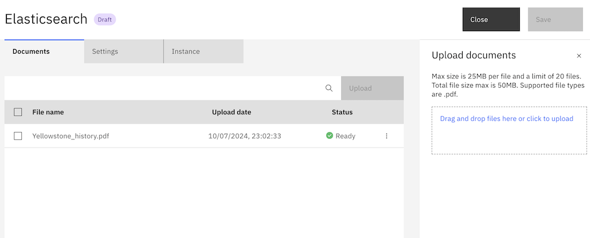
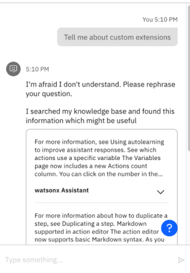

---

copyright:
  years: 2021, 2024
lastupdated: "2024-04-29"

subcollection: watson-assistant

---

{{site.data.keyword.attribute-definition-list}}

# Elasticsearch search integration set up 
{: #search-elasticsearch-add}

You can integrate search integration in your assistants by using Elasticsearch if you have Plus or Enterprise plan. Elasticsearch powers your assistants to perform different types of searches such as metric, structured, unstructured, and semantic with higher accuracy and relevance. The powerful data analytics engine in Elasticsearch expands the scope of search integration to larger data sets in assistants. In addition, you can enable conversational search for Elasticsearch in your assistant that helps to answer query by using simple conversation.

When you change the existing search integration to a new one, the settings of the existing search integration is deleted completely. For example, when you change from {{site.data.keyword.discoveryshort}} to Elasticsearch, the configuration of {{site.data.keyword.discoveryshort}} is deleted completely from the assistant.{: important}

For more information about integrating {{site.data.keyword.discoveryshort}}, see [{{site.data.keyword.discoveryfull}} search integration setup](/docs/watson-assistant?topic=watson-assistant-search-add).{: tip}

## Select Elasticsearch
{: #select-elasticsearch-search-integration}

To select Elasticsearch as the default search integration, do one of the following options:

- **Select Elasticsearch search integration from the Integrations page** 

    1. After you launch a {{site.data.keyword.conversationshort}} instance, go to **Home** > **Integrations**.
    1. Click **Open** inside the **Search** tile to view the "Open Search" window.
    1. In the "Open Search" window, select the `Draft` option in the dropdown if you want to set up Elasticsearch in a draft assistant. If you want to set up Elasticsearch in a live assistant, select the `Live` option in the dropdown.
    1. In the following "Edit an existing new search integration" window, select the **Elasticsearch** tile.

- **Select Elasticsearch search integration from the Environments page** 

    1. After you launch a {{site.data.keyword.conversationshort}} instance, go to **Home** > **Environments**.
    1. Select the `Draft` tab if you want to set up Elasticsearch in a draft assistant. If you want to set up Elasticsearch in a live assistant, select the `Live` tab.
    1. In the **Resolution methods** section, click **Add** inside the **Search** tile under **Extensions** if you want to add a new Elasticsearch search integration.

       If you already added the Elasticsearch search integration, you see the **Open** button instead of **Add** inside the **Search** tile under **Extensions**. {: tip}

    1. In the "Set up a new search extension" window, select the **Elasticsearch** tile to see the "Search integration" dialog.

    

1. Use the **Message**, **No results found** and **Connectivity issue** tabs to customize different messages to share with users based on the successfulness of the search.

    | Tab | Scenario | Example message |
    | --- | --- | --- |
    | Message | Search results are returned | `I found this information that might be helpful:` |
    | No results found | No search results are found | `I searched my knowledge base for information that might address your query, but did not find anything useful to share.` |
    | Connectivity issue | I was unable to complete the search for some reason | `I might have information that could help address your query, but am unable to search my knowledge base at the moment.` |
    {: caption="Search result messages" caption-side="top"}

1. Switch the Conversational Search toggle to `on` if you want to activate conversational search. If you don't want to activate conversational search, switch the toggle to `off`.  

1. If you switch the Conversational Search toggle to `on` , you can see the citation titles in your assistant responses. For more information on citation titles of Conversational search, see [Conversational search](/docs/watson-assistant?topic=watson-assistant-conversational-search#conversational-search-setup)

1. Click **Save** to save your settings.

1. Click **Documents** tab in the **Elasticsearch** window.

1. In **Upload documents** section, you can drag and drop your files or do a single click to upload documents directly to your assistant. Click **Upload**.

     You can upload only 20 PDF files. Each file size must not exceed 500 MB.{: important}

   
  

1. After you upload the documents, you can see the upload status of your documents in a table in the **Elasticsearch** window.

1. Status `Ready` indicates that your files are available for search.

1. If the status indicates `Error`, you can delete the file by clicking the three dots next to the `Error` and click `Delete`.

   

1. If you want to change the Elasticsearch instance credentials, click **Instance** tab, edit the credentials and then click **Save**. Skip this step if you do not want to change Elasticsearch instance credentials.

1. Click **Close** to end the Elastic search setup.

 ## Configure your assistant to use Elasticsearch
 {: #search-assistant-configure}

After you configure Elasticsearch integration, you must configure your assistant to use Elasticsearch when the customer response matches no action. For more information about updating **No matches** to use search, see [Use search when no action matches](/docs/watson-assistant?topic=watson-assistant-search-integration-enhancement#search-no-action-matches). 

## Test Elasticsearch
{: #elasticsearch-test}

You can test search integration for Elasticsearch in actions preview, the preview page, or by using the preview link.

In this example, the user asks, `Tell me about a custom extension`.

Search results are pulled from your knowledge base when conversational search is `off`. The answer is, `I searched my knowledge base and found this information which might be useful`.

   

A text-based reply from the best results in your knowledge base displays when conversational search is `on`. 

   

