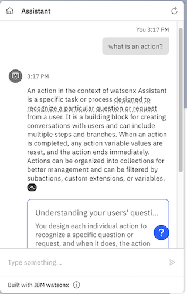

---

copyright:
  years: 2025
lastupdated: "2025-02-06"

subcollection: watson-assistant

---

{{site.data.keyword.attribute-definition-list}}

# Milvus search integration setup
{: #search-milvus-add}

[Plus]{: tag-green} [Enterprise]{: tag-purple} 

Milvus is a vector database that you can use for handling large-scale datasets. For applications requiring real-time search capabilities and numerous concurrent users, you can use Milvus, which has a distributed architecture, high performance, and flexible data model.
{: shortdesc}

You can have only one search integration per environment. When you change the existing search integration to other integration types such as {{site.data.keyword.discoveryfull}}, Elasticsearch or Custom service, the settings of the existing search integration are overwritten.
{: important}

## Selecting Milvus 
{: #select-milvus-search}

To select Milvus as the search integration, use one of the following procedures:

 - **Selecting Milvus search integration from the Integrations page** 

    1. After you create a {{site.data.keyword.conversationshort}} instance, go to **Home** > **Integrations**.
    1. Click **Open** inside the **Search** tile to view the **Open Search** window.
    1. In the **Open Search** window, select the `Draft` option if you want to set up Custom service in your assistant’s draft environment. If you want to set up Custom service in your assistant’s live environment, select the `Live` option.
    1. In the **Edit an existing new search integration** window, select the **Milvus** tile.

 - **Selecting Milvus search integration from the Environments page** 
 
    1. After you create a {{site.data.keyword.conversationshort}} instance, go to **Home** > **Environments**.
    1. Select the `Draft` tab if you want to set up Milvus in the draft environment. If you want to set up Milvus in the live environment, select the `Live` tab.
    1. In the **Resolution methods** section, click **Add** inside the **Search** tile under **Extensions** if you want to add a Milvus search integration.
 
       If you already added the Milvus search integration, you see the **Open** button instead of **Add** inside the **Search** tile under **Extensions**.
       {: tip}

    1. In the `Set up a new search extension` window, select the **Milvus** tile to see the `Search integration` dialog.
 
      

 
## Setting up Milvus
{: #setup-milvus}
      
To set up Milvus on your assistant, use the following procedure:
      
In the **Connect your search provider** section of the **Milvus** window,      
1. Provide the following fields to enable your assistant to connect to your Milvus instance:
   
    - **GRPC port (optional)**
    - **Choose an authentication type**
        * If you select `Basic authentication`, you must provide **username** and **password**.
        * If you select `watsonx.data API key`,  you must provide the corresponding **API key**.
        * if you select `None`, you cannot provide any other authentication details.
1. Click **Next** to go to **Select data source** and provide the following details:
   -  In **Database**, select your preferred database.
   -  In **Choose collection**, select your collection.
   -  In **Choose index**, select the index.
   -  In **Choose embedding_model_id**, select your model. 


1. Click **Next** to go to **Conversational search (optional)**.
1. Conversational search is available only in the Plus and Enterprise plans of {{site.data.keyword.conversationshort}}.
To activate conversational search, switch the **Conversational Search** toggle to `on`. For more information, see [Conversational search](/docs/watson-assistant?topic=watson-assistant-conversational-search#conversational-search-setup).

1. Expand the **Advanced Milvus settings** section to define **Filter**.

   For more information on defining filter expression examples, see [Filter expression examples](#filter-expression-examples)

1. You can tune your [conversational search’s tendency to say “I don’t know"](/docs/watson-assistant?topic=watson-assistant-conversational-search#behavioral-tuning-conversational-search) and the [generated response length](/docs/watson-assistant?topic=watson-assistant-conversational-search#tuning-the-generated-response-length-in-conversational-search).
1. Use the **Message**, **No results found** and **Connectivity issue** tabs to customize different messages to share with users based on the successfulness of the search. 

    | Tab | Scenario | Example message |
    | --- | --- | --- |
    | Message | Search results are returned | `I found this information that might be helpful:` |
    | No results found | No search results are found | `I searched my knowledge base for information that might address your query, but did not find anything useful to share.` |
    | Connectivity issue | I was unable to complete the search for some reason | `I might have information that could help address your query, but am unable to search my knowledge base at the moment.` |
    {: caption="Search result messages" caption-side="top"}
1.  Skip this step if you do not want to change Milvus instance details. If you want to change the Milvus instance credentials, click the **Instance** tab, change the authentication type or edit the credentials, and then click **Save**. If you want to change the Milvus instance URL, click the **Update** button next to the URL, that takes you to Step 1 to start from initial setup.

1. Click **Save** and then **Close** to finish the Milvus setup.

## Defining filter expression 
{: #filter-expression-examples}

You define the filter as a string to filter the Milvus search results. For more information, see [Milvus-filter-search](https://milvus.io/docs/filtered-search.md){: external}.

Few filter expression examples:
### Contains
```
title like "%action%"
```
This filter expression allows only the search results with title containing the word `action`.
### Doesn't contain
```
not (title like "%action%")
```
This filter expression allows only the search results with title not containing the word `action`.
### Equal
```
"Understand your most and least successful actions"
```
This filter expression allows only the search results with title equal to the phrase `Understand your most and least successful actions`.
### Doesn't Equal
```
"Understand your most and least successful actions"
```
This filter expression allows only the search results with title not equal to the phrase `Understand your most and least successful actions`.
### Nested filter expression
```
(title like "%action%") and (url in ["www.url1.com", "www.url2.com"])
```
This filter expression allows only the search results with title containing the word "action" and url being one of ["www.url1.com", "www.url2.com"].

## Configuring your assistant to use Milvus
{: #milvus-assistant-configure}

After you configure the Milvus search integration, you must configure your assistant to use Milvus when the response matches no action. For more information about updating **No matches** to use search, see [Use search when no action matches](/docs/watson-assistant?topic=watson-assistant-search-integration-enhancement#search-no-action-matches).

## Testing Milvus
{: #milvus-test}

You can test search integration with Milvus in actions preview, the preview page, or by using the preview link.

You may not see proper results in your preview when conversational search is `off`.
{: note}

In this example, the user asks, `What is an action?`.

A text-based reply from the best results in your knowledge base displays when conversational search is `on`. 

   
