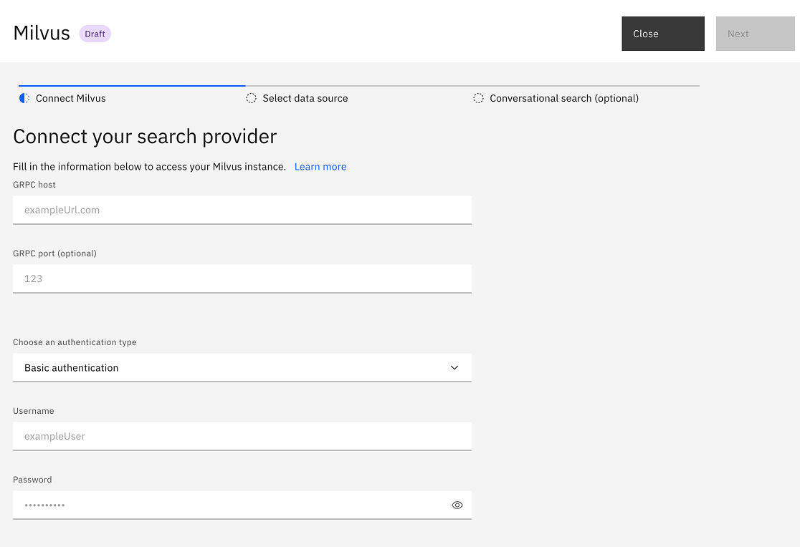
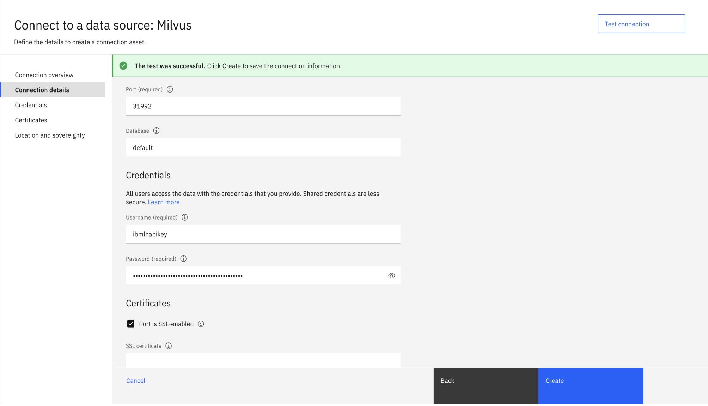
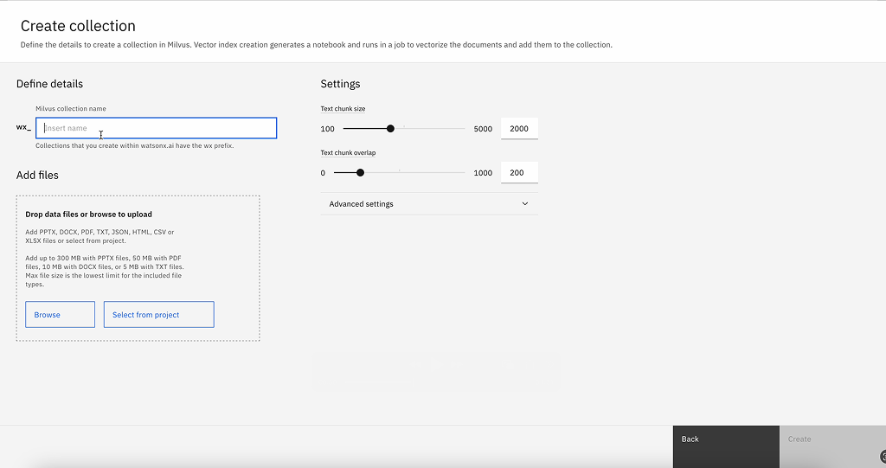

---

copyright:
  years: 2025
lastupdated: "2025-06-02"

subcollection: watson-assistant

---

{{site.data.keyword.attribute-definition-list}}

# Milvus search integration setup
{: #search-milvus-add}

[Plus]{: tag-green} [Enterprise]{: tag-purple} 
  
Milvus is a vector database that you can use for handling large-scale datasets. For applications that require real-time search capabilities and numerous concurrent users, you can use Milvus, which has a distributed architecture, high performance, and flexible data model.
{: shortdesc}

You can have only one search integration per environment. When you change the existing search integration to other integration types such as {{site.data.keyword.discoveryfull}}, Elasticsearch or Custom service, the settings of the existing search integration are overwritten.
{: important}

## Prerequisites for connecting Milvus to assistant
{: #prerequisites-milvus-connection}

- You must have an active account on {{site.data.keyword.lakehouse_short}} and watsonx.ai. 

   To create an account on {{site.data.keyword.lakehouse_short}} see, [{{site.data.keyword.lakehouse_short}} home page](https://www.ibm.com/products/watsonx-data){: external}. 

   To create an account on watsonx.ai, see [watsonx.ai home page](https://www.ibm.com/products/watsonx-ai){: external}.

- You must provision a Milvus instance in {{site.data.keyword.lakehouse_short}}.

   For more information on creating a Milvus instance in {{site.data.keyword.lakehouse_short}}, see [Adding Milvus service in {{site.data.keyword.lakehouse_short}}](/docs/watsonxdata?topic=watsonxdata-adding-milvus-service).

   For more information on creating an API key, see [API keys](https://cloud.ibm.com/iam/apikeys).

- You must configure {{site.data.keyword.lakehouse_short}} Milvus in IBM watsonx.ai. 

   To configure {{site.data.keyword.lakehouse_short}} in IBM watsonx.ai, see [Configuring {{site.data.keyword.lakehouse_short}} in IBM watsonx.ai](/docs/watsonxdata?topic=watsonxdata-wxd_wxai_milvus_conn). 

   For more details on creating a vector index, see [Creating vector index](/docs/content/wsj/analyze-data/fm-prompt-data-index-create.html?context=wx#procedure).

   For more information about creating collections, see [Creating collections](https://github.com/watson-developer-cloud/assistant-toolkit/blob/master/integrations/extensions/starter-kits/search-with-milvus/search-with-watsonx-data-milvus.md#step-2-ingest-data-into-milvus).

## Connecting Milvus to assistant
{: #procedure-milvus-connection}

Integrating Milvus in assistant involves three platforms.
1. {{site.data.keyword.conversationshort}}, where we build the integration.
1. {{site.data.keyword.lakehouse_short}}, where we are provisioning the Milvus instance.
1. watsonx.ai, where we are building the data source called collections.

### Selecting Milvus as a search integration in assistant
{: #select-milvus-search}

After you create a {{site.data.keyword.conversationshort}} instance, you can select Milvus as the search integration by using one of the following procedures:

 - **Selecting Milvus search integration from the Integrations page** 
    1. Go to **Home** > **Integrations**.
    1. Scroll down to the **Extensions** section. In the **Search** tile, click **Add** to open the **Set up a new search integration** window.
    1. Select **Milvus** to open the **Connect your search provider** window.
   
 - **Selecting Milvus search integration from the Environments page** 
    1. Go to **Home** > **Environments**.
    1. In the **Resolution methods** section, go to the **Extensions** section.
    1. Click **Add** inside the **Search** tile to open the **Set up a new search integration** window.
    1. Select **Milvus** to open the **Connect your search provider** window.
 
 - **Selecting Milvus search integration through Conversational search** 
   1. In the **Home** page, scroll down to the **Assistant architecture** section.
   1. In the **Conversational search** node, click **Add** to open the **Set up a new search integration** window.

    If Milvus is already added, the **Open** button is displayed. Else, **Add** is displayed. To set up custom service on the **Draft** or **Live** assistant environment, click **Open**.
       {: note}
 


### Connecting to {{site.data.keyword.lakehouse_short}} to set up Milvus
{: #setup-milvus}
  
After you select Milvus as the search integration, use data on your Milvus instance in {{site.data.keyword.lakehouse_short}} to set up Milvus on your assistant. 



For more information on creating a Milvus instance in 
{{site.data.keyword.lakehouse_short}}, see [Prerequisites for Milvus integration](#prerequisites-milvus-connection).
      
You can use the **Connect Milvus** to connect to the Milvus service inside {{site.data.keyword.lakehouse_short}}. In the **Connect your search provider** section, provide the following fields from {{site.data.keyword.lakehouse_short}} to enable your assistant to connect to your Milvus instance.    
   
   - **GRPC host** and **GRPC port**
   
      To get the details of **GRPC host** and **GRPC port**, see [Connection details](https://github.com/watson-developer-cloud/assistant-toolkit/blob/master/integrations/extensions/starter-kits/search-with-milvus/search-with-watsonx-data-milvus.md#get-other-connection-details).

      

   - **Choose an authentication type**
        * If you select `Basic authentication`, you must provide a **username** and **password**.
        * If you select `watsonx.data API key`, you must provide the corresponding **API key**. 
        * if you select `None`, you cannot provide any other authentication details.

        For more information about credentials, see [Getting credentials](https://github.com/watson-developer-cloud/assistant-toolkit/blob/master/integrations/extensions/starter-kits/search-with-milvus/search-with-watsonx-data-milvus.md#get-the-credentials).  

### Ingesting data into the Milvus vector database through watsonx.ai 
{: #ingest-data-milvus}

After you collect information from {{site.data.keyword.lakehouse_short}}, you must ingest data into the Milvus database to use in {{site.data.keyword.conversationshort}}.

In the Milvus window of your assistant, click **Next** to go to **Select data source** and provide the following details:
   -  In **Database**, select your preferred database.
   -  In **Choose collection**, select your collection. For more information, see [Prerequisites for Milvus integration](#prerequisites-milvus-connection).

   
   -  In **Choose index**, select the index.
   -  In **Choose embedding_model_id**, select your model. 

   For more information on the supported embedding models, see [Embedding models](https://dataplatform.cloud.ibm.com/docs/content/wsj/analyze-data/fm-models-embed.html?context=wx#embed){: external}.
   
   Your selected model must align with the model that you used to create your index. 
   {: note}

### Configuring the result content
{: #configure-result-content}

After you connect Milvus by selecting the data source, you can configure how the search response displays in the Milvus window of your assistant. In the **Configure result content** section of **Select data source**, provide the following fields to map the title, body, and URL from Milvus to the search response in assistant window:

   - **Title**
      Search result title. Use the title, name, or similar type of field from the collection as the search result title.
      Select something for the title or no search result response is displayed in the Facebook and Slack integrations.

   - **Body**
      Search result description. Use an abstract, summary, or highlight field from the collection as the search result body.
      Select something for the body or no search result response is displayed in the Facebook and Slack integrations.

   - **URL**
      This field can be populated with any footer content that you want to include at the end of the search result.

## Enabling conversational search in Milvus
{: enable-conv-search-milvus}

After you configure the result content, click **Next** to go to **Conversational search** (optional).

Conversational search is available only in the Plus and Enterprise plans of {{site.data.keyword.conversationshort}}.{: note}

To activate conversational search, switch the **Conversational Search** toggle to `on`. For more information, see [Conversational search](/docs/watson-assistant?topic=watson-assistant-conversational-search#conversational-search-setup).

### Defining filter expression 
{: #define-filter-expression}

Expand the **Advanced Milvus settings** section to define **Filter**.

You can define the filter as a string to filter the Milvus search results. For more information, see [Milvus-filter-search](https://milvus.io/docs/filtered-search.md){: external}. For more information on filter expression examples, see [Filter expression examples](#filter-expression-examples).

### Tuning your conversational search

You can tune your [conversational search’s tendency to say “I don’t know"](/docs/watson-assistant?topic=watson-assistant-conversational-search#behavioral-tuning-conversational-search) and the [generated response length](/docs/watson-assistant?topic=watson-assistant-conversational-search#tuning-the-generated-response-length-in-conversational-search).

Use the **Message**, **No results found**, and **Connectivity issue** tabs to customize different messages to share with users based on the successfulness of the search. 

   | Tab | Scenario | Example message |
   | --- | --- | --- |
   | Message | Search results are returned | `I found this information that might be helpful:` |
   | No results found | No search results are found | `I searched my knowledge base for information that might address your query, but did not find anything useful to share.` |
   | Connectivity issue | I was unable to complete the search for some reason | `I might have information that could help address your query, but am unable to search my knowledge base at the moment.` |
   {: caption="Search result messages" caption-side="top"}

You can skip this step if you do not want to change the Milvus instance details. If you want to change the Milvus instance credentials, click the **Instance** tab, change the authentication type, or edit the credentials, and then click **Save**. If you want to change the Milvus instance URL, click the **Update** button next to the URL that takes you to Step 1 to start the initial setup.

Click **Save** and then **Close** to finish the Milvus setup.

### Filtering expression examples
{: #filter-expression-examples}

The following examples help you to define a filter expression.

**Contains**
```
title like "%action%"
```
This filter expression allows only the search results with title that contains the word `action`.

**Doesn't contain**
```
not (title like "%action%")
```
This filter expression allows only the search results with title not containing the word `action`.

**Equal**
```
"Understand your most and least successful actions"
```
This filter expression allows only the search results with title equal to the phrase `Understand your most and least successful actions`.

**Doesn't Equal**
```
"Understand your most and least successful actions"
```
This filter expression allows only the search results with title not equal to the phrase `Understand your most and least successful actions`.

**Nested filter expression**
```
(title like "%action%") and (url in ["www.url1.com", "www.url2.com"])
```
This filter expression allows only the search results with the title that contains the word "action" and the url being one of ["www.url1.com", "www.url2.com"].

## Configuring your assistant to use Milvus
{: #milvus-assistant-configure}

After you configure the Milvus search integration, you must configure your assistant to use Milvus when the response matches no action. For more information about updating **No matches** to use search, see [Use search when no action matches](/docs/watson-assistant?topic=watson-assistant-search-integration-enhancement#search-no-action-matches).

## Testing Milvus
{: #milvus-test}

You can test search integration with Milvus in actions preview, the preview page, or by using the preview link.

You cannot see proper results in your preview when conversational search is `off`.
{: note}

In this example, the user asks, `What is an action?`.

A text-based reply from the best results in your knowledge base displays when conversational search is `on`. 

   
