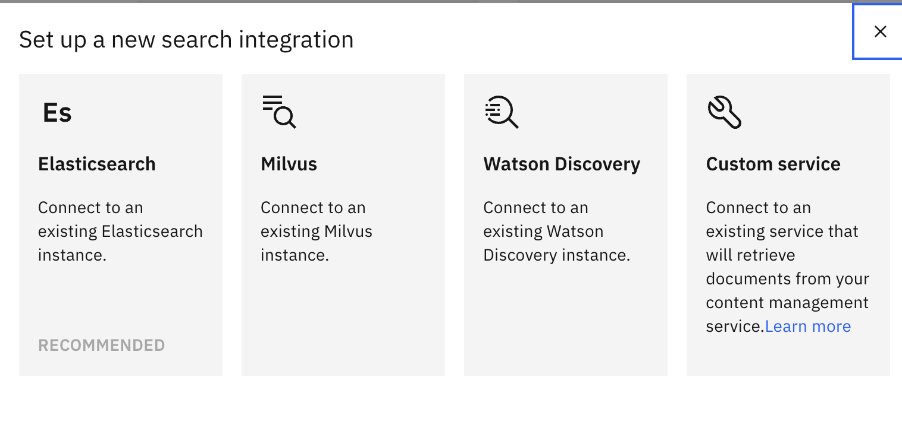

---

copyright:
  years: 2025
lastupdated: "2025-10-31"

subcollection: watson-assistant

---

{{site.data.keyword.attribute-definition-list}}

# Milvus search integration setup
{: #search-milvus-add}
 
Milvus is a high-performance, distributed vector database that is designed to manage large-scale datasets. It supports real-time search and handles multiple concurrent users efficiently, making it ideal for AI-powered applications.
{: shortdesc}

You can configure only one search integration per environment in {{site.data.keyword.conversationfull}}. If you switch to another integration type, such as {{site.data.keyword.discoveryfull}}, Elasticsearch, or a custom service, the existing configuration is overwritten.
{: important}

## Prerequisites for connecting Milvus to an assistant
{: #prerequisites-milvus-connection}

Before you connect Milvus to your assistant, you must complete the following steps:

### 1. Create required accounts

To begin using IBM watsonx services for Milvus integration, you must create accounts for both {{site.data.keyword.lakehouse_short}} and watsonx.ai platforms:

- [Sign up for IBM watsonx.data](https://www.ibm.com/products/watsonx-data)
- [Sign up for IBM watsonx.ai](https://www.ibm.com/products/watsonx-ai)

---

### 2. Set up Milvus in watsonx.data

To enable vector search capabilities within your assistant, you must deploy and configure Milvus in your {{site.data.keyword.lakehouse_short}} environment.

- [Add a Milvus service](https://www.ibm.com/docs/en/watsonxdata?topic=watsonxdata-adding-milvus-service)
- [Update Milvus authentication credentials](#updating-your-milvus-authentication-credentials)
- [Create an API key](https://cloud.ibm.com/iam/apikeys)

---

### 3. Configure Milvus in watsonx.ai

After you set up Milvus in {{site.data.keyword.lakehouse_short}}, you must configure its integration within watsonx.ai to enable vector-based retrieval and enhance your assistant’s capabilities.

- [Connect Milvus to watsonx.ai](https://www.ibm.com/docs/en/watsonxdata?topic=watsonxdata-wxd_wxai_milvus_conn)
- [Create a vector index](https://dataplatform.cloud.ibm.com/docs/content/wsj/analyze-data/fm-prompt-data-index-milvus.html?context=wx&locale=en)
- [Create collections](https://github.com/watson-developer-cloud/assistant-toolkit/blob/master/integrations/extensions/starter-kits/search-with-milvus/search-with-watsonx-data-milvus.md#step-2-ingest-data-into-milvus)

---

## Procedure to connect Milvus to an assistant
{: #procedure-milvus-connection}

This procedure explains how to integrate Milvus as a search provider in {{site.data.keyword.conversationshort}}. The integration involves three IBM platforms:

1. **{{site.data.keyword.conversationfull}}** – Configure and manage the search integration.
2. **{{site.data.keyword.lakehouse_short}}** – Provision and manage the Milvus vector database instance.
3. **IBM watsonx.ai** – Create and manage collections (data sources) for vector search.

### Selecting Milvus as a search integration in {{site.data.keyword.conversationshort}}
{: #select-milvus-search}

After you create a {{site.data.keyword.conversationshort}} instance, you can add Milvus as the search integration by using one of the following procedures:

**Option 1: From the Integrations page**:

1. Go to **Home** > **Integrations**.
2. Scroll to the **Extensions** section.
3. In the **Search** tile, click **Add** to open the **Set up a new search integration** window.
4. Select **Milvus** to open the **Connect your search provider** window.

**Option 2: From the Environments page**:

1. Go to **Home** > **Environments**.
2. In the **Resolution methods** section, locate the **Extensions** section.
3. Click **Add** in the **Search** tile to open the **Set up a new search integration** window.
4. Select **Milvus** to open the **Connect your search provider** window.

**Option 3: From the Conversational Search node**:

1. On the **Home** page, scroll to the **Assistant architecture** section.
2. In the **Conversational search** node, click **Add** to open the **Set up a new search integration** window.

If Milvus is already added, the **Open** button is displayed instead of **Add**. To configure a custom service in the **Draft** or **Live** assistant environment, click **Open**. {: note}
 


### Setting Up Milvus in {{site.data.keyword.lakehouse_short}}
{: #setup-milvus}
  
After you select Milvus as the search integration, you can connect your assistant to your Milvus instance in {{site.data.keyword.lakehouse_short}}.

To learn how to create a Milvus instance, see the [Prerequisites for Milvus integration](#prerequisites-for-connecting-milvus-to-an-assistant).

Use the **Connect Milvus** option to link your assistant to the Milvus service in {{site.data.keyword.lakehouse_short}}. 

#### Required Connection Details


In the **Connect your search provider** section, enter the following details:
 
- **GRPC host** and **GRPC port** - Retrieve these values from your Milvus instance. For instructions, see [Connection details](https://github.com/watson-developer-cloud/assistant-toolkit/blob/master/integrations/extensions/starter-kits/search-with-milvus/search-with-watsonx-data-milvus.md#get-other-connection-details).

#### Authentication options

 Choose one of the following authentication methods:

 - **Basic Authentication**  
      Provide your **username** and **password**.

 - **watsonx.data API Key**  
         Enter your **API key**.

- **None**  
         No authentication details are required.

For more information about credentials, see [Getting credentials](https://github.com/watson-developer-cloud/assistant-toolkit/blob/master/integrations/extensions/starter-kits/search-with-milvus/search-with-watsonx-data-milvus.md#get-the-credentials).  

### Updating your Milvus authentication credentials 
{: #update-milvus-auth-bc}

{{site.data.keyword.lakehouse_full_notm}} version 2.3 introduces changes to Milvus authentication. To avoid service disruptions, update your Milvus connection settings by 10 December 2025.

#### Step 1: Locate your new Milvus username
{: #step-1-locate-your-new-milvus-username}

Your new Milvus username follows this format:  

`ibmlhapikey_<your watsonx.data username>`

**Examples**

| watsonx.data username | Milvus username |
| -- | -- |
| `abc@ibm.com` | `ibmlhapikey_abc@ibm.com` |
| `serviceid-abcdef-123456` | `ibmlhapikey_serviceid-abcdef-123456` |

If you do not know your {{site.data.keyword.lakehouse_short}} username:

1. Go to **Infrastructure manager** in the {{site.data.keyword.lakehouse_short}} console.  
2. Select your Milvus service to view the **Details** page.  
3. Click the **Access control** tab. 
4. Locate your {{site.data.keyword.lakehouse_short}} username in the first column of the table. 

#### Step 2: Update your Milvus connection in {{site.data.keyword.conversationshort}}
{: #step-2-update-your-milvus-connection-in-assistant}

Update your Milvus credentials for each assistant that uses a Milvus as a source:

1. Go to **Home** > **Integrations**.
1. In the **Extensions** section, click **Open** on the Search tile.
1. If prompted, choose the environment to update. Repeat for each environment (For example, **Draft** and **Live**).
1. Select **Milvus**.
1. Record your current connection settings for reference.
1. Go to the **Instance** tab and click **Update**.  
1. Enter the following connection information:
   - **GRPC Host** and **GRPC Port**.
   - **Username**: Use your new Milvus username from [Step 1](#step-1-locate-your-new-milvus-username).
   - **Password**: Use your existing password or API key.
     - If you are using a {{site.data.keyword.lakehouse_short}} API key, enter it as the password.
1. Click **Next**.
1. Click **Save** and then click **Close**.  
1. Return to the search tile and click **Open**.
1. Select the same environment that you chose in [Step 2](#step-2-update-your-milvus-connection-in-sitedatakeywordconversationshort).
1. Click **Milvus**.
1. Go to the **Conversational Search** section.
1. Reenter the settings that you recorded in step 5.
1. Click **Save**, then **Close**. 
1. Use the assistant chat window to confirm Milvus search results are working correctly.

### Ingesting data into the Milvus through watsonx.ai 
{: #ingest-data-milvus}

To use Milvus with your assistant, first collect your data in {{site.data.keyword.lakehouse_short}}, then ingest it into the Milvus vector database.

In the Milvus setup window of your assistant, click **Next** to proceed to the **Select data source** step. Provide the following details:

   -  In **Database**, select your preferred database.
   -  In **Choose collection**, select the collection that you want to use.
    For more information, see [Prerequisites for Milvus integration](#prerequisites-for-connecting-milvus-to-an-assistant).
   -  In **Choose index**, select the index that is associated with your collection.
   -  In **Choose embedding_model_id**, select the embedding model that matches the one used to create your index.  

   [Learn more about embedding models](https://dataplatform.cloud.ibm.com/docs/content/wsj/analyze-data/fm-models-embed.html?context=wx#embed){: external}.
   
  The selected model must match the model that is used during index creation. {: note}

### Configuring the result content
{: #configure-result-content}

After you connect Milvus by selecting the data source, you can configure how the search response displays in the Milvus window of your assistant. 

In the **Configure result content** section of **Select data source**, map the following fields from your Milvus collection:

- **Title**: Use a title, name, or similar field. It appears as the search result title. If not set, search results are not displayed in Facebook or Slack integrations.

- **Body**: Use an abstract, summary, or highlight field. It appears as the search result description. If not set, search results are not displayed in Facebook or Slack integrations. 

- **URL**: Add any footer content to display at the end of the search result.

---

## Enabling conversational search in Milvus
{: #enable-conv-search-milvus}

After you configure the result content, click **Next** to access the **Conversational Search** section (optional).

Conversational search is available only in the Plus and Enterprise plans of {{site.data.keyword.conversationshort}}.{: note}

To activate conversational search, toggle **Conversational Search** to `On`. 

- [Learn more about conversational search](https://www.ibm.com/docs/en/watson-assistant?topic=watson-assistant-conversational-search#conversational-search-setup).

### Defining filter expression 
{: #define-filter-expression}

To filter Milvus search results, expand the **Advanced Milvus settings** section and define a **Filter** string.

- [Learn more about filtered search](https://milvus.io/docs/filtered-search.md).
- [See filter expression examples](#filter-expression-examples).

---

### Tuning your conversational search

You can customize how your assistant responds when search results are returned, missing, or when connectivity issues occur.

You can tune your [conversational search’s tendency to say “I don’t know"](/docs/watson-assistant?topic=watson-assistant-conversational-search#behavioral-tuning-conversational-search) and the [generated response length](/docs/watson-assistant?topic=watson-assistant-conversational-search#tuning-the-generated-response-length-in-conversational-search).

Use the following tabs to configure messages:

   | Tab | Scenario | Example message |
   | --- | --- | --- |
   | Message | Search results are returned | `I found this information that might be helpful:` |
   | No results found | No search results are found | `I searched my knowledge base for information that might address your query, but did not find anything useful to share.` |
   | Connectivity issue | The search might not be completed | `I might have helpful information, but I'm unable to search my knowledge base.` |
   {: caption="Search result messages" caption-side="top"}

If you skip this step, default messages will be used. To update Milvus instance credentials, go to the **Instance** tab, change the authentication type or credentials, and click **Save**. To update the Milvus URL, click **Update** to restart setup from Step 1. {: note}

Click **Save** and then **Close** to complete the setup.

---

### Filtering expression examples
{: #filter-expression-examples}

Use the following examples to define filter expressions:

**Contains**
```
title like "%action%"
```
Returns results where the title contains `action`.

**Doesn't contain**
```
not (title like "%action%")
```
Excludes results where the title contains `action`.

**Equal**
```
"Understand your most and least successful actions"
```
Returns results with an exact title match.

**Doesn't Equal**
```
"Understand your most and least successful actions"
```
Excludes results with the exact title.

**Nested filter expression**
```
(title like "%action%") and (url in ["www.url1.com", "www.url2.com"])
```
Returns results where the title contains "action" and the URL matches one of the specified values.

## Configuring your assistant to use Milvus
{: #milvus-assistant-configure}

After you set up Milvus, configure your assistant to use it when no action matches.

- [Learn how to use search when no action matches](https://www.ibm.com/docs/en/watson-assistant?topic=watson-assistant-search-integration-enhancement#search-no-action-matches).

## Testing Milvus integration
{: #milvus-test}

You can test Milvus search integration by using:

- Actions preview
- Preview page
- Preview link

Conversational search must be turned `On` to see proper results.
{: note}

### Example

User query: `What is an action?`

If conversational search is enabled, the assistant returns a text-based reply from the best results in your knowledge base.


