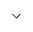

---

copyright:
  years: 2022
lastupdated: "2022-06-27"

subcollection: watson-assistant

---

{:shortdesc: .shortdesc}
{:new_window: target="_blank"}
{:external: target="_blank" .external}
{:deprecated: .deprecated}
{:important: .important}
{:note: .note}
{:tip: .tip}
{:pre: .pre}
{:preview: .preview}
{:codeblock: .codeblock}
{:screen: .screen}
{:javascript: .ph data-hd-programlang='javascript'}
{:java: .ph data-hd-programlang='java'}
{:python: .ph data-hd-programlang='python'}
{:swift: .ph data-hd-programlang='swift'}
{:table: .aria-labeledby="caption"}
{:video: .video}

{{site.data.content.classiclink}}

# Sending events to Segment
{: #segment-add}

You can use the Segment extension to send {{site.data.keyword.conversationshort}} events to Segment.
{: shortdesc}

## Overview
{: #segment-overview}

With this extension, you can use [Segment](https://segment.com/){: external} to capture and centralize data about your customers' behavior, including their interactions with your assistant. Events are sent from {{site.data.keyword.conversationshort}} to Segment, making them available to destinations such as data warehouses, raw data tools, and analytic tools.

## Adding the extension to the draft environment

To add the Segment extension to your assistant, follow these steps:

1. On the  **Integrations** page, scroll to the **Extensions** section and find the tile for the Segment extension.

1. Click **Add**. Review the overview of the extension and click **Add** to configure it for your assistant.

    When you first add the Segment extension to an assistant, the configuration settings you provide are applied only to the draft environment. You must complete configuration for the draft environment before you can add the extension in the live environment.
    {: important}

1. In the **Connect** step, click the link to log in to your Segment account in another browser tab.

    If you do not already have a Segment account, click **Sign up for free account** to create one. Verify your email address and complete your profile to activate your account.

1. In the Segment web app, go to your workspace. In the **Sources** section, find the **Add IBM Watson Assistant Source** tile and click **Add Source**.

1. In the **Source Name** field, type a descriptive name for your {{site.data.keyword.conversationshort}} instance (for example, `Customer Care Assistant`). Click **Create Source**.

1. Click **Copy** to copy the generated key to the clipboard.

1. Go back to the Segment integration settings in the {{site.data.keyword.conversationshort}} interface. In the **Segment key** field, paste the key you copied from the Segment web app in the previous step. Click **Next**.

1. In the **Select events** step, review the list of events {{site.data.keyword.conversationshort}} can send to Segment.

    Each row in the table shows the name of a supported event, along with a brief description.

    <!--
    To see more information about an event, click the  icon next to its row in the table. The expanded view of an event shows details about the properties included with the event.
    -->

1. Click the checkboxes to select the events you want to send to Segment. Click **Next**.

1. In the **Review & Confirm** step, review the configuration and click **Finish**.

The Segment extension is now connected to your assistant in the draft environment. Click **Close** to close the integration settings.

## Configuring the extension for the live environment

To configure the Segment extension for the live environment, follow these steps:

1. On the  **Integrations** page, scroll to the **Extensions** section and find the tile for the Segment extension.

1. Click **Open**. The **Open extension** window opens.

1. In the **Environment** field, select **Live**. Click **Confirm**.

1. Repeat the configuration process, specifying the values you want to use for the live environment.

The Segment extension is now available in the environments you have configured, , and events will be sent to the destinations configured in your Segment workspace.
