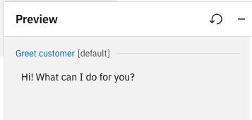

---

copyright:
  years: 2018, 2021
lastupdated: "2021-09-24"

subcollection: watson-assistant

---

{:shortdesc: .shortdesc}
{:new_window: target="_blank"}
{:external: target="_blank" .external}
{:deprecated: .deprecated}
{:important: .important}
{:note: .note}
{:tip: .tip}
{:pre: .pre}
{:codeblock: .codeblock}
{:screen: .screen}
{:javascript: .ph data-hd-programlang='javascript'}
{:java: .ph data-hd-programlang='java'}
{:python: .ph data-hd-programlang='python'}
{:swift: .ph data-hd-programlang='swift'}

# Starting the conversation
{: #start-conversation}

As you start building your assistant, one of the first things you should consider is how it will start each new conversation with a user. This might be as simple as saying hello, or it might involve asking some questions to gather data the assistant needs before it can do anything else. Starting a new conversation is handled by the *Greet customer* action, which is automatically created (with a default greeting) when you create an assistant.
{: shortdesc}

The *Greet customer* action is triggered in situations where your assistant initiates the conversation and then waits for input from the user. Depending on how users connect to your assistant, the Greeting action might not be triggered. (For more information, see [When the greeting action is triggered](#greeting-triggered).)
{: note}

## Customizing the greeting
{: #customize-greeting}

The *Greet customer* action is automatically provided for any assistant. To customize this action:

1. In the left-hand navigation pane of the actions editor, click **Actions** to expand the list.

1. Click **Set by assistant** to see a list of built-in actions that are automatically provided when you create an assistant.

1. Click *Greet customer* to edit the greeting action.

    Notice that for this action, you cannot specify the customer input that starts the action. That's because the greeting action is automatically sent when the assistant starts the conversation, before any user input is received.

1. Under **Conversation steps**, click the first step. In the **Assistant says** field, edit the default text to specify the greeting text you want to use. For example, if you want your assistant to use a more casual tone, you might specify the text `Hi! What can I do for you?`

1. To see your new greeting in action, click **Preview**. In the Preview pane, you should see your customized greeting appear.

## Adding a mandatory welcome flow
{: #welcome-flow}

Apart from how it is initiated, the *Greet customer* action is just like any other action. If you need to start each conversation with more than just a standard greeting, you can configure your *Greet customer* action with more steps and customer responses, just as you would with any other action. For example, instead of just saying hello, your *Greet customer* action might start by asking for the user's account number. For more information about editing actions, see [Overview: Editing actions](/docs/watson-assistant?topic=watson-assistant-build-actions-overview).

You can also use the *Greet customer* action to initialize variables for use throughout the conversation. For example, you might want to initialize tracking variables at the beginning of the conversation, or store the user's name so you can personalize the assistant's interactions. In general, you can set variables in the *Greet customer* action just as you can with any other action. (For more information about setting variables, see [Managing information during the conversation](/docs/watson-assistant?topic=watson-assistant-manage-info).)

Keep in mind that you should not rely on the *Greet customer* action to initialize required variables unless you are certain it will always be triggered at the beginning of each conversation. For more information, see [When the greeting action is triggered](#greeting-triggered).

## When the greeting action is triggered
{: #greeting-triggered}

Depending on how you publish your assistant, the *Greet customer* action might not be triggered. This action is triggered only when the assistant, rather than the user, starts the conversation, as in the following situations:

- Assistant preview
- Phone integration
- Web chat integration with home screen disabled
- A custom client application, depending on design

In this kind of situation, the integration or client application starts the session by sending an empty message to the assistant and waits for the assistant to greet the user (this is when the *Greet customer* action is triggered).

However, there are other situations in which the *Greet customer* action is never triggered:

- Integrations with text messaging channels, such as Slack, Facebook Messenger, or SMS. With these kinds of channels, the user starts the conversation by sending an initial message or request. This triggers the appropriate action for handling the user's request, so the *Greet customer* action is not triggered.
- Web chat integration with home screen enabled. The home screen is an optional feature of the web chat integration. When enabled, the home screen displays a welcome message to the user; because the greeting is defined in the web chat configuration, the *Greet customer* action is not triggered. 

