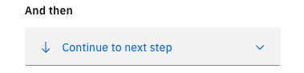

---

copyright:
  years: 2018, 2023
lastupdated: "2023-10-24"

subcollection: watson-assistant

---

{{site.data.keyword.attribute-definition-list}}

# Choosing what to do at the end of a step
{: #step-what-next}

By default, the steps in an action are executed in sequence from first to last. However, you can change this default in order to change what happens next. Used in combination with step conditions, this capability makes it possible for the conversation to follow many different flows depending on the customer's input.

To specify what happens when a step finishes, click **And then**.

Select an option from the drop-down list. The following options are available:

- [Continue to next step](#continue-to-next-step)
- [Re-ask previous step(s)](#re-ask-previous-step)
- [Go to a subaction](#go-to-another-action)
- [Use an extension](#use-extension)
- [Search for the answer](#search-for-answer)
- [Connect to agent](#connect-to-agent)
- [End the action](#end-action)

## Continue to next step
{: #continue-to-next-step}

This option processes the next step in the steps list. As always, the conditions for the next step are evaluated first to determine whether to show the step's response to the customer. This is the default selection.

## Re-ask previous step(s)
{: #re-ask-previous-step}

This option repeats one or more steps that are listed earlier in the current action. These might be steps that the customer already completed, or steps that were skipped previously based on their step conditions.

You can use this option to handle situations where the customer has made a mistake and asks to go back to a previous point in the conversation. For example, you might include a confirmation step at the end of a process that asks the user whether the collected information is correct; if the user says no, you can return to the beginning of the process. This option is only available from a step that comes third or later in the steps list.

To repeat previous steps:

1. In the **And then** field, select **Re-ask previous step(s)**.

1. In the Settings window, click to select any previous steps you want to repeat. You can select any step that precedes the step you are editing.

    Note that only the selected steps will repeat, regardless of their **And then** settings. Therefore, if you want to repeat the entire action up to this point, you must select all of the previous steps.

    The current step you are editing is automatically included in the list of steps to be repeated. To avoid an infinite loop, use step conditions to ensure that this step only executes when it is appropriate for previous steps to be repeated. For example, you might have a step that repeats previous steps only if the user answered `No` to a confirmation question; this way, if the user answers `Yes`, nothing is repeated and the action continues.
    {: tip}

1. Click **Apply**.

Any session variable values that were defined based on choices that the customer made in the repeated steps are cleared and replaced with the new responses.

There is no option to jump to a later step. Instead of jumping directly to a later step, control the flow through the intervening steps with step conditions or skipping steps.
{: note}

## Go to a subaction
{: #go-to-another-action}

An action that is called from another action is referred to as a _subaction_. This option switches the conversation flow to another action. If you have an action flow that can be applied across multiple actions, you can use a subaction to build it once and then call it from each action that needs it. For example, as part of an action to place an order, you might call a subaction that enables a new customer to create an account.

To call a subaction:

1. In the **And then** field, select **Go to a subaction**.

1. In the Settings window, click the **Go to** field and select the action that you want to call.

1. If you do not want to continue with the current action, click **End this action after the other action is completed**. You might use this option in cases where the customer decides to do something different; in this case, you want the conversation flow to switch to the subaction and not return.

    By default, the assistant returns to the current action after the subaction completes. Any action variables or session variables that are defined in the subaction are accessible from subsequent steps in the calling action.

1. Click **Apply**.

### Passing values to a subaction

Optionally, you can pass values to the subaction so the customer does not need to specify them again. For example, if your order-placement action collects the customer's name, you can then pass that information to the account-creation subaction. The step in the subaction that asks for the customer's name is skipped, and the value that is already specified is used instead.

To pass values to the subaction:

1. Click **Edit passed values**.

1. In the **Edit passed variables** window, click **Set new value**.

1. Select an action variable that you want to pass a value for. (The available action variables are based on the customer responses that are defined in the subaction.)

1. Select the value that you want to pass from the current action. You can select any available variable, or select **Expression** if you want to specify a different value.

1. Click **Apply**.

## Use an extension
{: #use-extension}

You can call an extension that has been added to your assistant in order to interact with an external service. For example, you might use an extension to interact with a ticketing or customer relationship management (CRM) system, or to retrieve real-time data such as mortgage rates or weather conditions. For more information about calling an extension, see [Calling an extension](/docs/watson-assistant?topic=watson-assistant-call-extension).

## Search for the answer
{: #search-for-answer}

[Plus]{: tag-green}

This option indicates that the assistant should use the {{site.data.keyword.discoveryfull}} service to search an external data source for information related to the customer's question. To use this option, you must configure a search integration for your assistant. For more information about configuring a search integration, see [{{site.data.keyword.discoveryfull}} search integration setup](/docs/watson-assistant?topic=watson-assistant-search-add).

## Connect to agent
{: #connect-to-agent}

This option indicates that the assistant should transfer the conversation to a human agent. For more information, see [Connecting to a live agent](/docs/watson-assistant?topic=watson-assistant-human-agent).

## End the action
{: #end-action}

This option indicates that this action is complete. Any action variable values that were defined based on choices that the customer made during the action are reset. The action ends immediately, without executing any subsequent steps.

This option can be applied to more than one step in a single action because an action can define more than one branch of a conversation, controlled by step conditions. For example, the open an account action might have one conversational flow for creating a checking account and a separate one for creating a savings account. Each branch might have its own final step. Identifying the final step helps analytical tools that follow a customer's progress through an action to identify the success or failure of the action.
