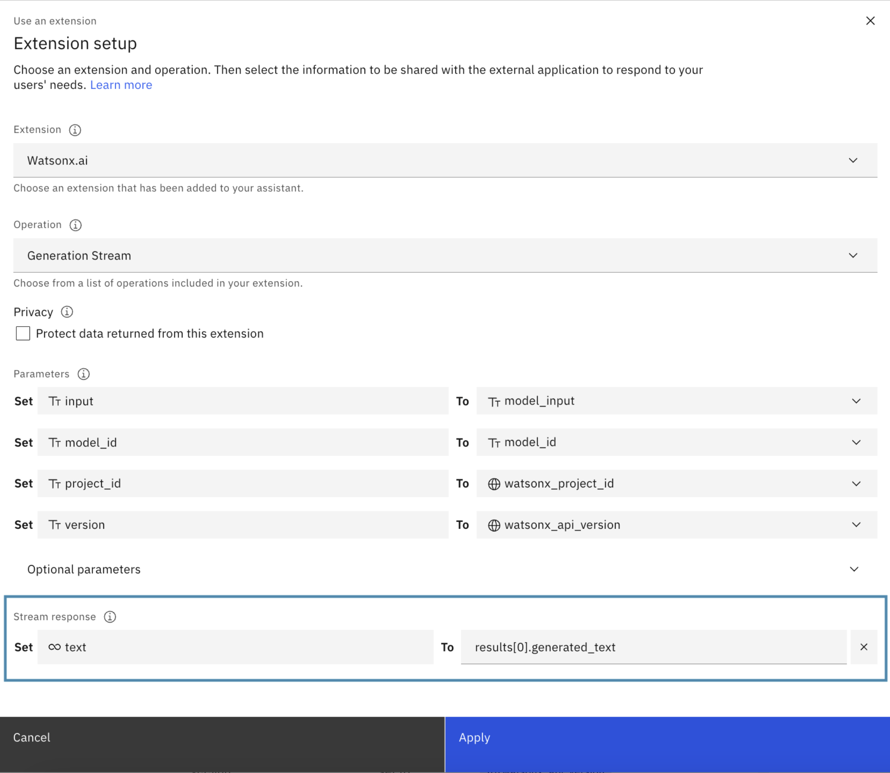

---

copyright:
  years: 2022, 2024
lastupdated: "2024-09-06"

subcollection: watson-assistant

---

{{site.data.keyword.attribute-definition-list}}

# Streaming from an extension
{: #stream-from-extension}

## Before you begin

If you want to enable the streaming on webchat, do the following steps:

-   Go to **Home** > **Preview** > **Customize web chat**.
-   Click the **Styles** tab.
-   Set the **Streaming** toggle button to `On`.
-   Click **Save and exit**.

## How to stream from an extension

You can follow the steps that are outlined in [Call the custom extension](/docs/watson-assistant?topic=watson-assistant-call-extension). If the selected **Operation** defines `text/event-stream` as the response `content-type`, then the feature enables the selection of text to be streamed from SSE generated by the operation.

{: caption="Streaming from an extension" caption-side="top"}

If your operation generates Server-Sent Events like the following examples:

```bash
data: {"model_id":"ibm/granite-13b-chat-v2","created_at":"2024-07-01T21:49:29.696Z","results":[{"generated_text":"to lear","generated_token_count":10,"input_token_count":0,"stop_reason":"not_finished"}]}

data: {"model_id":"ibm/granite-13b-chat-v2","created_at":"2024-07-01T21:49:29.731Z","results":[{"generated_text":"n ne","generated_token_count":11,"input_token_count":0,"stop_reason":"not_finished"}]}

data: {"model_id":"ibm/granite-13b-chat-v2","created_at":"2024-07-01T21:49:29.767Z","results":[{"generated_text":"w skill","generated_token_count":12,"input_token_count":0,"stop_reason":"not_finished"}]}
```

Specify `text` as the JSON Path in watsonx Assistant to indicate where the text or token is extracted from each SSE. In the previous example, `results[0].generated_text` is the path from where the text is extracted, resulting in: `to learn new`.

## Running the stream

When the custom extension is called, watsonx Assistant attempts a call to stream text from the specified **Operation**. The next step runs only after the stream is completed successfully or whether an error occurs before the streaming starts. If the stream completes successfully, the streamed text is stored in the `.body` property of the result variable.

You can access properties from the last event in the stream by referencing the `.last_event` property. For example, use `${step_596_result_1.last_event.citations}` to retrieve specific data.
{: note}

## Checking success or failure

Use the `Ran successfully` response variable to check whether the stream completes successfully or to handle cases where the stream fails to start. This variable returns a boolean value (true or false). It is `true` if the stream completes successfully and `false` if the stream fails to start. For details on conditioning based on HTTP status, see [Conditioning on HTTP status](/docs/watson-assistant?topic=watson-assistant-call-extension#extension-condition-status) to check how to condition.


If the stream fails after it starts due to network issues or it reaches the maximum 30-second timeout, an error will be generated for the user.{: note}
