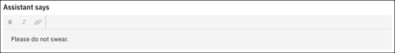

---

copyright:
  years: 2022
lastupdated: "2022-09-08"

subcollection: watson-assistant

---

{:shortdesc: .shortdesc}
{:new_window: target="_blank"}
{:external: target="_blank" .external}
{:deprecated: .deprecated}
{:important: .important}
{:note: .note}
{:tip: .tip}
{:pre: .pre}
{:codeblock: .codeblock}
{:screen: .screen}
{:javascript: .ph data-hd-programlang='javascript'}
{:java: .ph data-hd-programlang='java'}
{:python: .ph data-hd-programlang='python'}
{:swift: .ph data-hd-programlang='swift'}

{{site.data.content.classiclink}}

{{site.data.content.earlyaccess}}

# Trigger word detected
{: #trigger-word-detected}

Use the *Trigger word detected* action to add words or phrases to two separate groups. The first group connects customers with an agent. The second group shows customers a customizable warning message.
{: shortdesc}

By default, this action has two steps&mdash;the *Danger word detected* step and the *Profanity detected* step. To see how this action works, click **Set by assistant** in the list of actions, and then click *Trigger word detected*.

## Danger word detected
{: #danger-word-detected}

The first step of the *Trigger word detected* action is the *Danger word detected* step. The *Danger word detected* step connects a customer with an agent if any trigger words are detected in the customer's input. Use this step to capture any key phrases where it’s important to connect a customer with another person rather than activate any further actions.

For example, you might add `hurt` and `harm` as trigger words for the *Danger word detected* step:

In this example, if a customer enters `hurt` or `harm`, they are automatically connected with an agent.

## Profanity detected
{: #profanity-detected}

The second and final step of the *Trigger word detected* action is the *Profanity detected* step. The *Profanity detected* step shows a customizable warning message to your customer if any trigger words are detected in the customer's input. Use this step to discourage customers from interacting with your assistant in potentially harmful ways, such as using profanity.

For example, you might add `darn`, `dang`, and `heck` as trigger words for the *Profanity detected* step:

In this example, you can customize your warning message to `Please do not swear.`:

Then, if a customer enters `darn`, `dang`, or `heck`, the assistant responds, `Please do not swear.`
