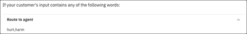
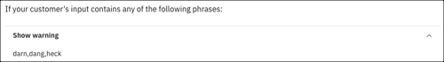

---

copyright:
  years: 2022, 2024
lastupdated: "2024-12-27"

subcollection: watson-assistant

---

{{site.data.keyword.attribute-definition-list}}

# Detecting trigger words
{: #trigger-phrases}

[IBM Cloud]{: tag-ibm-cloud}

Use the *Trigger word detected* action to add words or phrases to two separate groups. The first group connects customers with an agent. The second group shows customers a customizable warning message.
{: shortdesc}

By default, this action has two steps: the *Connect to agent* step and the *Show warning* step. To see how this action works, click **Set by assistant** in the list of actions, and then click **Trigger word detected**.

## Connect to agent
{: #trigger-phrases-connect-to-agent}

The first step of the *Trigger word detected* action is the *Connect to agent* step. The *Connect to agent* step goes to the *Fallback* action if any trigger words are detected in the customer's input. Use this step to capture any key phrases where it’s important to connect a customer with a live agent rather than activate any further actions.

For example, you might add `hurt` and `harm` as trigger words for the *Connect to agent* step:

{: caption="Adding trigger words to the Connect to agent step" caption-side="bottom"}

In this example, a customer enters a word or phrase that includes `hurt` or `harm`, which triggers the *Fallback* action. Step 4 has:
- `Danger word detected` as the fallback reason.
- The default message: `It seems this conversation would be best managed by a human agent. Let me connect you to one of our agents.` You can customize this message. 
- **And then** set to **Connect to agent (action ends)**.

For more information about the *Fallback* action, see [Editing the fallback action](/docs/watson-assistant?topic=watson-assistant-handle-errors#fallback-action).

## Show warning
{: #trigger-phrases-show-warning}

The second and final step of the *Trigger worFixd detected* action is the *Show warning* step. The *Show warning* step shows a customizable warning message to your customer if any trigger words are detected in the customer's input. Use this step to discourage customers from interacting with your assistant in unacceptable ways, such as using profanity.

For example, you might add `darn`, `dang`, and `heck` as trigger words for the *Show warning* step:

{: caption="Adding trigger words to the Show warning step" caption-side="bottom"}

In this example, a customer enters `darn`, `dang`, or `heck`, the assistant responds with `Please use appropriate language when interacting with the assistant`. You can customize this message. 

If the customer triggers the *Show warning* step again, the *Fallback* action is triggered. The default setting is if attempts exceed 2 total tries. You can customize this setting.

In the *Fallback* action, step 5 has:

- `Profanity detected` as the fallback reason.
- The default message: `It seems this conversation would be best managed by a human agent. Let me connect you to one of our agents.` You can customize this message. 
- **And then** set to **Connect to agent (action ends)**.

For more information about the *Fallback* action, see [Editing the fallback action](/docs/watson-assistant?topic=watson-assistant-handle-errors#fallback-action).
