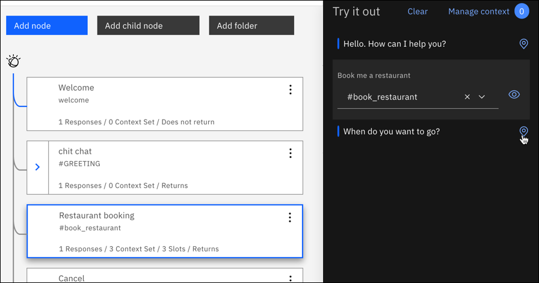
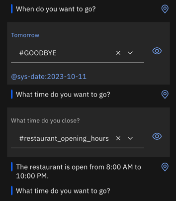
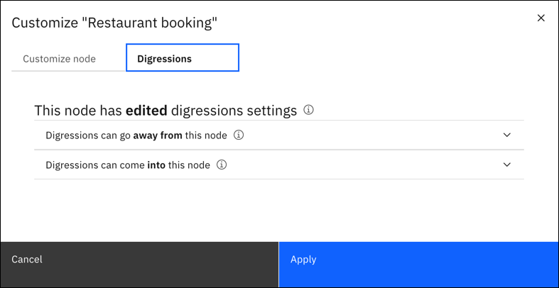

---

copyright:
  years: 2015, 2023
lastupdated: "2023-10-11"

subcollection: watson-assistant
content-type: tutorial
account-plan: lite
completion-time: 20m

---

{{site.data.keyword.attribute-definition-list}}

# Understanding digressions in dialog
{: #tutorial-digressions}
{: toc-content-type="tutorial"}
{: toc-completion-time="20m"}

In this tutorial, you see firsthand how digressions work.
{: shortdesc}

## Learning objectives
{: #tutorial-digressions-objectives}

By the time you finish the tutorial, you learn how:

- Digressions are designed to work.
- Digression settings impact the flow of the dialog.
- To test digression settings for a dialog.

### Duration
{: #tutorial-digressions-duration}

This tutorial takes approximately 20 minutes to complete.

## Step 1: Get the Digressions Showcase dialog
{: #tutorial-digressions-import-json}

You use the *Digression Showcase* dialog as an example in this tutorial. 

1. Download [digression-showcase.json](https://github.com/watson-developer-cloud/community/blob/master/watson-assistant/digression-showcase.json){: external} from the IBM GitHub repository.

2. Next, upload the JSON file to your assistant. 

If you are using dialog in {{site.data.keyword.conversationshort}}:

1. The upload overwrites any existing dialog. Use an assistant without an existing dialog, then [activate dialog](/docs/watson-assistant?topic=watson-assistant-skill-dialog-add). 

1. In **Dialog**, click **Upload/Download**. 

1. Upload `digression-showcase.json`.

If you are using a dialog skill in the classic experience:

1. On **Skills**, click **Create skill**.

1. Choose **Dialog skill**, then click **Next**.

1. Choose **Upload skill**, then upload `digression-showcase.json`.

## Step 2: Temporarily digressing away from dialog
{: #tutorial-digressions-temporarily-digress-away}

Digressions allow users to break away from a dialog branch to temporarily change the topic before they return to the original dialog flow. In this step, you start to book a restaurant reservation, then digress away to ask for the restaurant's hours. The assistant provides opening hours information, then returns to the restaurant booking dialog flow.

1. Click **Dialog** to open the dialog tree.

1. Click **Try it**.

1. Type `Book me a restaurant`.

   Your assistant responds with `When do you want to go?`.

1. To highlight the node that triggered the response, click the **Location** icon .

   The **Restaurant booking** node is highlighted in the dialog tree.
   
   {: caption="Restaurant booking node" caption-side="bottom"}

1. Type `Tomorrow`.

    Your assistant responds with a prompt for the time to reserve `What time do you want to go?`.

1. You do not know when the restaurant closes, so you ask, `What time do you close?`

    The assistant digresses away from the restaurant booking node to process the **Restaurant opening hours** node. It responds with, `The restaurant is open from 8:00 AM to 10:00 PM.`. Your assistant then returns to the restaurant booking node, and prompts you again for the reservation time.

    {: caption="Digression" caption-side="bottom"}

1. **Optional**: To complete the dialog flow, type `8pm` for the reservation time and `2` for the number of guests.

You digressed away from and returned to a dialog flow.

## Step 3: Disabling slot digressions
{: #tutorial-digressions-disable-slot}

In this step, you edit the digression setting for the restaurant booking node to prevent users from digressing away from it, and see how the setting change impacts the dialog flow.

Look at the current digression settings for the **Restaurant booking** node. 

1. Click the node to open it in edit view.

1. Click **Customize**, and then click the **Digressions** tab.

   {: caption="Digression settings" caption-side="bottom"}

1. Click to expand **Digressions can go away from this node**.

1. Set the **Allow digressions away while slot filling** switch to **Off**, and then click **Apply**.

1. Click the **Close** icon  to close the node edit view.

1. Click **Try it**.

1. Click **Clear** in the "Try it out" pane to start over. 

1. Type `Book me a restaurant`.

    Your assistant responds with a prompt for the day to reserve, `When do you want to go?`

1. Type `Tomorrow`.

    Your assistant responds with a prompt for the time to reserve, `What time do you want to go?`

1. Ask, `What time do you close?`

    Your assistant recognizes that the question triggers the `#restaurant_opening_hours` intent, but ignores it and displays the prompt that is associated with the `@sys-time` slot again instead.

You prevented the user from digressing away from the restaurant booking process.

## Step 4: Digressing to a node that does not return
{: #tutorial-digressions-digress-without-return}

You can configure a dialog node to not go back to the node that your assistant digressed away from for the current node to be processed. To demonstrate this configuration, you change the digression setting for the restaurant hours node. In Step 2, after you digress from the restaurant booking node to go to the restaurant opening hours node, your assistant returns to the restaurant booking node to continue with the reservation. In this exercise, after you change the setting, you digress from the **Job opportunities** node to ask for  opening hours and see that your assistant does not return to where it left off.

1. Click to open the **Restaurant opening hours** node.

1. Click **Customize**, and then click the **Digressions** tab.

1. Click to expand **Digressions can come into this node**, and deselect the **Return after digression** checkbox. 

1. Click **Apply**.

1. Click the **Close** icon  to close the node edit view.

1. Click **Try it**.

1. Click **Clear** in the "Try it out" pane to start over. 

1. Type `I'm looking for a job`.

    Your assistant responds by saying, `We are always looking for talented people to add to our team. What type of job are you interested in?`

1. Instead of answering this question, ask an unrelated question. Type `What time do you open?`

    Your assistant digresses away from the *Job opportunities* node to the *Restaurant opening hours* node to answer your question. Your assistant responds with `The restaurant is open from 8:00 AM to 10:00 PM.`

    Unlike in the previous test, this time the dialog does not pick up where it left off in the **Job opportunities** node. Your assistant does not return to the dialog that was in progress because you changed the setting on the **Restaurant opening hours** node to not return.

You digressed away from a dialog without returning.

## Summary
{: #tutorial-digressions-summary}

In this tutorial you experienced how digressions work, and saw how individual dialog node settings can impact the digressions behavior.
