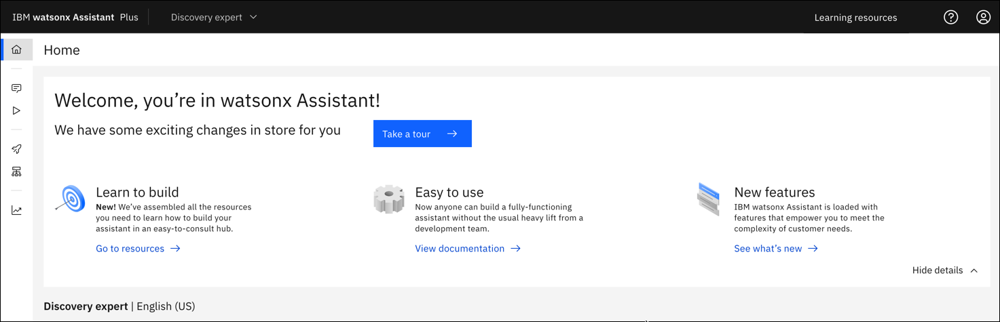

---

copyright:
  years: 2023
lastupdated: "2023-08-08"

subcollection: watson-assistant
content-type: tutorial
services: watson-assistant
account-plan: trial
completion-time: 4h

---

{{site.data.keyword.attribute-definition-list}}

# Use NeuralSeek to return polished answers from existing help content
{: #tutorial-neuralseek}
{: toc-content-type="tutorial"}
{: toc-services="watson-assistant"}
{: toc-completion-time="4h"}

In this tutorial, you will use the Watson {{site.data.keyword.discoveryshort}}, {{site.data.keyword.conversationshort}}, and NeuralSeek services that are available from the {{site.data.keyword.cloud_notm}} catalog to create a virtual assistant that can answer questions about Watson {{site.data.keyword.discoveryshort}}. The assistant will generate answers by using the existing Watson {{site.data.keyword.discoveryshort}} product documentation as its knowledge base.
{: shortdesc}

This tutorial shows the steps for creating a managed deployment of {{site.data.keyword.discoveryshort}}. However, you can create a {{site.data.keyword.discoveryshort}} service instance that is either hosted by {{site.data.keyword.cloud_notm}} or installed in {{site.data.keyword.icp4dfull_notm}} and connect it to a NeuralSeek service instance.
{: note}

## Learning objectives
{: #tutorial-neuralseek-objectives}

By the time you finish the tutorial, you will understand how to:

-  Create a Document Retrieval project in {{site.data.keyword.discoveryshort}}.
-  Upload PDF documents to your project, and apply a user-trained Smart Document Understanding model to your PDFs.
-  Connect your {{site.data.keyword.discoveryshort}} project to a NeuralSeek service instance. NeuralSeek is an AI-powered answer generation engine.
-  Create an assistant in {{site.data.keyword.conversationshort}} and apply a NeuralSeek integration to it.
-  Add an action to your {{site.data.keyword.conversationshort}} that connects to NeuralSeek for answers.
-  Use your assistant to answer questions about {{site.data.keyword.discoveryshort}}.

NeuralSeek is a third-party product that is provided by a vendor outside of IBM and is subject to a separate agreement between you and the third party, if you accept their terms. IBM is not responsible for the product and makes no privacy, security, performance, support, or other commitments regarding the product.
{: important}

### Duration
{: #tutorial-neuralseek-duration}

This tutorial will take approximately 4 to 5 hours to complete.

### Prerequisite
{: #tutorial-neuralseek-prereqs}

1.  Before you begin, you must set up a paid account with IBM Cloud.

    You can complete this tutorial at no cost by using a Plus plan, which offers a 30-day trial at no cost. However, to create a Plus plan instance of the service, you must have a paid account (where you provide credit card details). For more information about creating a paid account, see [Upgrading your account](/docs/account?topic=account-upgrading-account){: external}.

1.  Create a Plus plan {{site.data.keyword.discoveryshort}} service instance.

    Go to the [{{site.data.keyword.discoveryshort}}](https://cloud.ibm.com/catalog/services/watson-discovery){: external} resource page in the {{site.data.keyword.cloud_notm}} catalog and create a Plus plan service instance. 
    
    Specify **Dallas** as the location. 
    
    As part of this tutorial, you will provision other services also. The services must be hosted in the same data location so that they can connect to one another. Because the NeuralSeek service is available only from Dallas, you will create all of the service instances in Dallas.

If you decide to stop using the Plus plan and don't want to pay for it, delete the Plus plan service instance before the 30-day trial period ends.
{: important}

## Get the product documentation
{: #tutorial-neuralseek-pdfs}
{: step}

To use the {{site.data.keyword.discoveryshort}} product documentation as our knowledge base, we will download the product documentation as a PDF file.

1.  From a web browser, go to the product documentation site.

    ```text
    https://cloud.ibm.com/docs/discovery-data
    ```
    {: codeblock}

1.  From the table of contents panel, click the overflow menu icon in the *Product guide* section, and then choose **View as PDF**.

1.  Save the PDF file to your system by clicking the *Save* icon from the page header.

1.  Use a PDF file editor to split the PDF document into two separate PDF files of similar size. 

    Splitting the PDF creates two smaller files that can be enriched faster in {{site.data.keyword.discoveryshort}}.

## Create a Document Retrieval project
{: #tutorial-neuralseek-project}
{: step}

Now that you have the latest copy of the product documentation, add it to a {{site.data.keyword.discoveryshort}} project as your data source.

In {{site.data.keyword.discoveryshort}}, you will create a *Document Retrieval* project type. Documents that you add to a project of this type are automatically enriched in the following ways:

-   Entities, such as proper nouns, are identified and tagged.
-   Parts of speech are identified and tagged.

This tagged information is used later when a natural language phrase is submitted as a search query to return an accurate response.

1.  Open a new web browser page.

1.  From the {{site.data.keyword.discoveryshort}} Plus plan service page in {{site.data.keyword.cloud_notm}}, click **Launch {{site.data.keyword.discoveryshort}}**.
1.  From the *My Projects* page, click **New Project**.
1.  Name your project `Discovery documentation`, and then click the **Document Retrieval** tile.

    {: caption="Figure 1. Project type options" caption-side="bottom"}

1.  Click **Next**.

You'll configure the data source for the project in the next step.

## Upload data to the project
{: #tutorial-neuralseek-upload}
{: step}

Add the documentation PDFs to your {{site.data.keyword.discoveryshort}} project.

1.  From the *Select data source* page, click the **Upload data** tile, and then click **Next**.

    {: caption="Figure 2. Creating a collection from uploaded data" caption-side="bottom"}

1.  Name the collection *Discovery docs part 1*, and then click **Next**.

1.  Click **Drag and drop files here or upload**, and then browse to add the first PDF file that you created earlier.

1.  Click **Finish**.

    Your file is processed as it is added to the collection.

1.  From the navigation panel, click **Manage collections**, and then click **New collection**.

    {: caption="Figure 3. Adding a second collection" caption-side="bottom"}

1.  Repeat the previous steps to add the second PDF file as a collection named *Discovery docs part 2*.

After the data is uploaded, it is processed and indexed by {{site.data.keyword.discoveryshort}}. While the data is being processed, let's create our virtual assistant.

## Create an assistant
{: #tutorial-neuralseek-assistant}
{: step}

For this tutorial, you will create an assistant with a single action. First, you must create a {{site.data.keyword.conversationshort}} service instance.

Both Lite and Trial plan {{site.data.keyword.conversationshort}} service instances are available at no cost. You will create a Trial plan.

1.  From a new web browser tab, return to the {{site.data.keyword.cloud_notm}} catalog.

    Keep the {{site.data.keyword.discoveryshort}} page open in a separate tab, so you can switch between the two applications.
    {: tip}

1.  From the [{{site.data.keyword.conversationshort}}](https://cloud.ibm.com/catalog/services/watson-assistant){: external} resource page in the {{site.data.keyword.cloud_notm}} catalog, create a Trial plan {{site.data.keyword.conversationshort}} service instance in the Dallas location.

1.  From the {{site.data.keyword.conversationshort}} plan service page in {{site.data.keyword.cloud_notm}}, click **Launch {{site.data.keyword.conversationshort}}**.

    The {{site.data.keyword.conversationshort}} product user interface is displayed where you can create your first assistant.

1.  Add `Discovery expert` as the assistant name, and then click **Next**.

1.  If you are asked to share information about you and your assistant, complete the required fields, and then click **Next**.
    
    When you create an assistant, a web chat application is created for you automatically.

1.  Click **Create** to create the assistant and the corresponding web chat app.

After a congratulatory message, the home page for your new assistant is displayed.

{: caption="Figure 4. Assistant home page" caption-side="bottom"}

Before we add anything to our new assistant, let's check on the status of our data.

## Prepare your data for retrieval
{: #tutorial-neuralseek-sdu}
{: step}

To improve the retrievability of the information in your PDF files, you will split the PDF files into many smaller documents. To do so, you will first teach {{site.data.keyword.discoveryshort}} about the structure of your PDF files, so it understands how subsections are formatted and can split the document by subsection.

1.  Return to the web browser tab where your {{site.data.keyword.discoveryshort}} project is displayed.

    The *Improve and customize* page for the last PDF file that you uploaded is displayed.

1.  From the *Improvement tools* panel, expand *Define structure*, and then click **New fields**.

    {: caption="Figure 5. Opening the tool for defining fields" caption-side="bottom"}

1.  Choose the *Discovery docs part 1* collection.

    The Identify fields tab is displayed, where you can choose the type of Smart Document Understanding model that you want to use.

1.  Click **User-trained models**, and then click **Submit**.

    {: caption="Figure 6. Creating a user-trained model" caption-side="bottom"}

1.  Click **Apply changes and reprocess**.

    After some processing occurs, a representation of the document is displayed in the Smart Document Understanding tool. The tool shows you a view of the original document along with a representation of the document, where the text is replaced by blocks. The blocks represent field types.

    Initially, the blocks are labeled as `text` because all of the document content is considered to be standard text by default, and is indexed in the `text` field. 

    We want to label all first- and second-level headings as subtitles instead of text.

1.  From the thumbnails view, click the thumbnail for the first full-text page from the document to open the first page with real content.

    {: caption="Figure 7. The Smart Document Understanding tool" caption-side="bottom"}

1.  To annotate the document, click the `subtitle` label from the *Field labels* list. Then, click each block in the representation of the PDF page that represents a heading to change its label from `text` to `subtitle`.

    {: caption="Figure 8. Applying the subtitle label" caption-side="bottom"}

1.  After every subtitle on the current page is labeled, click **Submit page**.

    The next page of the PDF file is displayed.

    {: caption="Figure 9. Next page is displayed for labeling" caption-side="bottom"}

1.  Repeat this process until the tool is able to label the headings correctly for you in a consistent way when new pages are loaded into the tool. At that point, click **Apply changes and reprocess**.

    Congratulations! You have successfully trained a Smart Document Understanding (SDU) model that can recognize subtitles in your documents. Let's apply the same model to the other PDF file that you added to the project.

1.  From the SDU editor toolbar, click the overflow menu icon  from the page header, and choose **Export model**.

1.  Save the `.sdumodel` file to your system in a location where you can access it again shortly.

1.  From the navigation panel, click **Manage collections**, and then open the *Discovery docs part 2* collection.

1.  Open the *Identify fields* tab.

1.  Click **User-trained models**, and then click **Submit**.

1.  Click **Apply changes and reprocess**.

1.  From the SDU editor toolbar, click the overflow menu icon , and choose **Import model**, and then click **Select model**.

1.  Browse to find the `.sdumodel` file that you downloaded earlier, and then click **Open**.

1.  Click **Apply changes and reprocess** to apply the same SDU model to the first collection.

{{site.data.keyword.discoveryshort}} reprocesses the data in its index to identify subtitles in the documents. While the data is being reprocessed, let's create our answer generator.

## Create a NeuralSeek service instance
{: #tutorial-neuralseek-instance}
{: step}

You can use a search extension in {{site.data.keyword.conversationshort}} to connect your assistant directly to {{site.data.keyword.discoveryshort}} and return passages straight from the data source. However, we will add the NeuralSeek service between {{site.data.keyword.conversationshort}} and {{site.data.keyword.discoveryshort}} in this tutorial. NeuralSeek retrieves the passages from {{site.data.keyword.discoveryshort}} and then converts them into answers that sound more conversational.

1.  From a new web browser tab, return to the {{site.data.keyword.cloud_notm}} catalog.

    Keep the pages to the other services open in separate tabs, so you can switch between the different service instances.
    {: tip}

1.  From the [NeuralSeek](https://cloud.ibm.com/catalog/services/neuralseek){: external} resource page in the {{site.data.keyword.cloud_notm}} catalog, create a Lite plan service instance.

1.  On the *Configure* page, add details about your {{site.data.keyword.discoveryshort}} service instance and customize the connection. 

    -  You can get the service URL and API key from the {{site.data.keyword.discoveryshort}} service instance details page in {{site.data.keyword.cloud_notm}}. 
    -  The project ID is available from the {{site.data.keyword.cloud_notm}} user interface. To get it, click **Integrate and deploy** from the navigation panel. Open the *API Information* page, and then copy the project ID.
    -  Set the document score range to 50%.
    -  Change the snippet character size to 400.
    -  Specify your company as the company display name.
    -  Change the minimum confidence percentage to 50.

    Click **Save**.

## Split your PDF documents
{: #tutorial-neuralseek-split-pdfs}
{: step}

Now that subtitles are indexed properly in {{site.data.keyword.discoveryshort}}, use them as the basis for splitting the PDF files into many smaller documents.

1.  Return to the web browser tab where your {{site.data.keyword.discoveryshort}} project is displayed.

1.  Open the **Manage fields** tab for the current collection.

1.  In the *Split document on each occurrence of* field, choose **subtitle**, and then click **Apply changes and reprocess**.

    {: caption="Figure 10. Split a document" caption-side="bottom"}

1.  From the navigation panel, click **Manage collections**, and then open the other collection.

1.  Go to the *Manage fields* page, and then choose **subtitle** in the *Split document on each occurrence of* field.

1.  Click **Apply changes and reprocess**.

The collections start to be reprocessed. After reindexing is finished, instead of containing one document each, the collections will contain several hundred documents each. 

{: caption="Figure 11. The collections with more documents" caption-side="bottom"}

While the index is being rebuilt, let's get our assistant ready.

## Add an extension to your assistant
{: #tutorial-neuralseek-extension}
{: step}

Connect your assistant to your NeuralSeek service instance.

1.  Reopen the NeuralSeek service from {{site.data.keyword.cloud_notm}}. You can find the instance in the *AI and Machine Learning* section of your [resource list](https://cloud.ibm.com/resources){: external}.

1.  Click the *Integrate* tab and follow the instructions to set up the NeuralSeek custom extension for your assistant. Return to this procedure when you're ready to create the action.

    {: caption="Figure 12. Set up the NeuralSeek instance integration" caption-side="bottom"}

1.  From the {{site.data.keyword.conversationshort}} navigation panel, click **Actions**, and then click **New action**.

1.  Choose **Quick start from templates**, and then scroll to find and click the **NeuralSeek Starter kit**.

    {: caption="Figure 13. Choose Quick start from template" caption-side="bottom"}

1.  Click **Select this starter kit**, and then click **Add templates**.

1.  Click to open the *NeuralSeek search* action that you just added to the assistant.

1.  Add the following user example queries to the first step in the action:

    ```text
    What Watson Discovery project types are available and what do they do?
    ```
    {: codeblock}

    ```text
    What external data sources are supported by Watson Discovery?
    ```
    {: codeblock}
    
    ```text
    Can I add a custom dictionary to Watson Discovery?
    ```
    {: codeblock}

    ```text
    How do I use the Content Mining application?
    ```
    {: codeblock}

    ```text
    When should I add query expansions to my project?
    ```
    {: codeblock}

    ```text
    Which file types support Smart Document Understanding models?
    ```
    {: codeblock}

    ```text
    Can I enable optical character recognition for all file types?
    ```
    {: codeblock}

    ```text
    Does my data have to be written in English?
    ```
    {: codeblock}

    {{site.data.keyword.conversationshort}} uses the sample questions to recognize the types of user questions it should route to this action. 

1.  Click to open Step 3 for editing.

    In the *And then* section, click **Edit extension**.

    Choose **NeuralSeek**, and then click **Apply**.

    {: caption="Figure 14. Set up the NeuralSeek extension" caption-side="bottom"}

1.  Click to open Step 6 for editing.

    This step shows a link that users can click to get more information. We want this link to go directly to the product documentation on the {{site.data.keyword.cloud_notm}} Docs site.

    Change the hypertext reference in the anchor HTML element to contain the following URL:

    ```text
    <a href="https://cloud.ibm.com/docs/discovery-data?topic=discovery-data-about" target="_blank">
    ```
    {: codeblock}

    {: caption="Figure 15. Change the URL for the *More information* link" caption-side="bottom"}

1.  Save your changes, and then click the X to close the step.

Congratulations! You successfully created an action that recognizes questions about {{site.data.keyword.discoveryshort}}, and gets its answers from the connected NeuralSeek extension.

## Configure the web chat for your assistant
{: #tutorial-neuralseek-web-chat}
{: step}

To preview your assistant, you will use the built-in web chat as the chat user interface for interacting with the assistant.

1.  From the navigation panel in {{site.data.keyword.conversationshort}}, click **Environments**.

    The draft environment is displayed. It shows that a web chat is connected to your assistant. You also can see that the web chat is connected to the NeuralSeek extension.

    {: caption="Figure 16. Environment diagram" caption-side="bottom"}

1.  Click the *Web chat* tile to edit the web chat. 

    We don't want to add multiple starter questions, so we're going to turn off the home screen for the web chat. Click the **Home screen** tab. Set the switcher to **Off**, and then click **Save and exit**.

    {: caption="Figure 17. Web chat home screen disabled" caption-side="bottom"}

You're ready to preview your assistant!

## Preview the assistant
{: #tutorial-neuralseek-test-chat}
{: step}

To preview an assistant that connects to data that is stored in {{site.data.keyword.discoveryshort}}, you must preview the assistant from the *Environments* page. When you preview the web chat independently, the assistant is not able to retrieve data from {{site.data.keyword.discoveryshort}}; it needs the environment resources to be able to connect to {{site.data.keyword.discoveryshort}}.

1.  From the *Environments* page, click **Preview this environment**.

    A sample web page is displayed that includes a chat icon .

1.  Click the chat icon to open the web chat window.

    {: caption="Figure 18. Web chat welcome message" caption-side="bottom"}

1.  Enter the following text question:

    ```text
    What project types are available?
    ```
    {: codeblock}

    The correct answer is returned and it includes a link to the product documentation.

    {: caption="Figure 19. Web chat returns search response" caption-side="bottom"}

1.  Submit a question that wasn't used as a query example when you created the action.

    ```text
    How do you define synonyms in Watson Discovery?
    ```
    {: codeblock}

    A detailed answer is returned.

    {: caption="Figure 20. Web chat returns a detailed answer" caption-side="bottom"}

1.  Optionally ask the assistant other questions. 

    If the assistant doesn't know the answer, reword the question to include “in Watson Discovery” to make it clearer that you are asking about how something works in {{site.data.keyword.discoveryshort}} specifically.

Congratulations! You successfully created an assistant that can answer questions about {{site.data.keyword.discoveryshort}} by retrieving information from the product documentation by way of the NeuralSeek service.

### Summary
{: #tutorial-neuralseek-summary}

In this tutorial, you created a Watson {{site.data.keyword.discoveryshort}} Document Retrieval project with uploaded PDF files that contain the {{site.data.keyword.discoveryshort}} product documentation. Separately, you created a {{site.data.keyword.conversationshort}} virtual assistant with a single action that can recognize user questions about {{site.data.keyword.discoveryshort}}. You added a custom extension to your assistant that connects to a third-party service called NeuralSeek that gets the correct answer from {{site.data.keyword.discoveryshort}} and rewords the response. Finally, you tested your virtual assistant by asking a question and getting an accurate and well-written response.

### Next steps
{: #tutorial-neuralseek-next}

The assistant that you created is available from the draft environment. Next, you can publish your assistant to a production environment and deploy it. You can deploy the assistant in various ways. For more information, see [Overview: Previewing and publishing](/docs/watson-assistant?topic=watson-assistant-publish-overview){: external}.
