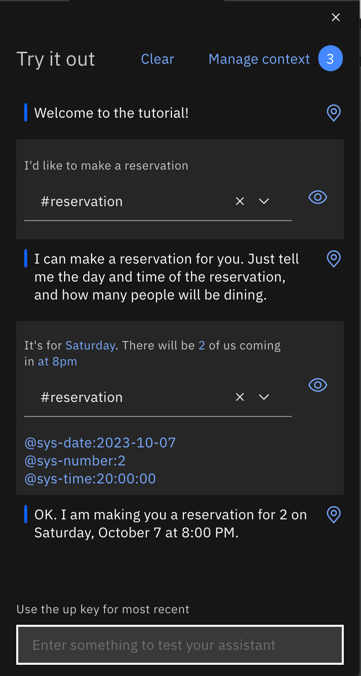

---

copyright:
  years: 2015, 2023
lastupdated: "2023-10-06"

subcollection: watson-assistant
content-type: tutorial
account-plan: lite
completion-time: 2h

---

{{site.data.keyword.attribute-definition-list}}

# Improving a dialog node with slots
{: #tutorial-slots-complex}
{: toc-content-type="tutorial"}
{: toc-completion-time="2h"}

In this tutorial, you enhance a simple node with slots that collects the information necessary to make a restaurant reservation.
{: shortdesc}

## Learning objectives
{: #tutorial-slots-complex-objectives}

By the time you finish the tutorial, you learn how to:

- Test a node with slots
- Add slot response conditions that address common user interactions.
- Anticipate and address unrelated user input.
- Handle unexpected user responses.

### Duration
{: #tutorial-slots-complex-duration}

This tutorial takes approximately 2 to 3 hours to complete.

### Prerequisite
{: #tutorial-slots-complex-prereqs}

Before you begin, complete the [Adding a node with slots to a dialog](/docs/watson-assistant?topic=watson-assistant-tutorial-slots). You must complete the first slots tutorial before you begin this one because you build on the node with slots that you create in the first tutorial.

## Improve the format of the responses
{: #tutorial-slots-complex-fix-format}
{: step}

When the date and time system entity values are saved, they are converted into a standardized format. This standardized format is useful for performing calculations on the values, but you might not want to show this reformatting to customers. In this step, you reformat the date (`2021-04-09`) and time (`17:00:00`) values that are referenced by the dialog.

To reformat the `$date` context variable value:

1. In your dialog, open the **#reservation** node.

1. Click the **Customize slot** icon  for the `@sys-date` slot.

1. From the options menu  menu, select **Open JSON editor**, and then edit the JSON that defines the context variable. Add a method that reformats the date so that it converts the `2021-04-09` value into a full day of the week, followed by the full month and day. Edit the JSON as follows:

    ```json
    {
      "context": {
        "date": "<? @sys-date.reformatDateTime('EEEE, MMMM d') ?>"
      }
    }
    ```
    {: codeblock}

    The EEEE indicates that you want to spell out the day of the week. If you use 3 Es (EEE), the day of the week is shortened to Fri instead of Friday, for example. The MMMM indicates that you want to spell out the month. Again, if you use only 3 Ms (MMM), the month is shortened to Dec instead of December.

1. Click **Save**.

1. To change the format in which the time value is stored in the $time context variable to use the hour, minutes and indicate AM or PM, click the **Customize slot** icon  for the `@sys-time` slot.

1. From the options menu  menu, select **Open JSON editor**, and then edit the JSON that defines the context variable so that it reads as follows:

    ```json
    {
      "context": {
        "time": "<? @sys-time.reformatDateTime('h:mm a') ?>"
      }
    }
    ```
    {: codeblock}

1. Click **Save**.

1. Test the node again. Open the "Try it out" pane, and click **Clear** to delete the slot context variable values that you specified when you tested the node with slots earlier. To see the impact of the changes you made, use the following script:

   | Speaker | Utterance |
   | --- | --- |
   | You | I want to make a reservation |
   | Assistant | What day would you like to come in? |
   | You | Friday |
   | Assistant | What time do you want for the reservation? |
   | You | 5pm |
   | Assistant | How many people will be dining? |
   | You | 6 |
   {: caption="Script details" caption-side="bottom"}

   This time the assistant responds with `OK. I am making you a reservation for 6 on Friday, April 9 at 5:00 PM.`

You improved the format that the dialog uses when it references context variable values in its responses. The dialog now uses `Friday, April 9` instead of the more technical, `2021-04-09`. And it uses `5:00 PM` instead of `17:00:00`.

## Ask for everything at once
{: #tutorial-slots-complex-ask-for-everything}
{: step}

Now that you tested the dialog more than once, you might notice that it can be annoying to answer one slot prompt at a time. To prevent users from having to provide one piece of information at a time, you can ask for every piece of information that you need up front. Doing so gives the user a chance to provide all or some of the information in a single input.

The node with slots is designed to find and save any slot values that the user provides while the current node is being processed. You can help users to take advantage of the design by telling them what values to specify.

In this step, you learn how to prompt for everything at once.

1. Open the **#reservation** node.

1. Click **Customize**.

1. In **Slots**, select the **Prompt for everything** checkbox to enable the initial prompt, and then click **Apply**.

   {: caption="Prompt for everything" caption-side="bottom"}

1. Back in the node edit view, scroll down to the newly added **If no slots are pre-filled, ask this first** section. Add the following initial prompt for the node, `I can make a reservation for you. Just tell me the day and time of the reservation, and how many people will be dining.`

1. Click  to close the node edit view.

1. Test this change from the "Try it out" pane. Open the pane, and then click **Clear** to nullify the slot context variable values from the previous test.

1. Enter `I'd like to make a reservation`.

    The dialog now responds with, `I can make a reservation for you. Just tell me the day and time of the reservation, and how many people it is for.`

1. Enter, `It's for Saturday. There will be 2 of us coming in at 8pm`.

    The assistant responds with, `OK. I am making you a reservation for 2 on Saturday at 8:00 PM.`

    {: caption="Test prompt for everything" caption-side="bottom"}

If the user provides any one of the slot values in their initial input, then the prompt that asks for everything is not displayed. For example, the initial input from the user might be `I want to make a reservation for this Friday night`. In this case, the initial prompt is skipped because you do not want to ask for information that the user already provided. The dialog shows the prompt for the next empty slot instead.
{: note}

## Treat zeros properly
{: #tutorial-slots-complex-recognize-zero}
{: step}

When you use the `sys-number` system entity in a slot condition, it does not deal with zeros properly. Instead of setting the context variable that you define for the slot to 0, your assistant sets the context variable to false. As a result, the slot does not think it is full and prompts the user for a number again and again until the user specifies a number other than zero.

1. Test the node so you can better understand the problem. Open the "Try it out" pane, and click **Clear** to delete the slot context variable values that you specified when you tested the node with slots earlier. Use the following script:

   | Speaker | Utterance |
   | --- | --- |
   | You | I want to make a reservation |
   | Assistant | I can make a reservation for you. Just tell me the day and time of the reservation, and how many people will be dining. |
   | You | We want to dine May 23 at 8pm. There will be 0 guests. |
   | Assistant | How many people will be dining? |
   | You | 0 
   | Assistant | How many people will be dining? |
   {: caption="Script details" caption-side="bottom"}
   
   You are stuck in this loop until you specify a number other than 0.

To ensure that the `@sys-number` slot treats zeros properly:

1. Click the **Customize slot** icon  

1. In **Check for**, enter`@sys-number >= 0`.

1. Now, you change the context variable that is stored for the number. 

    The slot condition is used both to check the user input for a number value, and to store that number in a context variable. Now that you edited the condition in the **Check for** field, you find mention of the number zero.
    
    However, you want to save only the number, and store it in the context variable. From the options menu  menu, select **Open JSON editor**, and then edit the JSON that defines the context variable.

    The value looks like this:

    ```json
    {
      "context": {
        "guests": "@sys-number >= 0"
      }
    }
    ```
    {: codeblock}

    Change it to look like this:

    ```json
    {
      "context": {
        "guests": "@sys-number"
      }
    }
    ```
    {: codeblock}

1. Click **Save**. 

    You must edit the context variable value in the JSON editor. Do not edit the value in the slot's **Check for** field. The **Check for** field must remain set to `@sys-number >= 0`.
    { :important}
    
    When you edit the value in the JSON editor, you are effectively changing only what to save in the context variable. However, you do not want to change what to look for in the input. These two values will be different.

1. Test the node again. Open the "Try it out" pane, and click **Clear** to delete the slot context variable values that you specified when you tested the node with slots earlier. To see the impact of the changes you made, use the following script:

   | Speaker | Utterance |
   | --- | --- |
   | You | I want to make a reservation. |
   | Assistant | I can make a reservation for you. Just tell me the day and time of the reservation, and how many people will be dining. |
   | You | We want to dine May 23 at 8pm. There will be 0 guests. |
   {: caption="Script details" caption-side="bottom"}

    This time the assistant responds with, `OK. I am making you a reservation for 0 on Thursday, May 23 at 8:00 PM.`

You formatted the number slot so that it treats zeros properly. But, you might not want the node to accept a zero as a valid number of guests. You will learn how to validate values that are specified by users in the next step.

## Validate user input
{: #tutorial-slots-complex-slot-conditions}
{: step}

So far, we assume that the user provides the appropriate value types for the slots. You can account for times when users might provide an invalid value by adding conditional responses to slots. In this step, you use conditional slot responses to perform the following tasks:

- Check that the date requested is not in the past.
- Check whether a requested reservation time falls within the seating time window.
- Confirm the user's input.
- Check that the number of guests provided is larger than zero.
- Indicate that you are replacing one value with another.

To validate the date, complete the following steps:

1. Click the **Customize slot** icon  for the `@sys-date` slot.

1. From the options menu  menu, select **Enable condition**.

1. In the **Found** section, click **Add a response**, then click the **Customize handler** icon .

1. Add the following condition and response to check whether the date that the user specifies falls before today:

   | If assistant recognizes | Assistant responds | Then assistant should |
   | --- | --- | --- |
   | `@sys-date.before(now())` | `You cannot make a reservation for a day in the past.` | Clear slot and prompt again |
   {: caption="Condition details" caption-side="bottom"}

1. Add a second conditional response that is displayed if the user provides a valid date. This type of simple confirmation tells the user that the response was understood.

   | If assistant recognizes | Assistant responds | Then assistant should |
   | --- | --- | --- |
   | `true` | `$date it is.` | Move on |
   {: caption="Condition details" caption-side="bottom"}

To validate the time:

1. Click the **Customize slot** icon  for the `@sys-date` slot.

1. From the options menu  menu, select **Enable condition**.

1. In the **Found** section, click **Add a response**, then click the **Customize handler** icon .

1. Add the following conditions and responses to check whether the time that the user specifies falls within the allowed time window:

   | If assistant recognizes | Assistant responds | Then assistant should |
   | --- | --- | --- |
   | `@sys-time.after('21:00:00')` | `Our last seating is at 9 PM.` | Clear slot and prompt again |
   | `@sys-time.before('09:00:00')` | `Our first seating is at 9 AM.` | Clear slot and prompt again |
   {: caption="Condition details" caption-side="bottom"}

1. Add a third conditional response that is displayed if the user provides a valid time that falls within the window. This type of simple confirmation tells the user that the response was understood.

   | If assistant recognizes | Assistant responds | Then assistant should |
   | --- | --- | --- |
   | `true` | `Ok, the reservation is for $time.` | Move on |
   {: caption="Condition details" caption-side="bottom"}

You can add conditions to validate the number of guests.

- Check that the number of guests that are specified is larger than zero.
- Anticipate and address the case when the user changes the number of guests.

If at any point while the node with slots is being processed, the user changes a slot value, the corresponding slot context variable value is updated. However, it can be useful to tell the user that the value is being replaced to give clear feedback to the user and to give the user a chance to rectify it.

1. Click the **Customize slot** icon  for the `@sys-number` slot.

1. From the options menu  menu, select **Enable condition**.

1. In the **Found** section, click **Add a response**, then click the **Customize handler** icon .

1. Add the following conditions and responses to validate the number of guests:

   | If assistant recognizes | Assistant responds | Then assistant should |
   | --- | --- | --- |
   | `@sys-number == 0` | `Please specify a number that is larger than 0.` | Clear slot and prompt again |
   | `(event.previous_value != null) && (event.previous_value != event.current_value)` | `Ok, updating the number of guests from <? event.previous_value ?\> to <? event.current_value ?>.` | Move on |
   | `true` | `Ok. The reservation is for $guests guests.` | Move on |
   {: caption="Condition details" caption-side="bottom"}

## Add a confirmation slot
{: #tutorial-slots-complex-confirmation-slot}
{: step}

You might want to design your dialog to call an external reservation system and book a reservation for the user in the system. Before your application completes this task, you probably want to confirm with the user that the dialog understands the details of the reservation correctly. You can do so by adding a confirmation slot to the node.

1. The confirmation slot expects a Yes or No answer from the user. You must teach the dialog to be able to recognize a Yes or No intent in the user input first.

1. Click the **Intents** tab to return to the Intents page. Add the following intents and example utterances.

   `#yes`

   ```json
   Yes
   Sure
   I'd like that
   Please do
   Yes please
   Ok
   That sounds good
   ```
   {: screen}

   {: caption="Yes intent" caption-side="bottom"}

   `#no`

   ```json
   No
   No thanks.
   Please don't
   Please do not!
   That's not what I want at all
   Absolutely not
   No way
   ```
   {: screen}

   {: caption="No intent" caption-side="bottom"}

1. In your dialog, open the **#reservation** node.

1. In the **Then check for** section, click **Add slot** to add a fourth slot:

   | Check for | Save it as | If not present, ask |
   | --- | --- | --- |
   | `(#yes \|\| #no) && slot_in_focus` | `$confirmation` | `I'm going to reserve you a table for $guests on $date at $time. Should I go ahead?` |
   {: caption="Slot details" caption-side="bottom"}

   This condition checks for either answer. You specify what happens next depending on whether the user answer Yes or No by using conditional slot responses. The `slot_in_focus` property forces the scope of this condition to apply to the current slot only. This setting prevents random statements that might match against a `#yes` or `#no` intent that the user might make from triggering this slot.

   For example, the user might be answering the number of guests slot, and say something like, `Yes, there will be 5 of us.`. You do not want the `Yes` included in this response to accidentally fill the confirmation slot. By adding the `slot_in_focus` property to the condition, a `yes` or `no` answer from the user is applied to this slot only when the user is answering the prompt for this slot specifically.

1. Click the **Customize slot** icon  for the `yes/no` slot.

1. From the options menu  menu, select **Enable condition**.

1. In the **Found** section, click **Add a response**, then click the **Customize handler** icon 

1. Add the following condition and response to check for a `No` response:

   | If assistant recognizes | Assistant responds | Then assistant should |
   | --- | --- | --- |
   | `#no` | `Alright. Let's start over. I'll try to keep up this time.` | Clear slot and prompt again |
   {: caption="Condition details" caption-side="bottom"}

1. When the `#no` intent is found you need to reset the context variables that you saved earlier, so you can ask for the information again. From the options menu for the condition , select **Open context editor**.

1. Set the context by using these values:

   | Variable | Value |
   | --- | --- |
   | `$date` | `null` |
   | `$time` | `null` |
   | `$guests` | `null` |
   {: caption="Set context" caption-side="bottom"}

1. Click **Save**.

1. In the **Not found** section, clarify that you are expecting the user to provide a Yes or No answer. 

1. Add a response with the following condition:

   | If assistant recognizes | Assistant responds | Then assistant should |
   | --- | --- | --- |
   | `true` | `Respond with Yes to indicate that you want the reservation to be made as-is, or No to indicate that you do not.` | Wait for user input |
   {: caption="Condition details" caption-side="bottom"}

1. Click **Save**.

Now that you have confirmation responses for slot values, and you ask for everything at once, you might notice that the individual slot responses are displayed before the confirmation slot response is displayed, which can appear repetitive. Edit the slot found responses to prevent them from being displayed under certain conditions.

1. Click the **Customize slot** icon  for the `@sys-date` slot.

1. In the **Found** section, replace the `true` condition. For example:

   | If assistant recognizes | Assistant responds | Then assistant should |
   | --- | --- | --- |
   | `!($time && $guests)` | `$date it is` | Move on |
   {: caption="Condition details" caption-side="bottom"}

1. Click the **Customize slot** icon  for the `@sys-time` slot.

1. In the **Found** section, replace the `true` condition. For example:

   | If assistant recognizes | Assistant responds | Then assistant should |
   | --- | --- | --- |
   | `!($date && $guests)` | `Ok, the reservation is for $time.` | Move on |
   {: caption="Condition details" caption-side="bottom"}

1. Click the **Customize slot** icon  for the `@sys-number` slot.

1. In the **Found** section, replace the `true` condition. For example:

   | If assistant recognizes | Assistant responds | Then assistant should |
   | --- | --- | --- |
   | `!($date && $time)` | `Ok. The reservation is for $guests guests.` | Move on |
   {: caption="Condition details" caption-side="bottom"}

If you add more slots later, you must edit these conditions to account for the associated context variables for the additional slots. If you do not include a confirmation slot, you can specify `!all_slots_filled` only, and it would remain valid no matter how many slots you add later.

## Reset the slot context variable values
{: #tutorial-slots-complex-reset-variables}
{: step}

You might notice that before each test, you must clear the context variable values that were created during the previous test. You must do so because the node with slots prompts users only for information that it considers to be missing. If the slot context variables are all filled with valid values, no prompts are displayed. The same is true for the dialog at run time. You must build into the dialog a mechanism by which you reset the slot context variables to null so that the slots can be filled anew by the next user. To do so, you are going to add a parent node to the node with slots that sets the context variables to null.

1. From the tree view of the dialog, click the **Node options** icon  icon on the **#reservation** node with slots, and then select **Add node above**.

1. In **If assistant recognizes**, enter `#reservation` as the condition. The same condition that is used by the node with slots, but you change the condition for the node with slots later in this procedure.

1. In **Assistant responds**, click the options menu  and select **Open context editor**.

1. Set the context by using these values:

   | Variable | Value |
   | --- | --- |
   | `$date` | `null` |
   | `$time` | `null` |
   | `$guests` | `null` |
   | `$confirmation` | `null` |
   {: caption="Set context" caption-side="bottom"}

1. Click to edit the other **#reservation** node, the one you created previously and to which you added the slots.

1. Change the node condition from `#reservation` to `($date == null && $time == null)`.

1. Click the **Node options** icon  icon on the node with slots, and then select **Move**.

   {: caption="Move node" caption-side="bottom"}

1. Select the `#reservation` node as the move-to location target, and then choose **As child node** from the menu.

   {: caption="Move as child node" caption-side="bottom"}

1. Click to edit the **#reservation** node. In the **Then assistant should** section, change from **Wait for reply** to **Skip user input**.

    {: caption="Skip user input" caption-side="bottom"}

    When a user input matches the `#reservation` intent, this node is triggered. The slot context variables are all set to null, and then the dialog jumps directly to the node with slots to process it.

## Give users a way to exit the process
{: #tutorial-slots-complex-handler}
{: step}

Adding a node with slots is powerful because it keeps users on track providing the information that you need to give them a meaningful response or perform an action on their behalf. However, the user might be in the middle of providing reservation details, but decides to not go through with placing the reservation. You must give users a way to exit the process gracefully. You can do so by adding a slot handler that can detect a user's desire to exit the process, and exit the node without saving any values that were collected.

1. In **Intents**, add an `#exit` intent with the following example utterances.

   ```json
   I want to stop
   Exit!
   Cancel this process
   I changed my mind. I don't want to make a reservation.
   Stop the reservation
   Wait, cancel this.
   Never mind.
   ```
   {: screen}

   {: caption="#exit intent" caption-side="bottom"}

1. In **Dialog**, click to open the node with slots, and then click **Manage handlers**.

1. Add the following handler condition:

   | If assistant recognizes | Assistant responds | Then assistant should |
   | --- | --- | --- |
   | `#exit` | `Ok, we'll stop there. No reservation will be made.` | Skip to response |
   {: caption="Condition details" caption-side="bottom"}
   
   The **Skip to response** action jumps directly to the node-level response without displaying the prompts associated with any of the remaining unfilled slots.

1. Click **Save**, and then click **Save** again.

Now, you need to edit the node-level response to have it recognize when a user wants to exit the process rather than make a reservation. 

To add a conditional response for the node:

1. In the node with the slots, click **Customize**, set the **Multiple conditioned responses** switch to **On**, and then click **Apply**.

   {: caption="Multiple conditioned responses" caption-side="bottom"}

1. In **Assistant responds**, click **Add response**.

1. Add a response with the following condition:

   | If assistant recognizes | Assistant responds | Then assistant should |
   | --- | --- | --- |
   | `has_skipped_slots` | `I look forward to helping you with your next reservation. Have a good day.` | Default to node settings |
   {: caption="Condition details" caption-side="bottom"}

   The `has_skipped_slots` condition checks the properties of the slots node to see if any of the slots were skipped. The `#exit` handler skips all remaining slots to go directly to the node response. So, when the `has_skipped_slots` property is present, you know the `#exit` intent was triggered, and the dialog can display an alternative response.

   If you configure more than one slot to skip other slots, or configure another node-level event handler to skip slots, then you need a different approach to check if the #exit intent was triggered. See [Handling requests to exit a process](/docs/watson-assistant?topic=watson-assistant-dialog-slots#dialog-slots-node-level-handler) for an alternative way to do so.
   {: note}

1. You want your assistant to check for the `has_skipped_slots` property before it displays the standard node-level response. Move the `has_skipped_slots` conditional response so it gets processed before the original conditional response or it is never triggered. To do so, hover on the response you just added, use the **up arrow** to move it up, and then click **Save**.

   {: caption="Move conditional response" caption-side="bottom"}

1. Test this change by using the following script in the "Try it out" pane.

   | Speaker | Utterance |
   | --- | --- |
   | You | I want to make a reservation. |
   | Assistant | I can make a reservation for you. Just tell me the day and time of the reservation, and how many people will be dining. |
   | You | It's for 5 people |
   | Assistant | Ok. The reservation is for 5 guests. What day would you like to come in? |
   | You | Never mind |
   | Assistant | Ok, we'll stop there. No reservation will be made. I look forward to helping you with your next reservation. Have a good day. |
   {: caption="Script details" caption-side="bottom"}

## Apply a valid value if the user fails to provide one after several attempts
{: #tutorial-slots-complex-counter}
{: step}

In some cases, a user might not understand what you are asking for. They might respond again and again with the wrong types of values. To plan for this possibility, you can add a counter to the slot, and after 3 failed attempts by the user to provide a valid value, you can apply a value to the slot on the user's behalf and move on.

For the `$time` information, you define a follow-up statement that is displayed when the user does not provide a valid time. Create a context variable that can track how many times the user provides a value that does not match the value type that the slot expects. You want the context variable to be initialized and set to `0` before the node with slots is processed, so you add it to the parent `#reservation` node.

1. In **Dialog**, click to edit the `#reservation` node. 

1. In **Then set context**, click **Add variable**. (If **Then set context** isn't visible, click the options menu  in **Assistant responds** and select **Open context editor**.)

1. Set the context by using these values:

   | Variable | Value |
   | --- | --- |
   | `$counter` | `0` |
   {: caption="Set context" caption-side="bottom"}

1. Click the close icon  to close the node edit view.

1. From the tree view, click to edit the node with slots. 

1. Click the **Customize slot** icon  for the `@sys-time` slot.

1. Click the options menu  and select **Enable condition**. An **Enable this slot if:** section appears, set to `true`.

1. In the **Not found** section, add a response with the following condition:

   | If assistant recognizes | Assistant responds | Then assistant should |
   | --- | --- | --- |
   | `true` | `Please specify the time that you want to eat. The restaurant seats people between 9AM and 9PM.` | Wait for user input |
   {: caption="Condition details" caption-side="bottom"}

Now add a 1 to the `counter` variable each time this response is triggered. This *Not found* response is triggered only when the user does not provide a valid time value. 

1. In  **Assistant responds**, click the options menu  and select **Open context editor**.

1. Set the context by using these values:

   | Variable | Value |
   | --- | --- |
   | `$counter` | `"<? context['counter'] + 1 ?>"` |
      {: caption="Set context" caption-side="bottom"}

1. Click **Save**.

Add a second conditional response to the **Not found** section that checks whether the counter is greater than 1, which indicates that the user provided an invalid response 3 times previously. In this case, the dialog assigns the time value on the user's behalf to the popular dinner reservation time of 8 PM. The user has a chance to change the time value when the confirmation slot is triggered. 

1. In the **Not found** section, add a response with the following condition:

   | If assistant recognizes | Assistant responds | Then assistant should |
   | --- | --- | --- |
   | `$counter > 1` | `You seem to be having trouble choosing a time. I will make the reservation at 8PM for you.` | Wait for user input |
   {: caption="Condition details" caption-side="bottom"}

1. You must set the $time variable to 8 PM. In  **Assistant responds**, click the options menu  and select **Open context editor**.

1. Set the context by using these values:

   | Variable | Value |
   | --- | --- |
   | `$time` | `"<? '20:00:00'.reformatDateTime('h:mm a') ?>"` |
   {: caption="Set context" caption-side="bottom"}

1. Click **Save**.

The conditional response that you just added has a more precise condition than the true condition that is used by the first conditional response. You must move this response so it comes before the original conditional response or it is never triggered. 

1. Hover on the response you just added, use the **up arrow** to move it up, and then click **Save**.

1. Test your changes by using the following script.

   | Speaker | Utterance |
   | --- | --- |
   | You | I want to make a reservation. |
   | Assistant  | I can make a reservation for you. Just tell me the day and time of the reservation, and how many people will be dining. |
   | You | Tomorrow |
   | Assistant  | Friday, December 29 it is. What time do you want the reservation to be made for? |
   | You | orange |
   | Assistant  | Please specify the time that you want to eat. The restaurant seats people between 9AM and 9PM. |
   | You | pink |
   | Assistant  | Please specify the time that you want to eat. The restaurant seats people between 9AM and 9PM. |
   | You     | purple |
   | Assistant  | You seem to be having trouble choosing a time. I will make the reservation at 8 PM for you. How many people will be dining? |
   {: caption="Script details" caption-side="bottom"}

## Connect to an external service
{: #tutorial-slots-complex-webhook}
{: step}

Now that your dialog can collect and confirm a user's reservation details, you can call an external service to reserve a table in the restaurant's system or through a multi-restaurant online reservations service. See [Making programmatic calls from a dialog node](/docs/watson-assistant?topic=watson-assistant-dialog-webhooks) for more details.

In the logic that calls the reservation service, be sure to check for `has_skipped_slots` and do not continue with the reservation if it is present.

### Summary
{: #tutorial-slots-complex-summary}

In this tutorial, you tested a node with slots and made changes that optimize how it interacts with real users. For more information about this subject, see [Gathering information with slots](/docs/watson-assistant?topic=watson-assistant-dialog-slots).
