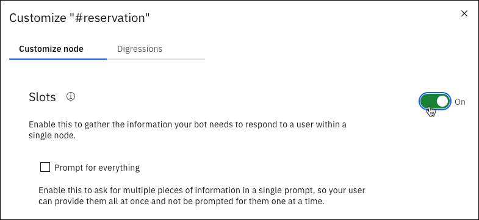
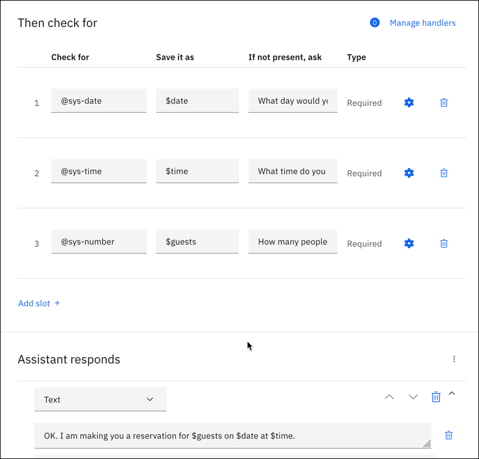
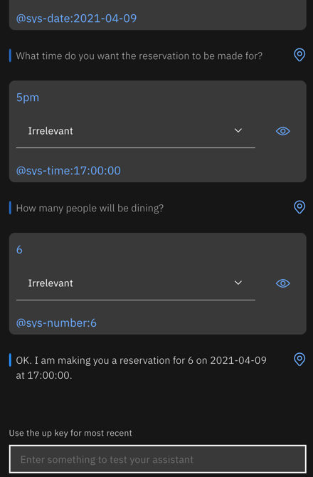

---

copyright:
  years: 2015, 2023
lastupdated: "2023-10-07"

subcollection: watson-assistant
content-type: tutorial
account-plan: lite
completion-time: 30m

---

{{site.data.keyword.attribute-definition-list}}

# Adding a node with slots to a dialog
{: #tutorial-slots}
{: toc-content-type="tutorial"}
{: toc-completion-time="30m"}

In this tutorial, you add slots to a dialog node to collect multiple pieces of information from a user within a single node. The node that you create collects the information that is needed to make a restaurant reservation.
{: shortdesc}

## Learning objectives
{: #tutorial-slots-objectives}

By the time you finish the tutorial, you can learn how to:

- Define the intents and entities that are needed by your dialog
- Add slots to a dialog node
- Test the node with slots

### Duration
{: #tutorial-slots-duration}

This tutorial takes approximately 30 minutes to complete.

### Prerequisite
{: #tutorial-slots-prereqs}

Before you begin, complete the [Getting Started tutorial](/docs/watson-assistant?topic=gs-dialog). You use the dialog that you created, and add nodes to the simple dialog that you built as part of the getting started exercise.

## Add intents and examples
{: #tutorial-slots-add-intent}
{: step}

Add an intent, which is the purpose or goal that is expressed in user input. You add a #reservation intent that recognizes user input that indicates that the user wants to make a restaurant reservation.

1. On the **Intents** page, click **Add intent**.
1. Add the following intent name, and then click **Create intent**:

    ```text
    reservation
    ```
    {: screen}

    The #reservation intent is added. A number sign (`#`) prefix is added to the intent name to label it as an intent. This naming convention helps you and others recognize the intent as an intent. It has no example user utterances that are associated with it yet.
1. In the **Add user examples** field, type the following utterance, and then click **Add example**:

    ```text
    i'd like to make a reservation
    ```
    {: screen}

1. Add these additional examples to help Watson recognize the `#reservation` intent.

    ```text
    I want to reserve a table for dinner
    Can 3 of us get a table for lunch?
    do you have openings for next Wednesday at 7?
    Is there availability for 4 on Tuesday night?
    i'd like to come in for brunch tomorrow
    can i reserve a table?
    ```
    {: screen}

1. Click the **Close**  icon to finish adding the `#reservation` intent and its example utterances.

## Add entities
{: #tutorial-slots-add-entity}
{: step}

An entity definition includes a set of entity *values* that represent vocabulary that is often used in the context of an intent. By defining entities, you can help your assistant identify references in the user input that are related to intents of interest. In this step, you enable system entities that can recognize references to time, date, and numbers.

1. Click **Entities** to open the Entities page.
1. Enable system entities that can recognize date, time, and number references in user input. Click **System entities**, and then turn on these entities:

    - `@sys-time`
    - `@sys-date`
    - `@sys-number`

You enabled the @sys-date, @sys-time, and @sys-number system entities. Now you can use them in your dialog.

## Add a dialog node with slots
{: #tutorial-slots-add-dialog-with-slots}
{: step}

A dialog node represents the start of a thread of dialog between your assistant and the user. It contains a condition that must be met for the node to be processed by your assistant. At a minimum, it also contains a response. For example, a node condition might look for the `#hello` intent in user input, and respond with, `Hi. How can I help you?` This example is the simplest form of a dialog node, one that contains a single condition and a single response. You can define complex dialogs by adding conditional responses to a single node, adding child nodes that prolong the exchange with the user, and much more. (If you want to learn more about complex dialogs, you can complete the [Building a complex dialog](/docs/watson-assistant?topic=watson-assistant-tutorial) tutorial.)

The node that you add in this step is one that contains slots. Slots provide a structured format through which you can ask for and save multiple pieces of information from a user within a single node. They are most useful when you have a specific task in mind and need key pieces of information from the user before you can perform it. For more information, see [Gathering information with slots](/docs/watson-assistant?topic=watson-assistant-dialog-slots).

The node that you add collects the information that is required to make a reservation at a restaurant.

1. Click **Dialog** to open the dialog tree.
1. Click the Node options icon  on the **Welcome** node, and then select **Add node below**.
1. Start typing `#reservation` in the **If assistant recognizes** field, and then select it from the list.
    This node is used if the user input matches the `#reservation` intent.
1. Click **Customize**, set the **Slots** switch to **On**, and then click **Apply**.

    {: caption="New dialog with built-in nodes" caption-side="bottom"}

1. In the **Then check for** section, add the following slots:

   | Check for | Save it as | If not present, ask |
   | --- | --- | --- |
   | `@sys-date` | `$date` | What day would you like to come in? |
   | `@sys-time` | `$time` | What time do you want for the reservation? |
   | `@sys-number`| `$guests` | How many people will be dining? |
   {: caption="Slot details" caption-side="bottom"}
    

1. In **Assistant responds**, enter the text response `OK. I am making you a reservation for $guests on $date at $time`.

    {: caption="Slots and response" caption-side="bottom"}

1. Click the close icon  to close the node edit view.

## Test the dialog
{: #tutorial-slots-test}
{: step}

1. Click **Try it**.
1. Type `i want to make a reservation`.

    The assistant recognizes the #reservation intent, and it responds with the prompt for the first slot `What day would you like to come in?`.

1. Type `Friday`.

    The assistant recognizes the value, and uses it to fill the $date context variable for the first slot. It then shows the prompt for the next slot `What time do you want the reservation to be made for?`.

1. Type `5pm`.

    The assistant recognizes the value, and uses it to fill the $time context variable for the second slot. It then shows the prompt for the next slot, `How many people will be dining?`.

1. Type `6`.

    The assistant recognizes the value, and uses it to fill the $guests context variable for the third slot. Now that all of the slots are filled, it shows the node response, `OK. I am making you a reservation for 6 on 2021-04-09 at 17:00:00.`

   {: caption="Node slots" caption-side="bottom"}

   It worked! You created a node with slots.

## Summary
{: #tutorial-slots-summary}

You created a node with slots that can capture the information necessary to reserve a table at a restaurant.

## Next steps
{: #tutorial-slots-next-steps}

Improve the experience of users who interact with the node. Complete the follow-on tutorial, [Improving a node with slots](/docs/watson-assistant?topic=watson-assistant-tutorial-slots-complex). It covers simple improvements, such as how to reformat the date (`2021-04-09`) and time (`17:00:00`) values that are returned by the system. It also covers more complex tasks, such as what to do if the user does not provide the type of value that your dialog expects for a slot.
