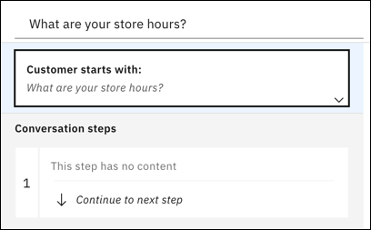
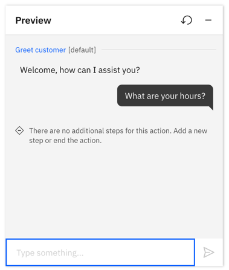

---

copyright:
  years: 2021
lastupdated: "2021-09-09"

subcollection: watson-assistant

---

{:shortdesc: .shortdesc}
{:new_window: target="_blank"}
{:external: target="_blank" .external}
{:deprecated: .deprecated}
{:important: .important}
{:note: .note}
{:tip: .tip}
{:pre: .pre}
{:codeblock: .codeblock}
{:screen: .screen}
{:javascript: .ph data-hd-programlang='javascript'}
{:java: .ph data-hd-programlang='java'}
{:python: .ph data-hd-programlang='python'}
{:swift: .ph data-hd-programlang='swift'}

{{site.data.content.classiclink}}

# Understand your users' questions or requests
{: #understand-questions}

Actions represent the discrete tasks or questions that your assistant is designed to help customers with. Each action has a beginning and an end, representing a conversation between the assistant and a customer. In this topic, learn how to begin an action, where it understands and recognizes a goal based on the words a customer uses to ask a question or make a request. 

## Beginning an action
{: #understand-questions-start}

Each assistant can include as many actions as you need to have conversations with your users. You design each individual action to recognize a specific question or request, and when it does, the action starts.

When you create a new action, your first task is to enter one phrase that a customer types or says to start the conversation about a specific topic. This phrase determines the problem your customer has or the question your user asks. 

To get going, you only need to enter one phrase, for example: `What are your store hours?`. 

<!---->

After you enter the phrase, it is stored in **Customer starts with**, at the start of the action.

## Testing your phrase
{: #understand-questions-testing}
At this point, before even doing anything else with your action, you can already start checking if your assistant recognizes the starting phrase. 

1.  Click the **Preview** button.
1.  Enter your first phrase, for example: `What are your store hours?`.
1.  If you see `There are no additional steps for this action`, that means the action recognizes the phrase. (And it's because you haven't added anything else to your action.)
    
    

1. If the assistant doesn't understand the phrase, you'll see the built-in action `No action matches`. For more information, see [When the assistant can't understand your customer's request](https://test.cloud.ibm.com/docs/watson-assistant?topic=watson-assistant-handle-errors#no-action-matches).

## Adding more examples
{: #understand-questions-adding-more-examples}
When you're creating a new action, one example phrase is enough to start with. You can build the rest of your action with steps before adding more example phrases. Once doing so, return to **Customer starts with** and add 10 or more variations of the same question or request, using words that your customers commonly use. For example:
    
- `Are you open on the weekend?`
- `How late are you open today?`
- `Get store hours`
- `What time do you open?`
- `Are you open now?`
    
Each phrase can be up to 1,024 characters in length.

By adding these phrases, your assistant learns when this is the right action for what a customer wants. The additional examples builds the training data that the machine learning engine of Watson Assistant uses to create a natural language processing model. The model is customized to understand your uniquely-defined actions.

## Asking clarifying questions
{: #understand-questions-ask-clarifying-question}

When your assistant finds that more than one action might fulfill a customer's request, it can automatically ask for clarification. Instead of guessing which action to take, your assistant shows a list of the possible actions to the customer, and asks the customer to pick the right one.

Any **Created by you** action that might match the customer's input can be included in the choices listed by a clarifying question. The **Set by assistant** actions are never included.

In the assistant output, the possible actions are listed by name. The default name for an action is the text of the first example message that you add to it (such as `I want to open an account`), but you can change this name to something more descriptive.

### Customizing clarification
{: #understand-questions-disambiguation-config}

You can control things like the wording your assistant uses to introduce the clarification list.

To customize clarification, complete the following steps:

1.  From the Actions page, click the *Settings* icon  in the page header.

1.  On the **Ask clarifying question** tab, you can make the following changes:

    - In the **Assistant says** field, edit the text that is displayed before the list of clarification choices. 
    
      The default text is *Did you mean:*. You can change it to something else, such as *What do you want to do?* or *Pick what to do next*.
    - In the **Label for a fallback choice** field, edit the label that is displayed for the choice that customers can click when none of the other choices are quite right. When a user picks this choice, the *Retry when no intent matches* system action is taken next.
    
      The label *None of the above* is used if you don't change it.  
      
      This fallback choice gives customers a way to get out of the clarification process if it's not helping them. If you don't want to give customers a fallback choice, remove the text from the field.

1.  Optionally, review and improve your action names. 

    If an action name is too long or doesn't reflect the purpose of the action, edit it. Use a name that is concise and represents the overall goal of the action, such as `Open an account` or `Cancel an order`.

### Disabling clarifying questions
{: #understand-questions-disambiguation-disable}

<!-- Every action that you add is used during clarification automatically. The system actions are not. -->

You can disable clarifying questions for all actions.

To disable clarification for all actions:

1.  From the Actions page, click the **Settings** icon  in the page header.
1.  On the **Ask clarifying question** tab, set the switch to off.
1.  Click **Save**, and then click **Close**.

### Excluding an action from clarifying questions

You can also prevent a single action from being included in the list of choices during clarification. To exclude an action from clarification:

1.  From the action editor, click the **Action settings** icon.
1.  On the Action Settings window, toggle the **Ask clarifying question** switch to off.

## Coordinating how multiple actions start
{: #understand-questions-multiple-actions}

As you work on your assistant, it's a good idea to coordinate customer phrase examples across multiple actions. It's important to distinguish how each action is triggered. When a user enters a question or request, the phrase is evaluated across all the **Customer starts with** examples in every action. If two actions have similar phrase examples, then the wrong action might get triggered by your user's question.

### Confidence scoring
Behind the scenes, Watson Assistant determines a confidence score for each phrase. The score is absolute, meaning that a confidence score is assigned based on a predetermined scale, and not relative to other customer phrases. This approach adds flexibility in case multiple questions or requests are detected in a single user input. It also means that the system might not trigger an action at all, if a phrase has a low confidence score. As confidence scores change, your action examples might need restructuring. 

To learn more about review and testing confidence scores, see [Action confidence score](/docs/watson-assistant?topic=watson-assistant-review#review-debug-confidence) in [Reviewing and debugging your work](/docs/watson-assistant?topic=watson-assistant-review).

