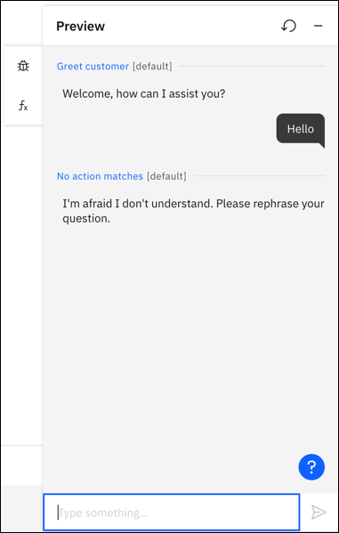
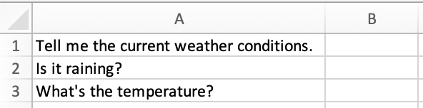

---

copyright:
  years: 2021, 2023
lastupdated: "2023-06-22"

subcollection: watson-assistant

---

{{site.data.keyword.attribute-definition-list}}

# Understanding your users' questions or requests
{: #understand-questions}

Actions represent the tasks or questions that your assistant can help customers with. Each action has a beginning and an end, making up a conversation between the assistant and a customer. Learn how to begin an action, where it understands and recognizes a goal based on the words a customer uses to ask a question or make a request.

## Beginning an action
{: #understand-questions-start}

Each assistant can include as many actions as you need to have conversations with your users. You design each individual action to recognize a specific question or request, and when it does, the action starts.

When you create a new action, your first task is to enter one phrase that a customer types or says to start the conversation about a specific topic. This phrase determines the problem that your customer has or the question your user asks.

To get going, you need to enter only one phrase, for example: `What are your store hours?`.


After you enter the phrase, it is stored in **Customer starts with**, at the start of the action.


## Testing your phrase
{: #understand-questions-testing}

Before even doing anything else with your action, you can already start checking that your assistant recognizes the starting phrase.

1. Click the **Preview** button.
1. Enter your first phrase, for example: `What are your store hours?`.
1. If you see `There are no additional steps for this action` that means the action recognizes the phrase. (And it's because you didn't add anything else to your action.)

    

1. If the assistant doesn't understand the phrase, you see the built-in action `No action matches`. For more information, see [When the assistant can't understand your customer's request](https://test.cloud.ibm.com/docs/watson-assistant?topic=watson-assistant-handle-errors#no-action-matches).

    

## Adding more examples
{: #understand-questions-adding-more-examples}

When you're creating a new action, one example phrase is enough to start with. You can build the rest of your action with steps before you add more example phrases. Then, return to **Customer starts with** and add 10 or more variations of the same question or request, by using words that your customers commonly use. For example:

- `Are you open on the weekend?`
- `How late are you open today?`
- `Get store hours`
- `What time do you open?`
- `Are you open now?`

Each phrase can be up to 1,024 characters in length.

By adding these phrases, your assistant learns what is the right action for what a customer wants. The additional examples build the training data that the machine learning engine of Watson Assistant uses to create a natural language processing model. The model is customized to understand your uniquely defined actions.

### Uploading phrases
{: #understand-questions-uploading-examples}

If you have many example phrases, you can upload them from a comma-separated value (CSV) file than to define them one by one. If you are migrating intent information from the classic {{site.data.keyword.conversationshort}} experience to example phrases in the new {{site.data.keyword.conversationshort}} experience, see [Migrating intents and entities](/docs/watson-assistant?topic=watson-assistant-migrate-intents-entities).

1. Collect the phrases into a CSV file. Save the CSV file with UTF-8 encoding and no byte order mark (BOM).

    - If you are creating a new CSV file to upload phrases, the format for each line in the file is as follows:
        ```text
        <phrase>
        ```
        Where `<phrase>` is the text of a user example phrase. If you’re using a spreadsheet to create a CSV file, put all your phrases into column 1, as shown in the following example:

        

    - If you [downloaded intents from the classic experience](/docs/watson-assistant?topic=watson-assistant-migrate-intents-entities#migrate-intents-download), the format for each line in the file is as follows:
        ```text
        <phrase>,<intent>
        ```
        Where `<phrase>` is the text of a user example phrase, and `<intent>` is the name of the intent. For example:
        ```text
        Tell me the current weather conditions.,weather_conditions
        Is it raining?,weather_conditions
        What's the temperature?,weather_conditions
        ```

        Only one intent can be uploaded per action, so the `<intent>` information listed in the second column of the CSV file must be the same.
        {: important}

1. Go to **Customer starts with** at the start of the action.

1. Click the **Upload** icon .

1. Select a file from your computer.

    The file is validated and uploaded, and the system trains itself on the new data.

### Downloading phrases
{: #understand-questions-downloading-examples}

You can download your example phrases to a CSV file, so you can then upload and reuse them in another {{site.data.keyword.conversationshort}} application.

1. Go to **Customer starts with** at the start of the action.

1. Click the **Download** icon .

    Your example phrases are downloaded to a CSV file.

## Asking clarifying questions
{: #understand-questions-ask-clarifying-question}

When your assistant finds that more than one action might fulfill a customer's request, it can automatically ask for clarification. Instead of guessing which action to take, your assistant shows a list of the possible actions to the customer, and asks the customer to pick the right one.


Any **Created by you** action that might match the customer's input can be included in the choices that are listed by a clarifying question. The **Set by assistant** actions are never included.

In the assistant output, the possible actions are listed by name. The default name for an action is the text of the first example message that you add to it (such as `I want to open an account`), but you can change this name to something more descriptive.

The order in which the actions are listed might change. In fact, the actions themselves that are included in the list might change. This behavior is intended. As part of development that is in progress to help the assistant learn automatically from user choices, the actions that are included and their order in the list is randomized on purpose. Randomizing the order helps to prevent bias that can be introduced by a percentage of people who always pick the first option without carefully reviewing all of their choices beforehand.

### Customizing clarifying questions
{: #understand-questions-disambiguation-config}

To customize clarification, you can:
- Change settings like the wording your assistant uses to introduce the clarification list or when no action matches.
- Enable *response modes* to modify the assistant's behavior when it asks questions. For more information, see [Response modes](/docs/watson-assistant?topic=watson-assistant-action-response-modes).

To change settings, complete the following steps:

1. From the **Actions** page of the assistant, click **Global settings** .

1. On the **Clarifying questions** tab, you can edit the **Ask clarifying questions** section:

   | Field | Default text | Description |
   |---|---|---|
   | **Assistant says** | `Did you mean:` | The text that is displayed before the list of clarification choices. You can change it to something else, such as `What do you want to do?` or `Pick what to do next`. |
   | **No action matches** | `None of the above` | The choice that customers can click when none of the other choices are right. If the customer picks this choice, the assistant uses your *No action matches* action. You can change it to something else, such as `I need something else` or `These aren't what I want`. Or, you can remove the text to omit offering this choice. |
   {: caption="Ask clarifying question settings" caption-side="bottom"}
   
1. If you enable response modes, you can modify this text:
   
   | Field | Default text | Description |
   |---|---|---|
   | **One action matches** | `Something else` | If an assistant prioritizes one action that it thinks matches the customer need, it can clarify the match by asking the customer to confirm. This choice accompanies the single action in case the customer needs something else. You can change it to something else, such as `I need something else` or `This isn't what I want`. |
      | **Connection to support** | `Connect to support` | The assistant can include a choice to connect to other support in the list of clarifying questions. If the customer picks this choice, the assistant uses your *Fallback* action. You can change it to something else, such as `Talk to a live agent` or `Search for the answer`. |
   {: caption="Response modes settings" caption-side="bottom"}

1.  Click **Save**, and then click **Close**.

1. Publish a new version of your assistant to the live environment to apply the customizations. For more information, see [Publishing your content](/docs/watson-assistant?topic=watson-assistant-publish).

### Disabling clarifying questions
{: #understand-questions-disambiguation-disable}

You can disable clarifying questions for all actions.

To disable clarification for all actions:

1.  From the **Actions** page of the assistant, click **Global settings** .
1.  On the **Clarifying questions** tab, ensure that the **Response modes** switch is set to **Off**.
1.  Set the **Enable disambiguation** switch to **Off**.
1.  Click **Save**, and then click **Close**.
1. Publish a new version of your assistant to the live environment to disable clarification. For more information, see [Publishing your content](/docs/watson-assistant?topic=watson-assistant-publish).

### Excluding an action from clarifying questions
{: #understand-questions-exclude-from-clarifying}

You can also prevent a single action from being used in a clarifying question. The effect of this choice depends on the confidence score for the action that you exclude.

If the action has the highest confidence score for a customer's question, no clarifying question is asked, and the action is triggered.

If the action doesn't have the highest confidence score, the action is excluded from the list of choices in the clarifying question.

For more information about confidence scores, see [Confidence scoring](#understand-questions-confidence-scoring).

To exclude an action from clarification:

1. From the action editor, click the **Action settings** icon .

1. In Action Settings, toggle the **Ask clarifying question** switch to **Off**.

## Coordinating how multiple actions start
{: #understand-questions-multiple-actions}

As you work on your assistant, it's a good idea to coordinate customer phrase examples across multiple actions. It's important to distinguish how each action is triggered. When a user enters a question or request, the phrase is evaluated across all the **Customer starts with** examples in every action. If two actions have similar phrase examples, then the wrong action might get triggered by your user's question.

### Confidence scoring
{: #understand-questions-confidence-scoring}

Behind the scenes, Watson Assistant determines a confidence score for each phrase. The score is absolute, meaning that a confidence score is assigned based on a predetermined scale, and not relative to other customer phrases. This approach adds flexibility in case multiple questions or requests are detected in a single user input. It also means that the system might not trigger an action at all, if a phrase has a low confidence score. As confidence scores change, your action examples might need restructuring.

To learn more about review and testing confidence scores, see [Action confidence score](/docs/watson-assistant?topic=watson-assistant-review#review-debug-confidence) in [Reviewing and debugging your work](/docs/watson-assistant?topic=watson-assistant-review).
