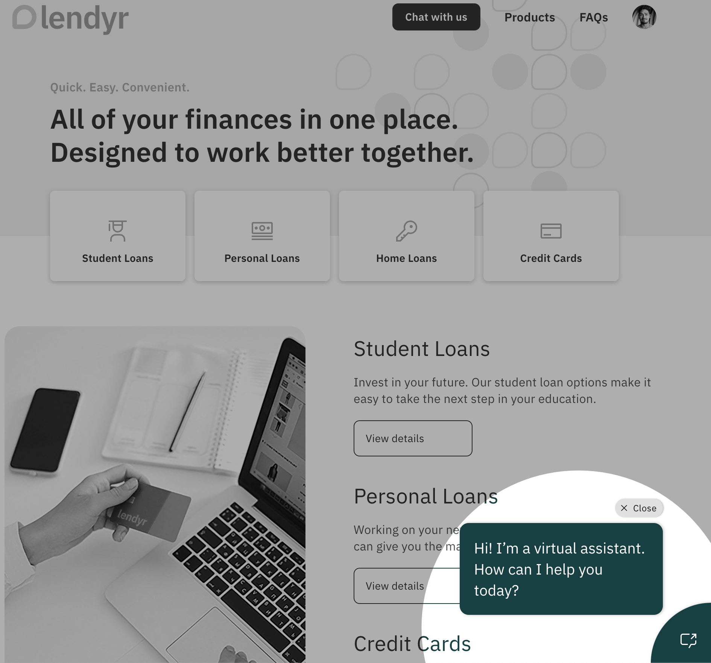
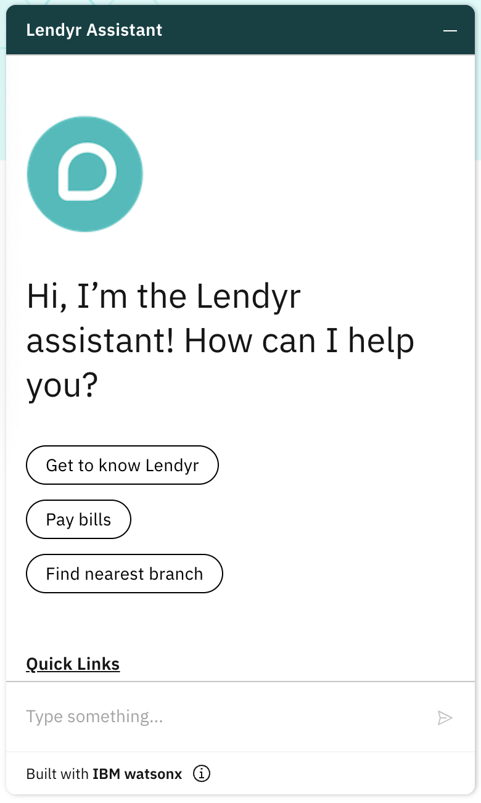
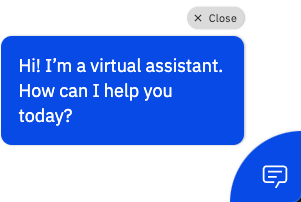
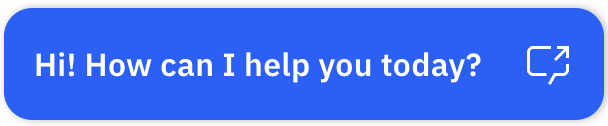

---

copyright:
  years: 2019, 2022
lastupdated: "2022-11-18"

subcollection: watson-assistant

---

{:shortdesc: .shortdesc}
{:new_window: target="_blank"}
{:external: target="_blank" .external}
{:deprecated: .deprecated}
{:important: .important}
{:note: .note}
{:tip: .tip}
{:preview: .preview}
{:pre: .pre}
{:codeblock: .codeblock}
{:screen: .screen}
{:javascript: .ph data-hd-programlang='javascript'}
{:java: .ph data-hd-programlang='java'}
{:python: .ph data-hd-programlang='python'}
{:swift: .ph data-hd-programlang='swift'}
{:video: .video}

{{site.data.content.classiclink}}

# How the web chat works
{: #web-chat-architecture }

The web chat provides an easy-to-use chatbot interface that you can add to your website without writing any code.
{: shortdesc }

After you add the web chat script to your website, your customers will see a launcher icon that they can click to open the chat window and start a conversation with the assistant. The appearance of the launcher icon adapts to desktop and mobile browsers.



When a customer clicks the launcher, the web chat window opens, initially displaying the _home screen_. The home screen displays a greeting and an optional set of suggested conversation starters for common questions and problems. The customer can either click a conversation starter or type a message in the input field to start the conversation with the assistant.



The appearance and behavior of the launcher icon, the home screen, and most other aspects of the web chat can be configured and customized to match your website style and branding. For more information, see [Configuring the web chat](/docs/watson-assistant?topic=watson-assistant-web-chat-config).
{: tip}

## Launcher appearance and behavior
{: #web-chat-architecture-launcher}

The web chat launcher welcomes and engages customers so they know where to find help if they need it. By default, the web chat launcher appears in a small initial state as a circle in the bottom right corner:


After 15 seconds, the launcher expands to show a greeting message to the user. In this expanded state, a customer can still click the launcher to open the web chat. (If the customer reloads the page or navigates to a different page before the launcher has expanded, the 15-second timer restarts.)

The appearance of this expanded state differs slightly depending on whether the customer is using a desktop browser or a mobile browser:

- For desktop browsers, the expanded launcher shows two primary buttons the customer can click to open the web chat, and a **Close** button that closes the launcher.

    

    The expanded launcher remains in its expanded state even if the customer reloads the page or navigates to a different page. It stays in its expanded state until the customer either opens it by clicking on either of the two primary buttons, or closes it, at which point it returns to its initial small state for the rest of the session.

- For mobile browsers, the launcher shows only a single primary button.

    

    The customer can close the launcher by scrolling on the page, swiping right on the expanded launcher, or waiting 10 seconds, at which point the expanded launcher shrinks back to its initial small state automatically. If the user reloads the page or navigates to a different page while the laucher is expanded, it stays in its expanded state, and the 10-second timer restarts.

After the next page refresh, if the launcher remains in its small state without being clicked, it bounces up and down to attract the customer's attention. The first bounce happens 15 seconds after the page refresh; if the customer still does not click the launcher, it bounces again 60 seconds later. (The timing of the second bounce might be affected if the user refreshes the page or navigates to a different page.) If the user still does not click the launcher, it does not bounce again.

The language of the default text shown within the launcher depends on the locale configured for the web chat. If you customize the greeting text, the text you provide is used regardless of the locale settings.

You can configure the color of the launcher, as well as the greeting message text, in the web chat settings. For more information, see [Configuring the web chat](/docs/watson-assistant?topic=watson-assistant-web-chat-config).

## Rendering assistant output

In addition to plain text, {{site.data.keyword.conversationshort}} supports many response types that can be used to output multimedia and interactive elements. The web chat includes built-in support for a wide variety of response types:

- **Text formatting**: The web chat supports formatting text using either Markdown or HTML. For more information, see [Markdown formatting].(#web-chat-architecture-markdown).
- **URLs**: Valid URLS (such as `http://example.com`) are automatically rendered as clickable links. When a customer clicks a link in the web chat, the target website opens in a new browser tab.
- **Options**: Options responses (when the assistant asks the customer to select from a set of choices) are automatically rendered as interactive elements. (By default, a set of fewer than five options is rendered as a set of clickable buttons; five or more options are rendered as a drop-down list.)
- **Dates**: When the assistant asks the customer to specify a date, the web chat displays an interactive date picker. The customer can specify the date either by clicking the date picker or by typing a valid date value in the input field.
- **Multimedia responses**: The web chat supports all multimedia response types (`audio`, `image`, and `video`).
- **iframe**: The web chat supports the `iframe` response type, which embeds HTML content (such as a form or interactive map) directly in the web chat window.

For more information about how the web chat handles specific response types, see the [Response types reference](/docs/watson-assistant?topic=watson-assistant-response-types-reference#iframe).

### Markdown formatting
{: #web-chat-architecture-markdown}

In text responses from your assistant, you can use Markdown formatting to apply highlighting such as italics, or to include elements like paragraphs and headings. Some common examples of Markdown formatting include:

- Headings:
    ```text
    # First-level heading

    ## Second-level heading
    ```

- Highlighting:

    ```text
    This text includes *italic* and **bold** highlighting, as well as a `code` snippet.
    ```

- Lists:

    ```text
    - ordered
    - list

    1. bulleted
    2. list
    ```

- Tables:

    ```text
    | Column 1 | Column 2 |
    |----------|----------|
    | Row      | One      |
    | Row      | Two      |
    ```

- Links:

    ```text
    [This link](https://www.ibm.com/products/watson-assistant/demos/lendyr/demo.html) opens in a new tab.

    [This link](https://www.ibm.com/products/watson-assistant/demos/lendyr/demo.html){{target=\"_self\" rel=\"noopener noreferrer\"}} opens in the same tab.
    ```

For detailed information about the Markdown format, see the [CommonMark specification](https://spec.commonmark.org/){: external}.

## Human agent transfer

The web chat supports transferring the customer to a human agent in situations the assistant can't handle. If you configure one of the supported contact center integrations, the web chat can open a separate chat window in which the customer can communicate with a human agent.

Your assistant can then initiate a transfer in situations when the assistant is unable to handle a customer's requests. (For more information about initiating a transfer, see [Connecting to a human agent](https://cloud.ibm.com/docs/watson-assistant?topic=watson-assistant-human-agent).)

For information about how to add a contact center integration to the web chat, see [Adding contact center support](/docs/watson-assistant?topic=watson-assistant-deploy-web-chat-haa).

## Technical details

The web chat is displayed on your web site by a short JavaScript code snippet, which calls additional JavaScript code that is hosted by {{site.data.keyword.cloud_notm}}. The hosted code is automatically updated with new features and fixes, so by default you will always have the latest version. (You can optionally [lock to a specific version](/docs/watson-assistant?topic=watson-assistant-web-chat-develop-versions) if you prefer to control upgrades yourself.)

The code snippet that creates the web chat widget includes a configuration object, which you can modify to change the appearance and behavior of the web chat. The configuration object also specifies details that enable the web chat to connect to your assistant. If you are comfortable writing JavaScript code, you can customize the web chat by modifying the code snippet and using the web chat API.

The web chat uses the {{site.data.keyword.conversationshort}} v2 stateful API to communicate with the assistant. By default, the session ends and the conversation ends after 5 minutes of inactivity. This means that if a user stops interacting with the assistant, after 5 minutes, any context variable values that were set during the previous conversation are set to null or back to their initial values. You can change the inactivity timeout setting in the assistant settings (if allowed by your plan).

### Browser support
{: #web-chat-architecture-browsers}

The web chat supports a variety of devices and platforms. As a general rule, if the last two versions of a browser account for more than 1% of all desktop or mobile traffic, the web chat supports that browser.

The following list specifies the minimum required browser software for the web chat (including the two most recent versions, except as noted):

- Google Chrome
- Apple Safari
- Mobile Safari
- Chrome for Android
- Microsoft Edge (Chromium and non-Chromium)
- Mozilla Firefox
- Firefox ESR (most recent ESR only)
- Opera
- Samsung Mobile Browser
- UC Browser for Android
- Mobile Firefox

For optimal results when rendering the web chat on mobile devices, the `<head>` element of your web page must include the following metadata element:

```html
<meta name="viewport" content="width=device-width, initial-scale=1" />
```
{: codeblock}

### Accessibility

IBM strives to provide products with usable access for everyone, regardless of age or ability.

The web chat integration complies with the [Web Content Accessibility 2.1 Level AA](https://www.w3.org/WAI/standards-guidelines/wcag/new-in-21/){: external} standard. It is tested with both screen readers and automated tools on a continual basis.

### Language support

By default, the web chat displays hardcoded labels and messages in English, but support is built in for all of the languages supported by {{site.data.keyword.conversationshort}}. You can also choose from a wide selection of locales to customize the display of strings like dates and times for global audiences.

In whichever language you are using, you can also customize the text of any hardcoded strings.

For more information, see [Supporting global audiences](/docs/watson-assistant?topic=watson-assistant-web-chat-develop-global).

### Billing
{: #web-chat-architecture-billing}

Watson Assistant charges based on the number of unique monthly active users (MAU).

By default, the web chat creates a unique, anonymous ID the first time a new user starts a session. This identifier is stored in a first-party cookie, which remains active for 45 days. If the same user returns to your site and chats with your assistant again while this cookie is still active, the web chat integration recognizes the user and uses the same user ID. This means that you are charged only once per month for the same anonymous user.

On Apple devices, the Intelligent Tracking Prevention feature automatically deletes any client-side cookie after 7 days. This means that if an anonymous customer accesses your website and then visits again two weeks later, the two visits are treated as two different MAUs. For information about how to avoid this problem, see [Managing user identity information](/docs/watson-assistant?topic=watson-assistant-web-chat-develop-userid).
{: important}

For information about how to customize the handling of user identity information for billing purposes, see [Managing user identity information](/docs/watson-assistant?topic=watson-assistant-web-chat-develop-userid).

The usage is measured differently depending on the plan type. For Lite plans, usage is measured by the number of `/message` calls (API) are sent to the assistant from the web chat integration. For all other plans, usage is measured by the number of monthly active users (MAU) that the web chat interacts with. The maximum number of allowed MAUs differs depending on your {{site.data.keyword.conversationshort}} plan type.

| Plan       |              Maximum usage |
|------------|---------------------------:|
| Enterprise |              Unlimited MAU |
| Premium (legacy) |        Unlimited MAU |
| Plus       |              Unlimited MAU |
| Trial      |                  5,000 MAU |
| Lite       | 10,000 API (approximately 1,000 MAU) |
{: caption="Plan details" caption-side="top"}

