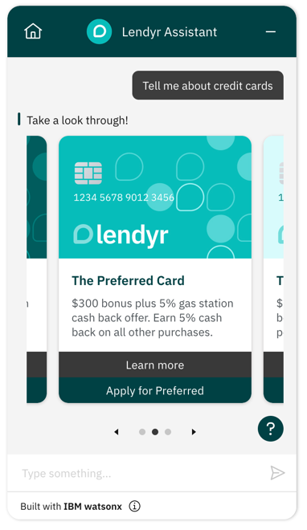

---

copyright:
  years: 2022
lastupdated: "2022-07-13"

subcollection: watson-assistant

---

{:shortdesc: .shortdesc}
{:new_window: target="_blank"}
{:external: target="_blank" .external}
{:deprecated: .deprecated}
{:important: .important}
{:note: .note}
{:tip: .tip}
{:preview: .preview}
{:pre: .pre}
{:codeblock: .codeblock}
{:screen: .screen}
{:javascript: .ph data-hd-programlang='javascript'}
{:java: .ph data-hd-programlang='java'}
{:python: .ph data-hd-programlang='python'}
{:swift: .ph data-hd-programlang='swift'}
{:video: .video}

{{site.data.content.classiclink}}

# Tutorial: Rendering a custom response as a content carousel
{: #web-chat-develop-content-carousel}

This tutorial shows how you might use custom responses to render information in the form of a content carousel.
{: shortdesc}

For a complete, working version of the example described in this tutorial, see [Content carousel for {{site.data.keyword.conversationshort}} web chat](https://github.com/watson-developer-cloud/assistant-toolkit/tree/master/integrations/webchat/examples/content-carousel){: external}.
{: note}

A _content carousel_ (or _slider_) is a type of interactive element that shows options as a scrollable series of slides.

{{site.data.keyword.conversationshort}} does not have a built-in response type for content carousels. But that isn't a problem: you can use the `user_defined` response type to send a custom response with the information you want to show, and extend the web chat to render the content carousel using standard JavaScript libraries.



This example shows how you can use the [Swiper](https://swiperjs.com/){: external} library to render a custom response as a content carousel.

1. In the action step that you want to create a content carousel, use the JSON editor to define a `user_defined` custom response, which can contain any data you want to include. Inside the response, specify the data required for populating the content carousel. In this example, we're sending information about various types of credit cards, which we will display in a custom response:

    ```json
    {
      "generic": [
        {
          "user_defined": {
            "carousel_data": [
              {
                "alt": "everyday card",
                "url": "lendyr-everyday-card.jpg",
                "title": "The Everyday Card",
                "description": "$300 bonus plus 5% gas station cash back offer. Earn 2% cash back on all other purchases."
              },
              {
                "alt": "preferred card",
                "url": "lendyr-preferred-card.jpg",
                "title": "The Preferred Card",
                "description": "$300 bonus plus 5% gas station cash back offer. Earn 5% cash back on all other purchases."
              },
              {
                "alt": "topaz card",
                "url": "lendyr-topaz-card.jpg",
                "title": "The Topaz Card",
                "description": "$90 Annual fee. Earn 120,000 bonus points. Earn additional points on every purchase."
              }
            ],
            "user_defined_type": "carousel"
          },
          "response_type": "user_defined"
        }
      ]
    }
    ```

    In this example, we are including the carousel data inside the `user_defined` response. Depending on the design of your assistant, another option would be to store the data in skill variables that can be accessed by web chat from the `context` object.
    {: note}


2. Register a listener for the custom response event. When web chat receives a `user_defined` response from the assistant, it will fire this event.
```javascript
instance.on({ type: 'customResponse', handler: customResponseHandler });
```
3. Create the handler that will display the information from the assistant.
```javascript
function customResponseHandler(event) {
  const { message, element, fullMessage } = event.data;
  // You could also look up variables from context using something like "fullMessage.context.skills['actions skill'].skill_variables"
  const messageData = message.user_defined;
  element.innerHTML = `<div>...the carousel will go here</div>`;
  // Use a library such as Swiper to render the slides and provide the interactive functionality for the
  // carousel. The linked example will show the details for this.
}
```

For complete working code see [the example in our GitHub repository](https://github.com/watson-developer-cloud/assistant-toolkit/tree/master/integrations/webchat/examples/content-carousel).