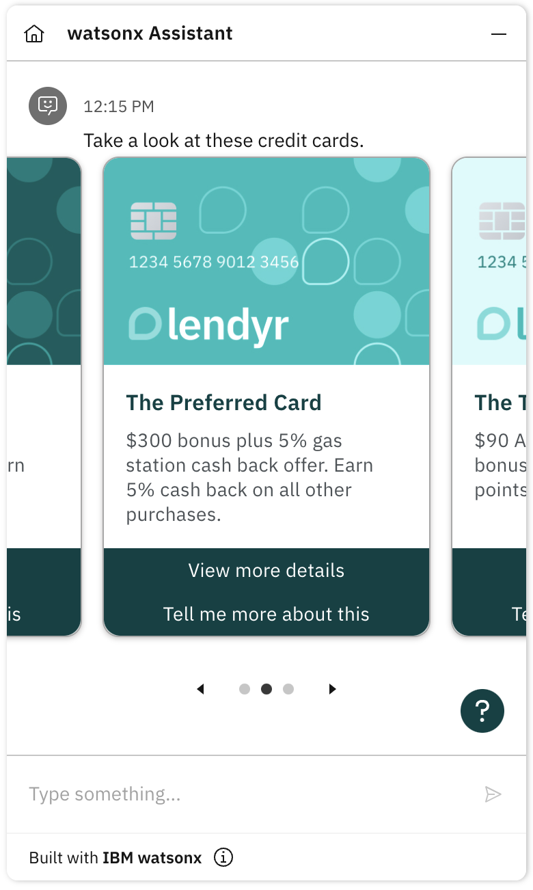

---

copyright:
  years: 2022
lastupdated: "2022-08-01"

subcollection: watson-assistant

---

{:shortdesc: .shortdesc}
{:new_window: target="_blank"}
{:external: target="_blank" .external}
{:deprecated: .deprecated}
{:important: .important}
{:note: .note}
{:tip: .tip}
{:preview: .preview}
{:pre: .pre}
{:codeblock: .codeblock}
{:screen: .screen}
{:javascript: .ph data-hd-programlang='javascript'}
{:java: .ph data-hd-programlang='java'}
{:python: .ph data-hd-programlang='python'}
{:swift: .ph data-hd-programlang='swift'}
{:video: .video}

{{site.data.content.classiclink}}

# Tutorial: Rendering a custom response as a content carousel
{: #web-chat-develop-content-carousel}

This tutorial shows how you might use custom responses to render information in the form of a content carousel.
{: shortdesc}

For a complete, working version of the example described in this tutorial, see [Content carousel for {{site.data.keyword.conversationshort}} web chat](https://github.com/watson-developer-cloud/assistant-toolkit/tree/master/integrations/webchat/examples/content-carousel){: external}.
{: note}

A _content carousel_ (or _slider_) is a type of interactive element that shows options as a scrollable series of slides.

{{site.data.keyword.conversationshort}} does not have a built-in response type for content carousels. But that isn't a problem: you can use the `user_defined` response type to send a custom response with the information you want to show, and extend the web chat to render the content carousel using standard JavaScript libraries.



This example shows how you can use the [Swiper](https://swiperjs.com/){: external} library to render a custom response as a content carousel.

1. In the action step that you want to create a content carousel, use the JSON editor to define a `user_defined` custom response, which can contain any data you want to include. Inside the response, specify the data required for populating the content carousel. In this example, we're sending information about various types of credit cards, which we will display in a custom response:

    ```json
    {
      "generic": [
        {
          "user_defined": {
            "carousel_data": [
              {
                "alt": "everyday card",
                "url": "lendyr-everyday-card.jpg",
                "title": "The Everyday Card",
                "description": "$300 bonus plus 5% gas station cash back offer. Earn 2% cash back on all other purchases."
              },
              {
                "alt": "preferred card",
                "url": "lendyr-preferred-card.jpg",
                "title": "The Preferred Card",
                "description": "$300 bonus plus 5% gas station cash back offer. Earn 5% cash back on all other purchases."
              },
              {
                "alt": "topaz card",
                "url": "lendyr-topaz-card.jpg",
                "title": "The Topaz Card",
                "description": "$90 Annual fee. Earn 120,000 bonus points. Earn additional points on every purchase."
              }
            ],
            "user_defined_type": "carousel"
          },
          "response_type": "user_defined"
        }
      ]
    }
    ```

    In this example, we are including the carousel data inside the `user_defined` response. Depending on the design of your assistant, another option would be to store the data in skill variables that can be accessed by web chat from the `context` object.
    {: note}

1. Create a handler for the [`customResponse`](https://web-chat.global.assistant.watson.cloud.ibm.com/docs.html?to=api-events#customresponse){: external} event. This handler renders the content carousel, using the styles defined by the Swiper library. (You can see the definitions of these styles in the [full example](https://github.com/watson-developer-cloud/assistant-toolkit/tree/master/integrations/webchat/examples/content-carousel){: external}.) This function also relies on a helper function (`createSlides()`), which we will create in the next step.

    ```javascript
    function carouselCustomResponseHandler(event, instance) {
      const { element, message } = event.data;

      element.innerHTML = `
        <div class="Carousel">
          <div class="swiper">
            <div class="swiper-wrapper"></div>
          </div>
          <div class="Carousel__Navigation" >
            <button type="button" class="Carousel__NavigationButton Carousel__NavigationPrevious bx--btn bx--btn--ghost">
              <svg fill="currentColor" width="16" height="16" viewBox="0 0 32 32" aria-hidden="true"><path d="M20 24L10 16 20 8z"></path></svg>
            </button>
            <div class="Carousel__BulletContainer"></div>
            <button type="button" class="Carousel__NavigationButton Carousel__NavigationNext bx--btn bx--btn--ghost">
              <svg fill="currentColor" width="16" height="16" viewBox="0 0 32 32" aria-hidden="true"><path d="M12 8L22 16 12 24z"></path></svg>
            </button>
          </div>
        </div>`;

      // Once we have the main HTML, create each of the individual slides that will appear in the carousel.
      const slidesContainer = element.querySelector('.swiper-wrapper');
      createSlides(slidesContainer, message, instance);

      // Initialize the Swiper library which is what we are using to control the carousel. We are using a custom pagination
      // element to control pagination and navigation.
      // eslint-disable-next-line no-new
      new Swiper(element.querySelector('.swiper'), {
        modules: [Navigation, Pagination, A11y],
        keyboard: {
          enabled: true,
        },
        pagination: {
          el: element.querySelector('.Carousel__BulletContainer'),
          clickable: true,
          bulletClass: 'Carousel__Bullet',
          bulletActiveClass: 'Carousel__Bullet--selected',
          renderBullet,
        },
        navigation: {
          prevEl: element.querySelector('.Carousel__NavigationPrevious'),
          nextEl: element.querySelector('.Carousel__NavigationNext'),
        },
        slidesPerView: 'auto',
        spaceBetween: 15,
        centeredSlides: true,
        rewind: true,
      });
    }
    ```

1. Create the helper function that renders each slide in the content carousel. This function populates the slide using values retrieved from the custom response (`alt`, `url`, `title`, and `description`).

    ```javascript
    function createSlides(slidesContainer, message, webChatInstance) {
      const carouselData = message.user_defined.carousel_data;

      // Create a slide for each credit card in the message custom data.
      carouselData.forEach((cardData) => {
        const { url, title, description, alt } = cardData;
        const cardElement = document.createElement('div');
        cardElement.classList.add('swiper-slide');

        cardElement.innerHTML = `
          <div class="bx--tile Carousel__Card">
            
            <div class="Carousel__CardText">
              <div class="Carousel__CardTitle">${title}</div>
              <div class="Carousel__CardDescription">${description}</div>
            </div>
            <!-- Here you would use a link to your own page that shows more details about this card. -->
            <a href="https://www.ibm.com" class="Carousel__CardButton bx--btn bx--btn--primary" target="_blank">
              View more details
            </a>
            <!-- This button will send a message to the assisstant and web chat will respond with more info. -->
            <button type="button" class="Carousel__CardButton Carousel__CardButtonMessage bx--btn bx--btn--primary">
              Tell me more about this
            </button>
          </div>
        `;

        // Add a click handler to the second link/button. This will send a silent message to the assistant to ask for
        // more information about the given credit card.
        const button = cardElement.querySelector('.Carousel__CardButtonMessage');
        button.addEventListener('click', () => {
          webChatInstance.send({ input: { text: `Tell me about ${title}` } }, { silent: true });
        });

        slidesContainer.appendChild(cardElement);
      });
    }
    ```

1. In your `onLoad` event handler, use the [`on()`](https://web-chat.global.assistant.watson.cloud.ibm.com/docs.html?to=api-instance-methods#on){: external} instance method to subscribe to the `customResponse` event, registering the `carouselCustomResponseHandler()` function as the callback.

    ```javascript
      instance.on({
        type: 'customResponse',
        handler: (event, instance) => {
          if (event.data.message.user_defined && event.data.message.user_defined.user_defined_type === 'carousel') {
            carouselCustomResponseHandler(event, instance);
          }
        },
      });
    ```

In this example, we are checking the custom `user_defined_type` property of the custom response, and calling the `carouselCustomResponseHandler()` function only if the specified type is `carousel`. This is an optional check that shows how you might use a custom property to define multiple different custom responses (each with a different value for `user_defined_type`).
{: note}

For complete working code, see the [Content carousel for {{site.data.keyword.conversationshort}} web chat](https://github.com/watson-developer-cloud/assistant-toolkit/tree/master/integrations/webchat/examples/content-carousel){: external} example.

