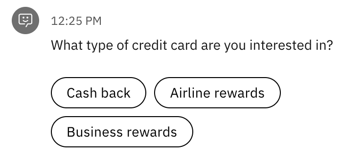
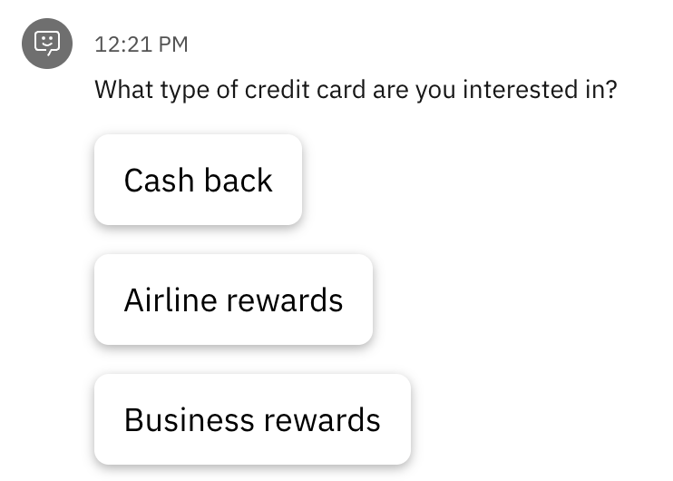

---

copyright:
  years: 2022
lastupdated: "2022-06-29"

subcollection: watson-assistant

---

{:shortdesc: .shortdesc}
{:new_window: target="_blank"}
{:external: target="_blank" .external}
{:deprecated: .deprecated}
{:important: .important}
{:note: .note}
{:tip: .tip}
{:preview: .preview}
{:pre: .pre}
{:codeblock: .codeblock}
{:screen: .screen}
{:javascript: .ph data-hd-programlang='javascript'}
{:java: .ph data-hd-programlang='java'}
{:python: .ph data-hd-programlang='python'}
{:swift: .ph data-hd-programlang='swift'}
{:video: .video}

{{site.data.content.classiclink}}

# Tutorial: implementing custom option buttons in the web chat
{: #web-chat-develop-custom-buttons}

This tutorial shows how you might replace the default rendering of an options response with your own custom clickable buttons.
{: shortdesc}

For a complete, working version of the example described in this tutorial, see [Custom buttons for {{site.data.keyword.conversationshort}} web chat](https://github.com/watson-developer-cloud/assistant-toolkit/tree/master/integrations/webchat/examples/custom-buttons){: external}.
{: note}

By default, the web chat always displays an options response as a set of clickable buttons (for 4 or fewer options) or as a drop-down list (for 5 or more more options). This example shows the default rendering of an options response with 3 options:



For this tutorial, we will replace this default rendering with larger, card-style buttons:



Because the rendering of an options response cannot be modified, we will do this by intercepting any incoming options responses from the assistant and converting them into custom (`user_defined`) responses. We can then implement a custom rendering for these responses.

1. Create a handler for the [`pre:receive`](https://web-chat.global.assistant.watson.cloud.ibm.com/docs.html?to=api-events#prereceive){: external} event. In this handler, look for any `option` responses in the message payload, and convert them into `user_defined` responses.

    ```javascript
    function preReceiveHandler(event) {
      const message = event.data;
      if (message.output.generic) {
        message.output.generic.forEach(messageItem => {
          if (messageItem.response_type === 'option') {
            messageItem.response_type = 'user_defined';
          }
        })
      }
    }
    ```

1. Create a handler for the [`customResponse`](https://web-chat.global.assistant.watson.cloud.ibm.com/docs.html?to=api-events#customresponse){: external} event. This handler renders the custom buttons, using a custom `CardButton` style we can define in the CSS. (You can see the definition of this style in the [full example](https://github.com/watson-developer-cloud/assistant-toolkit/tree/master/integrations/webchat/examples/custom-buttons){: external}.)

    ```javascript
    function customResponseHandler(event) {
      const { message, element, fullMessage } = event.data;
      message.options.forEach((messageItem, index) => {
        const button = document.createElement('button');
        button.innerHTML = messageItem.label;
        button.classList.add('CardButton');
        button.addEventListener('click', () => onClick(messageItem, button,     fullMessage, index));
        element.appendChild(button);
      });
    }
    ```

1. In your `onLoad` event handler, use the [`on()`](https://web-chat.global.assistant.watson.cloud.ibm.com/docs.html?to=api-instance-methods#on){: external} instance method to subscribe to the `pre:receive` and `customResponse` events, registering the handlers as callbacks.

    ```javascript
    instance.on({ type: 'customResponse', handler: customResponseHandler });
    instance.on({ type: 'pre:receive', handler: preReceiveHandler });
    ```

3. Create a click handler to respond when the customer clicks on one of the custom buttons. In the handler, use the [`send()`](https://web-chat.global.assistant.watson.cloud.ibm.com/docs.html?to=api-instance-methods#send){: external} instance method to send a message to the assistant, using the button label as the message text.

    In addition, we're adding the custom CSS class `CardButton--selected` to the clicked button, changing its appearance to show that it was selected. (This class is also defined in the [full example](https://github.com/watson-developer-cloud/assistant-toolkit/tree/master/integrations/webchat/examples/custom-buttons){: external}.)

    ```javascript
    function onClick(messageItem, button, fullMessage, itemIndex) {
      webChatInstance.send({ input: { text: messageItem.label }});
      button.classList.add('CardButton--selected');
    }
    ```

4. If the user reloads the page or navigates to a different page, the web chat reloads from the session history. If this happens, we want to preserve the "selected" state of any clicked buttons.

    To do this, in the `onClick` handler, use the [`updateHistoryUserDefined`](https://web-chat.global.assistant.watson.cloud.ibm.com/docs.html?to=api-instance-methods#updateHistoryUserDefined){: external} instance method to store a variable in the session history that indicates which button was clicked.

    ```javascript
    webChatInstance.updateHistoryUserDefined(fullMessage.id, { selectedIndex:     itemIndex });
    ```

    Then, in the `customResponse` handler, read this value and use it to set the initial states of the buttons in any custom responses already in the session history.

    ```javascript
    if (fullMessage.history?.user_defined?.selectedIndex === index) {
      button.classList.add('CardButton--selected');
    }
    ```

For complete working code, see the [Custom buttons for {{site.data.keyword.conversationshort}} web chat](https://github.com/watson-developer-cloud/assistant-toolkit/tree/master/integrations/webchat/examples/custom-buttons){: external} example. The example also shows how to disable the buttons in a custom response after the customer has sent a message, which prevents using the buttons to send a message out of order.
