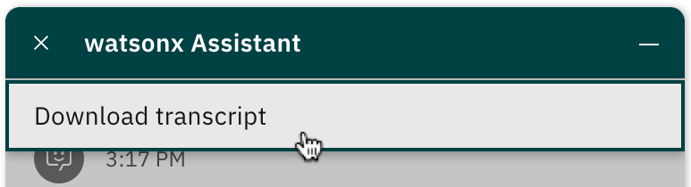

---

copyright:
  years: 2022
lastupdated: "2022-06-30"

subcollection: watson-assistant

---

{:shortdesc: .shortdesc}
{:new_window: target="_blank"}
{:external: target="_blank" .external}
{:deprecated: .deprecated}
{:important: .important}
{:note: .note}
{:tip: .tip}
{:preview: .preview}
{:pre: .pre}
{:codeblock: .codeblock}
{:screen: .screen}
{:javascript: .ph data-hd-programlang='javascript'}
{:java: .ph data-hd-programlang='java'}
{:python: .ph data-hd-programlang='python'}
{:swift: .ph data-hd-programlang='swift'}
{:video: .video}

{{site.data.content.classiclink}}

# Tutorial: Providing a downloadable conversation transcript
{: #web-chat-develop-download-transcript}

You can customize the web chat to offer your customers the option of downloading a transcript of the conversation history.
{: shortdesc}

For a complete, working version of the example described in this tutorial, see [Download history for {{site.data.keyword.conversationshort}} web chat](https://github.com/watson-developer-cloud/assistant-toolkit/tree/web-chat-tutorials-integration-branch/integrations/webchat/examples/download-history){: external}.
{: note}

To support downloading a conversation transcript, this example adds a custom menu option to the overflow menu in the header of the chat window:



Clicking this menu option initiates downloading of a file containing the complete conversation history in comma-separated values (CSV) format.

1. Create a handler for the [`send`](https://web-chat.global.assistant.watson.cloud.ibm.com/docs.html?to=api-events#send){: external} and [`receive`](https://web-chat.global.assistant.watson.cloud.ibm.com/docs.html?to=api-events#receive){: external} events. In this handler, save each incoming or outgoing message in a list (`messages`) in order to maintain a history of the conversation.

    ```javascript
    const messages = [];

    function saveMessage(event) {
      messages.push(event.data);
    }
    ```

1. Create a handler for the [`history:begin`](https://web-chat.global.assistant.watson.cloud.ibm.com/docs.html?to=api-events#historybegin) event, which is fired when the web chat is reloaded from the session history. In this handler, save any reloaded session history to the list.

    ```javascript
    function saveHistory(event) {
      messages.push(...event.messages);
    }
    ```

1. In your `onLoad` event handler, use the [`on()`](https://web-chat.global.assistant.watson.cloud.ibm.com/docs.html?to=api-instance-methods#on){: external} instance method to subscribe to the `send`, `receive`, and `history:begin` events, registering the appropriate handlers as callbacks.

    ```javascript
    instance.on({ type: 'send', handler: saveMessage });
    instance.on({ type: 'receive', handler: saveMessage });
    instance.on({ type: 'history:begin', handler: saveHistory });
    ```

1. Create a function that converts the messages saved in the `messages` list to the format you want to provide in the downloaded file. Note that this conversion needs to accommodate any response types that the conversation might include (such as text, images, options, or transfers to a human agent).

    In this example, we convert the messages into a CSV file format that can be opened with an application such as Microsoft Excel. The first column in each line is a label that indicates whether the message originated from the customer (`You`) or from the assistant (`Lendyr`).

    This function relies on a helper function (`createDownloadText`) that formats the text for each line. You can see the implementation of this helper function in the [full example](https://github.com/watson-developer-cloud/assistant-toolkit/tree/master/integrations/webchat/examples/download-history){: external}.
    {: note}

    ```javascript
    function createDownload() {
      const downloadLines = [createDownloadText('From', 'Message')];

      messages.forEach(message => {
        if (message.input?.text) {
          // This is a message that came from the user.
          downloadLines.push(createDownloadText('You', message.input.text));
        } else if (message.output?.generic?.length) {
          // This is a message that came from the assistant. It can contain an array of individual message items.
          message.output?.generic.forEach(messageItem => {
            // This is only handling a text response but you can handle other types of responses here as well as
            // custom responses.
            if (messageItem?.text) {
              downloadLines.push(createDownloadText('Lendyr', messageItem.text));
            }
          });
        }
      });

      return downloadLines.join('\n');
    }
    ```

1. Create a function that initiates the download of the conversation history file. This function calls the `createDownload()` function to generate the content to download. It then simulates clicking a link to start the download, using a file name generated from the current date.

    ```javascript
    function doDownload() {
      const downloadContent = createDownload();

      const blob = new Blob([downloadContent], { type: 'text/csv' });
      const url = URL.createObjectURL(blob);

      // To automatically trigger a download, we have to create a fake "a" element and then click it.
      const timestamp = new Date().toISOString().replace(/[_:]/g, '-').replace(/.[0-9][0-9][0-9]Z/, '');
      const a = document.createElement('a');
      a.setAttribute('href', url);
      a.setAttribute('download', `Chat History ${timestamp}.csv`);
      a.click();
    }
    ```

1. In your `onLoad` event handler, use the [`updateCustomMenuOptions()`](https://web-chat.global.assistant.watson.cloud.ibm.com/docs.html?to=api-instance-methods#updatecustommenuoptions){: external} instance method to add a custom menu option that customers can use to download the conversation history. Add this line immediately before the call to the `render()` instance method.

    ```javascript
    instance.updateCustomMenuOptions('bot', [{ text: 'Download history', handler: doDownload }]);
    ```

For complete working code, see the [Download history for {{site.data.keyword.conversationshort}} web chat](https://github.com/watson-developer-cloud/assistant-toolkit/tree/web-chat-tutorials-integration-branch/integrations/webchat/examples/download-history){: external} example.
